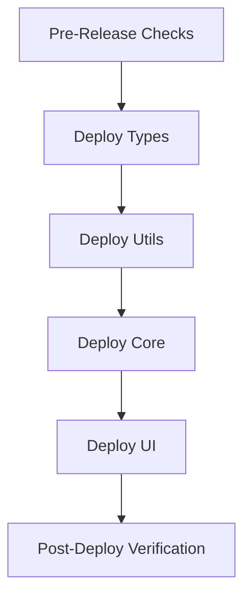

# Deployment Strategy

## 1. Deployment Philosophy

### 1.1 Core Principles
1. Package-First Deployment
   - Start with @jadugar/types
   - Then @jadugar/utils
   - Move to @jadugar/core
   - Finally @jadugar/ui

2. Validation Gates
   - Type safety verified
   - Tests passing
   - Documentation complete
   - Performance validated

3. Release Strategy
   - Semantic versioning
   - Staged releases
   - Automated deployment
   - Rollback support

### 1.2 Release Types
1. Major Release (x.0.0)
   - Breaking changes
   - API changes
   - Major features
   - Migration required

2. Minor Release (0.x.0)
   - New features
   - Enhancements
   - No breaking changes
   - Backward compatible

3. Patch Release (0.0.x)
   - Bug fixes
   - Documentation
   - Performance
   - Security updates

## 2. Deployment Process

### 2.1 Pre-Deployment
```bash
# 1. Version Check
yarn workspaces version check

# 2. Build Verification
yarn build

# 3. Test Suite
yarn test

# 4. Integration Check
yarn test:integration

# 5. Documentation
yarn docs:verify
```

### 2.2 Deployment Flow
```bash
# 1. Package Build
yarn build:packages

# 2. Version Bump
yarn version

# 3. Generate Changelog
yarn changelog

# 4. Publish
yarn publish

# 5. Tag Release
git tag -a v1.0.0 -m "Release v1.0.0"
```

## 3. Release Process

### 3.1 Package Order


### 3.2 Release Steps
1. @jadugar/types
   ```bash
   cd packages/types
   yarn version
   yarn build
   yarn publish
   ```

2. @jadugar/utils
   ```bash
   cd packages/utils
   yarn version
   yarn build
   yarn publish
   ```

3. @jadugar/core
   ```bash
   cd packages/core
   yarn version
   yarn build
   yarn publish
   ```

4. @jadugar/ui
   ```bash
   cd packages/ui
   yarn version
   yarn build
   yarn publish
   ```

## 4. Validation Gates

### 4.1 Pre-Release Gates
1. Code Quality
   - Lint passing
   - Tests passing
   - Coverage met
   - Types checked

2. Documentation
   - API docs
   - Changelog
   - Migration guide
   - Examples

3. Performance
   - Build size
   - Load time
   - Runtime metrics
   - Memory usage

### 4.2 Post-Release Gates
1. Integration
   - Cross-package
   - API contracts
   - Event handling
   - State management

2. Deployment
   - Package available
   - Imports working
   - Examples running
   - Documentation live

## 5. CI/CD Pipeline

### 5.1 CI Pipeline
```yaml
name: CI

on:
  push:
    branches: [main]
  pull_request:
    branches: [main]

jobs:
  validate:
    runs-on: ubuntu-latest
    steps:
      - uses: actions/checkout@v2
      - name: Setup
        uses: actions/setup-node@v2
      - name: Install
        run: yarn install
      - name: Build
        run: yarn build
      - name: Test
        run: yarn test
      - name: Integration
        run: yarn test:integration
```

### 5.2 CD Pipeline
```yaml
name: CD

on:
  push:
    tags:
      - 'v*'

jobs:
  deploy:
    runs-on: ubuntu-latest
    steps:
      - uses: actions/checkout@v2
      - name: Setup
        uses: actions/setup-node@v2
      - name: Install
        run: yarn install
      - name: Build
        run: yarn build
      - name: Publish
        run: yarn publish
        env:
          NODE_AUTH_TOKEN: ${{ secrets.NPM_TOKEN }}
```

## 6. Versioning Strategy

### 6.1 Version Management
```json
{
    "version": "1.0.0",
    "workspaces": {
        "packages": [
            "packages/*"
        ],
        "nohoist": [
            "**/typescript"
        ]
    }
}
```

### 6.2 Dependencies
```json
{
    "dependencies": {
        "@jadugar/types": "workspace:*",
        "@jadugar/utils": "workspace:*",
        "@jadugar/core": "workspace:*",
        "@jadugar/ui": "workspace:*"
    }
}
```

## 7. Rollback Strategy

### 7.1 Package Rollback
```bash
# 1. Revert Version
yarn workspace @jadugar/types version revert

# 2. Unpublish Latest
npm unpublish @jadugar/types@1.0.0

# 3. Publish Previous
npm publish @jadugar/types@0.9.0

# 4. Update Dependencies
yarn up @jadugar/types@0.9.0
```

### 7.2 System Rollback
```bash
# 1. Tag Rollback
git tag -d v1.0.0
git push origin :v1.0.0

# 2. Version Rollback
git revert HEAD
git push

# 3. Deploy Previous
yarn deploy:previous
```

## 8. Monitoring

### 8.1 Deployment Metrics
1. Build Metrics
   - Build time
   - Bundle size
   - Dependencies
   - Coverage

2. Runtime Metrics
   - Load time
   - Memory usage
   - CPU usage
   - Error rate

### 8.2 Health Checks
1. Package Health
   - Version check
   - Dependencies
   - Types
   - Tests

2. System Health
   - Integration
   - Performance
   - Security
   - Documentation

## 9. Security

### 9.1 Package Security
1. Dependencies
   - Audit
   - Updates
   - Vulnerabilities
   - Licenses

2. Code Security
   - Static analysis
   - Dynamic analysis
   - Penetration testing
   - Security review

### 9.2 Deployment Security
1. Access Control
   - NPM tokens
   - Git access
   - CI/CD access
   - Server access

2. Security Gates
   - Vulnerability scan
   - Dependency check
   - Code review
   - Security audit

## 10. Documentation

### 10.1 Release Documentation
1. Release Notes
   - Features
   - Bug fixes
   - Breaking changes
   - Migration steps

2. Deployment Guide
   - Setup
   - Configuration
   - Deployment
   - Verification

### 10.2 Maintenance
1. Documentation
   - Keep current
   - Update examples
   - Fix issues
   - Add features

2. Monitoring
   - Track metrics
   - Monitor health
   - Check security
   - Verify performance
