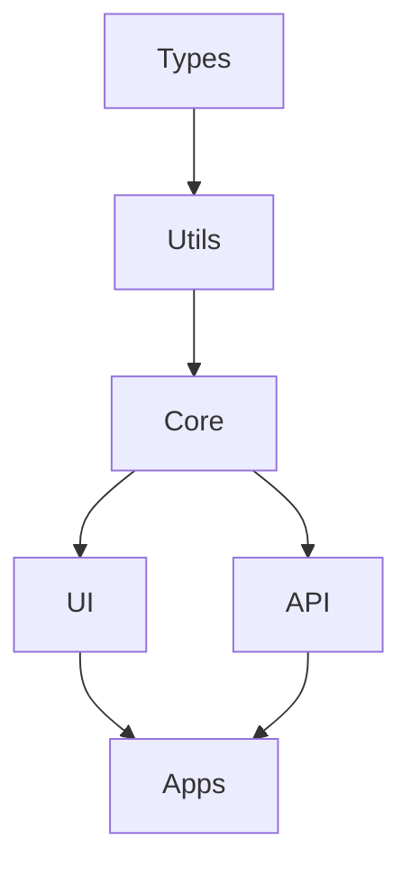

# Jadugar Package Development Guide

## Overview
This guide details how to develop packages for Jadugar, following our package-first development approach.

## Package Hierarchy



## Package Development Order

### 1. @jadugar/types
- Foundation for type safety
- Interface definitions
- Type utilities
- No runtime dependencies

### 2. @jadugar/utils
- Shared utilities
- Helper functions
- Common operations
- Depends on: types

### 3. @jadugar/core
- Business logic
- Core functionality
- Service implementations
- Depends on: types, utils

### 4. @jadugar/ui
- React components
- UI utilities
- Design system
- Depends on: types, utils, core

### 5. @jadugar/api
- API endpoints
- Service integrations
- Data models
- Depends on: types, utils, core

## Validation Gates

### 1. Type Safety
- No 'any' types
- No type assertions
- Complete interface definitions
- Generic constraints

### 2. Testing
- Unit tests: 90%+ coverage
- Integration tests
- E2E tests for critical paths
- Performance tests

### 3. Documentation
- API documentation
- Usage examples
- Type definitions
- Changelog

### 4. Performance
- Bundle size limits
- Runtime benchmarks
- Memory usage
- Network efficiency

## Development Process

### 1. Pre-Development
- Define types first
- Plan dependencies
- Design API
- Create tests

### 2. Development
- Implement types
- Write core logic
- Add tests
- Document changes

### 3. Review
- Type safety check
- Test coverage
- Documentation review
- Performance validation

### 4. Release
- Version bump
- Changelog update
- Package publication
- Integration verification

## Quality Requirements

### 1. Code Quality
- ESLint rules
- Prettier formatting
- No circular dependencies
- Clean architecture

### 2. Testing Quality
- Test coverage
- Test scenarios
- Edge cases
- Error handling

### 3. Documentation Quality
- API completeness
- Example accuracy
- Type documentation
- Update frequency

### 4. Performance Quality
- Load time
- Runtime performance
- Memory usage
- Network efficiency

## Integration Rules

### 1. Dependencies
- Explicit versions
- Peer dependencies
- Optional dependencies
- Dev dependencies

### 2. Type Integration
- Shared definitions
- Type augmentation
- Generic constraints
- No type assertions

### 3. API Integration
- RESTful principles
- GraphQL schemas
- WebSocket events
- Error standards

### 4. Build Integration
- Build order
- Cache invalidation
- Asset optimization
- Source maps

## Templates

### 1. Package Template
```
package/
├── src/
│   ├── index.ts
│   ├── types.ts
│   └── utils/
├── tests/
│   └── index.test.ts
├── docs/
│   └── API.md
└── package.json
```

### 2. Component Template
```
component/
├── index.tsx
├── styles.css
├── types.ts
└── tests/
    ├── index.test.tsx
    └── __snapshots__/
```

## Best Practices

### 1. Type Safety
- Use strict TypeScript
- Avoid type assertions
- Define clear interfaces
- Use generics wisely

### 2. Testing
- Test-driven development
- Complete test coverage
- Integration testing
- Performance testing

### 3. Documentation
- Clear API docs
- Usage examples
- Type definitions
- Change tracking

### 4. Performance
- Bundle optimization
- Code splitting
- Lazy loading
- Caching strategy

## Package Structure

### 1. Types Package (@jadugar/types)
```typescript
@jadugar/types/
├── src/
│   ├── build/           // Build-related types
│   │   ├── config.ts
│   │   ├── status.ts
│   │   └── events.ts
│   ├── monitoring/      // Monitoring types
│   │   ├── metrics.ts
│   │   ├── alerts.ts
│   │   └── health.ts
│   └── common/          // Shared types
│       ├── error.ts
│       └── config.ts
├── tests/
│   └── type-tests.ts    // Type testing
├── package.json
└── tsconfig.json
```

### 2. Utils Package (@jadugar/utils)
```typescript
@jadugar/utils/
├── src/
│   ├── logging/         // Logging utilities
│   │   ├── logger.ts
│   │   └── formatters.ts
│   ├── validation/      // Validation helpers
│   │   ├── schema.ts
│   │   └── validators.ts
│   └── common/          // Common utilities
│       ├── time.ts
│       └── string.ts
├── tests/
│   └── unit/           // Unit tests
├── package.json
└── tsconfig.json
```

### 3. Core Package (@jadugar/core)
```typescript
@jadugar/core/
├── src/
│   ├── build/          // Build tracking
│   │   ├── tracker.ts
│   │   └── manager.ts
│   ├── monitoring/     // Monitoring
│   │   ├── metrics.ts
│   │   └── health.ts
│   └── common/         // Shared functionality
│       ├── config.ts
│       └── errors.ts
├── tests/
│   ├── unit/          // Unit tests
│   └── integration/   // Integration tests
├── package.json
└── tsconfig.json
```

### 4. SDK Package (@jadugar/sdk)
```typescript
@jadugar/sdk/
├── src/
│   ├── client/         // SDK client
│   │   ├── index.ts
│   │   └── client.ts
│   ├── plugins/        // Build tool plugins
│   │   ├── webpack.ts
│   │   └── vite.ts
│   └── utils/          // SDK utilities
│       ├── auth.ts
│       └── config.ts
├── tests/
│   ├── unit/          // Unit tests
│   └── integration/   // Integration tests
├── package.json
└── tsconfig.json
```

## Development Workflow

### 1. Package Creation
```bash
# Create new package
npm create @jadugar/package-name

# Install dependencies
cd packages/package-name
npm install
```

### 2. Development Process
1. Define types in @jadugar/types
2. Implement utilities if needed
3. Develop core functionality
4. Create/update UI components
5. Integrate with API layer

### 3. Testing Strategy
```bash
# Unit tests
npm run test

# Integration tests
npm run test:integration

# E2E tests
npm run test:e2e
```

### 4. Documentation
1. Update API documentation
2. Add usage examples
3. Update dependency graph
4. Update changelog

### 5. Release Process
```bash
# Version bump
npm version [patch|minor|major]

# Create changeset
npm run changeset

# Build package
npm run build

# Publish
npm publish
```

## Package Dependencies

```mermaid
graph TD
    types[/@jadugar/types/]
    utils[/@jadugar/utils/]
    core[/@jadugar/core/]
    ui[/@jadugar/ui/]
    api[/@jadugar/api/]
    bo[/Build Observatory/]
    al[/Application Lighthouse/]

    %% Core dependencies
    types --> utils
    types --> core
    types --> ui
    types --> api
    
    %% Utils dependencies
    utils --> core
    utils --> ui
    utils --> api
    
    %% Core dependencies
    core --> ui
    core --> api
    
    %% Application dependencies
    api --> bo
    api --> al
    ui --> bo
    ui --> al
    
    %% Styling
    classDef package fill:#f9f,stroke:#333,stroke-width:2px
    classDef app fill:#bbf,stroke:#333,stroke-width:2px
    
    class types,utils,core,ui,api package
    class bo,al app
```

## Version Control

### Branch Strategy
```
main
├── develop
│   ├── feature/types/*
│   ├── feature/utils/*
│   ├── feature/core/*
│   ├── feature/ui/*
│   └── feature/api/*
└── release/*
```

### Commit Convention
```
<type>(<package>): <description>

feat(types): add build tracking types
fix(utils): correct date formatting
docs(core): update API documentation
```

## Quality Gates

### 1. Type Safety
- No `any` types
- Proper generics usage
- Type exports documented

### 2. Testing
- Unit tests: 90% coverage
- Integration tests
- E2E tests for critical paths

### 3. Performance
- Bundle size limits
- Runtime benchmarks
- Memory usage monitoring

### 4. Documentation
- API documentation
- Usage examples
- Changelog
- Dependency graph

## Troubleshooting

### Common Issues
1. Type conflicts
2. Circular dependencies
3. Version mismatches
4. Build failures

### Resolution Steps
1. Check package dependencies
2. Validate type definitions
3. Review circular imports
4. Clean and rebuild

## Resources
- [TypeScript Guidelines](../development/STANDARDS.md#typescript)
- [Testing Strategy](../development/TESTING_STRATEGY.md)
- [API Documentation](../api/API_DOCUMENTATION.md)
- [Security Guidelines](../security/SECURITY_GUIDE.md)
