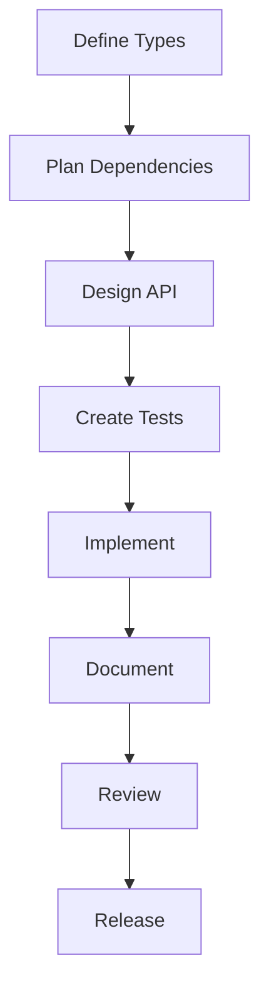

# Jadugar Development Standards

## Overview
This document outlines the development standards for the Jadugar project, ensuring consistency and quality across all packages.

## Core Principles

### 1. Package-First Development
- Follow package hierarchy strictly
- Maintain clear dependencies
- Ensure type safety
- Document interfaces

### 2. Type Safety
- Use TypeScript strict mode
- No `any` types
- No type assertions
- Complete interface definitions

### 3. Code Quality
- ESLint configuration
- Prettier formatting
- No circular dependencies
- Clean architecture patterns

### 4. Testing Standards
- Unit tests: 90%+ coverage
- Integration tests required
- E2E tests for critical paths
- Performance benchmarks

### 5. Documentation
- API documentation required
- Usage examples
- Type definitions
- Changelog maintenance

## Development Process

### 1. Package Development


### 2. Code Review Process
- Type safety check
- Test coverage verification
- Documentation review
- Performance validation

### 3. Release Process
- Version bump
- Changelog update
- Package publication
- Integration verification

## Coding Standards

### 1. TypeScript
```typescript
// ✅ Good
interface BuildConfig {
  projectId: string;
  timeout: number;
}

// ❌ Bad
interface BuildConfig {
  projectId: any;
  timeout: any;
}
```

### 2. React Components
```typescript
// ✅ Good
interface ButtonProps {
  label: string;
  onClick: () => void;
}

const Button: React.FC<ButtonProps> = ({ label, onClick }) => {
  return <button onClick={onClick}>{label}</button>;
};

// ❌ Bad
const Button = (props: any) => {
  return <button onClick={props.onClick}>{props.label}</button>;
};
```

### 3. API Endpoints
```typescript
// ✅ Good
interface BuildRequest {
  projectId: string;
}

interface BuildResponse {
  buildId: string;
  status: 'pending' | 'running' | 'complete';
}

// ❌ Bad
type BuildRequest = Record<string, any>;
type BuildResponse = any;
```

## Package Standards

### 1. Package Structure
```
package/
├── src/
│   ├── index.ts        # Main exports
│   ├── types.ts        # Type definitions
│   └── utils/          # Utilities
├── tests/
│   └── index.test.ts   # Tests
├── docs/
│   └── API.md          # Documentation
└── package.json        # Package config
```

### 2. Dependencies
- Explicit versions
- Peer dependencies declared
- Optional dependencies marked
- Dev dependencies separated

### 3. Documentation
```markdown
# Package Name

## Overview
Brief description

## Installation
Installation steps

## Usage
Code examples

## API Reference
API documentation

## Types
Type definitions
```

## Quality Gates

### 1. Code Quality
- ESLint: No errors
- Prettier: Formatted
- SonarQube: A rating
- Circular deps: None

### 2. Testing Quality
- Coverage: 90%+
- Unit tests: Required
- Integration: Required
- E2E: Critical paths

### 3. Documentation Quality
- API docs: Complete
- Examples: Working
- Types: Documented
- Changelog: Updated

### 4. Performance Quality
- Bundle size: Within limits
- Load time: < 100ms
- Memory: Optimized
- Network: Efficient

## Tools and Configuration

### 1. ESLint Configuration
```json
{
  "extends": [
    "eslint:recommended",
    "plugin:@typescript-eslint/recommended"
  ],
  "rules": {
    "@typescript-eslint/no-explicit-any": "error",
    "@typescript-eslint/explicit-function-return-type": "error"
  }
}
```

### 2. TypeScript Configuration
```json
{
  "compilerOptions": {
    "strict": true,
    "noImplicitAny": true,
    "strictNullChecks": true,
    "noUncheckedIndexedAccess": true
  }
}
```

### 3. Jest Configuration
```json
{
  "coverageThreshold": {
    "global": {
      "branches": 90,
      "functions": 90,
      "lines": 90,
      "statements": 90
    }
  }
}
```

## Validation Process

### 1. Pre-Commit
- Linting check
- Type check
- Unit tests
- Formatting

### 2. Pre-Push
- Full test suite
- Integration tests
- Build check
- Docs check

### 3. CI/CD
- Security scan
- Performance test
- E2E tests
- Deploy check
