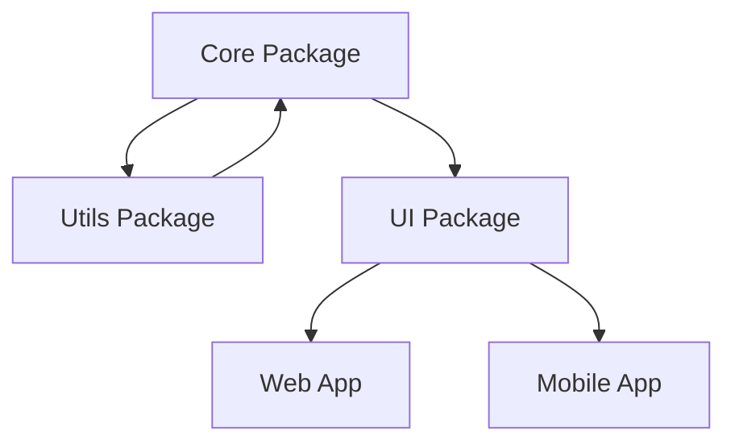
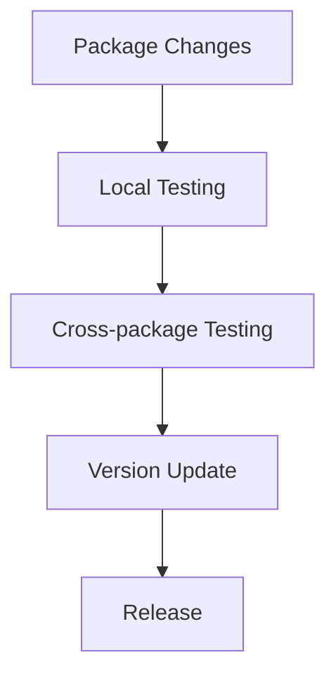
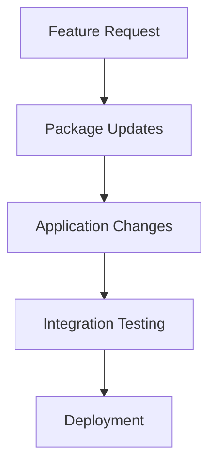
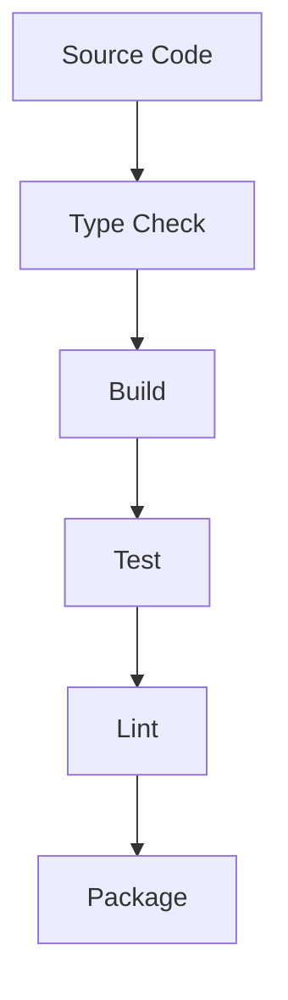

# Monorepo Architecture

## Overview
This document outlines the architectural design of the Jadugar monorepo, describing how packages and applications are organized and interact with each other.

## Architecture Principles

### 1. Package-First Design
- Independent, focused packages
- Clear package boundaries
- Minimal cross-package dependencies
- Shared type definitions

### 2. Parallel Development
- Independent package development
- Cross-package integration testing
- Flexible development order
- Coordinated releases

### 3. Cross-Platform Architecture
- Shared core packages
- Platform-specific adaptations
- Unified type system
- Consistent API design

## Repository Structure

### 1. Package Organization

### 2. Package Responsibilities

#### Core Packages
1. **@jadugar/utils**
   - Utility functions
   - Type definitions
   - Constants
   - Testing utilities

2. **@jadugar/core**
   - Business logic
   - Service layer
   - API interfaces
   - State management

3. **@jadugar/ui**
   - Component library
   - Styling system
   - Hooks
   - Platform adaptations

### Applications
1. **@jadugar/web**
   - Next.js application
   - Web-specific features
   - SSR optimization
   - Web routes

2. **@jadugar/mobile**
   - React Native application
   - Native features
   - Mobile navigation
   - Platform APIs

## Development Workflow

### 1. Package Development

### 2. Application Development

## Build System

### 1. Turborepo Pipeline

### 2. Cache Strategy
- Intelligent cache invalidation
- Shared remote cache
- Workspace-aware caching
- Dependency-based cache

## Testing Strategy

### 1. Package Testing
- Unit tests per package
- Integration tests
- Type testing
- API contracts

### 2. Cross-package Testing
- Integration suites
- E2E workflows
- Performance testing
- Breaking changes

## Deployment Strategy

### 1. Package Publishing
- Semantic versioning
- Changeset tracking
- Release notes
- Version constraints

### 2. Application Deployment
- Environment configuration
- Build optimization
- Deployment verification
- Rollback strategy

## Quality Gates

### 1. Package Quality
- TypeScript strict mode
- Test coverage
- Documentation
- API stability

### 2. Build Quality
- Zero type errors
- Passing tests
- Performance benchmarks
- Bundle size limits

## Resources
- [Turborepo Documentation](https://turborepo.org/docs)
- [Yarn Workspaces Guide](https://yarnpkg.com/features/workspaces)
- [TypeScript Project References](https://www.typescriptlang.org/docs/handbook/project-references.html)
- [Changesets Documentation](https://github.com/changesets/changesets)
