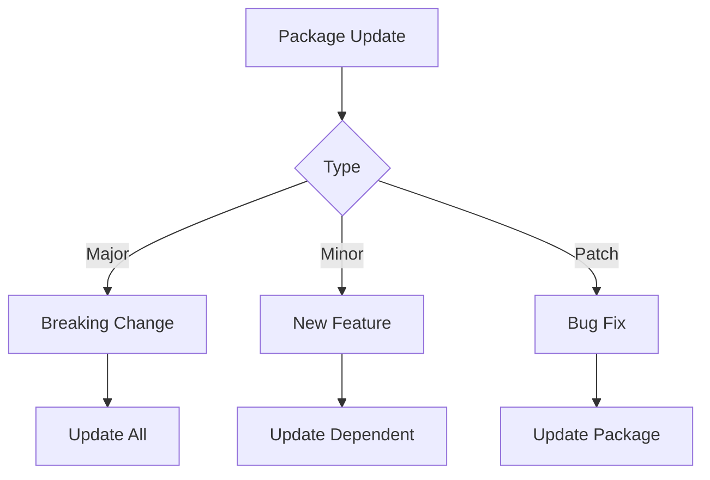
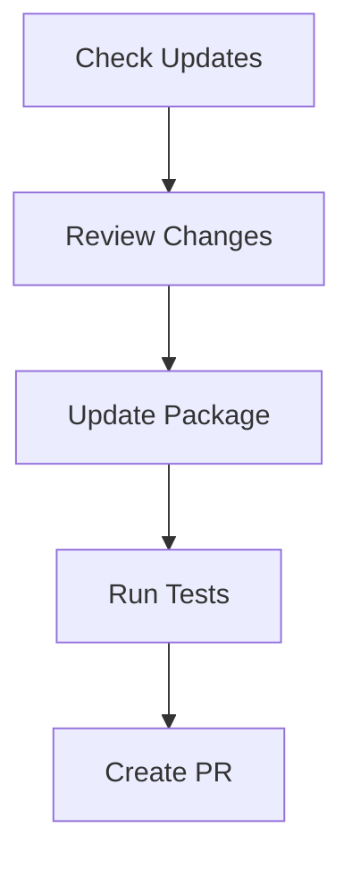
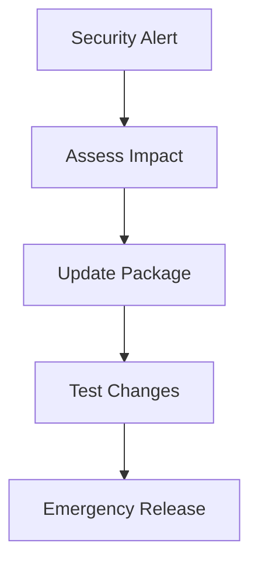

# Package Dependencies

## Overview
This document details the dependency management strategy for the Jadugar monorepo, ensuring consistent and maintainable dependencies across all packages and applications.

## Workspace Dependencies

### 1. Root Dependencies
```json
{
  "dependencies": {
    "typescript": "^5.0.0",
    "turbo": "^1.10.0"
  },
  "devDependencies": {
    "@changesets/cli": "^2.26.0",
    "eslint": "^8.0.0",
    "prettier": "^3.0.0"
  }
}
```

### 2. Shared Dependencies
Dependencies that should be consistent across all packages:

```json
{
  "dependencies": {
    "react": "^18.2.0",
    "react-dom": "^18.2.0"
  },
  "devDependencies": {
    "@types/react": "^18.2.0",
    "@types/react-dom": "^18.2.0",
    "jest": "^29.0.0",
    "@testing-library/react": "^14.0.0"
  }
}
```

## Package-Specific Dependencies

### 1. Core Package (@jadugar/core)
```json
{
  "dependencies": {
    "zod": "^3.0.0",
    "date-fns": "^2.30.0",
    "axios": "^1.0.0"
  }
}
```

### 2. UI Package (@jadugar/ui)
```json
{
  "dependencies": {
    "styled-components": "^6.0.0",
    "framer-motion": "^10.0.0",
    "react-aria": "^3.0.0"
  }
}
```

### 3. Web Application (@jadugar/web)
```json
{
  "dependencies": {
    "next": "^14.0.0",
    "@jadugar/core": "workspace:*",
    "@jadugar/ui": "workspace:*"
  }
}
```

### 4. Mobile Application (@jadugar/mobile)
```json
{
  "dependencies": {
    "react-native": "^0.72.0",
    "@jadugar/core": "workspace:*",
    "@jadugar/ui": "workspace:*"
  }
}
```

## Dependency Management

### 1. Version Control


### 2. Update Strategy
- Use workspace protocol for internal dependencies
- Keep external dependencies minimal
- Update in batches with changesets
- Test all affected packages

## Version Constraints

### 1. Internal Dependencies
- Use workspace protocol (`workspace:*`)
- Update together with changesets
- Track breaking changes
- Maintain compatibility

### 2. External Dependencies
- Lock major versions
- Update minor versions regularly
- Review security updates
- Test thoroughly

## Update Process

### 1. Regular Updates


### 2. Security Updates


## Best Practices

### 1. Dependency Selection
- Prefer established packages
- Check bundle impact
- Review security history
- Consider maintenance status

### 2. Version Management
- Use semantic versioning
- Document breaking changes
- Maintain changelogs
- Test thoroughly

### 3. Security
- Regular audits
- Automated updates
- Security scanning
- Vulnerability tracking

## Tools and Resources

### 1. Dependency Tools
- Yarn (package management)
- Changesets (versioning)
- Dependabot (security)
- Bundle analyzer

### 2. Documentation
- [Yarn Workspaces](https://yarnpkg.com/features/workspaces)
- [Semantic Versioning](https://semver.org/)
- [Changesets Guide](https://github.com/changesets/changesets)
- [Package Security](https://docs.npmjs.com/auditing-package-dependencies-for-security-vulnerabilities)
