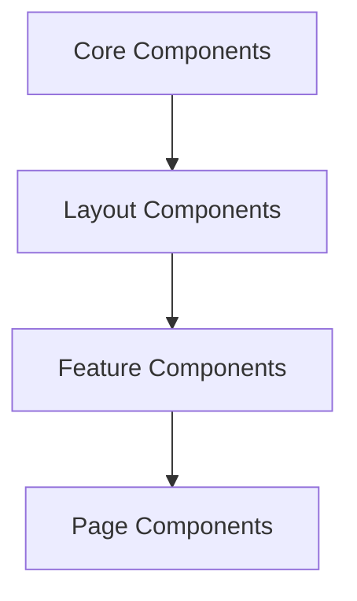
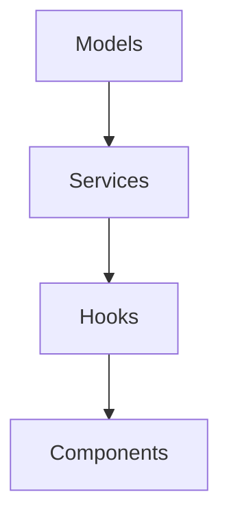
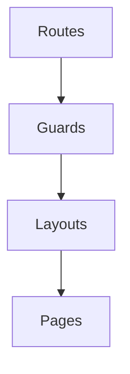

# Design Patterns

## Overview
This document outlines the design patterns and architectural decisions for the Jadugar project, ensuring consistency and maintainability.

## Core Patterns

### 1. Component Pattern
```typescript
// Base component pattern
interface Props {
  children?: React.ReactNode;
  style?: ViewStyle;
  testID?: string;
}

const Component: React.FC<Props> = ({
  children,
  style,
  testID
}) => {
  return (
    <View style={[styles.container, style]} testID={testID}>
      {children}
    </View>
  );
};

const styles = StyleSheet.create({
  container: {
    // Base styles
  }
});
```

### 2. Hook Pattern
```typescript
// Custom hook pattern
function useFeature<T>(config: Config): {
  data: T | null;
  loading: boolean;
  error: Error | null;
} {
  const [data, setData] = useState<T | null>(null);
  const [loading, setLoading] = useState(true);
  const [error, setError] = useState<Error | null>(null);

  useEffect(() => {
    // Implementation
  }, [config]);

  return { data, loading, error };
}
```

### 3. Service Pattern
```typescript
// Service interface pattern
interface Service<T> {
  get(id: string): Promise<T>;
  list(params: QueryParams): Promise<T[]>;
  create(data: Partial<T>): Promise<T>;
  update(id: string, data: Partial<T>): Promise<T>;
  delete(id: string): Promise<void>;
}
```

## Implementation Guidelines

### 1. Component Structure
```
components/
├── core/           # Basic components
│   ├── Button/
│   │   ├── index.tsx
│   │   ├── styles.ts
│   │   └── types.ts
│   └── Text/
├── composite/      # Combined components
│   └── Card/
└── features/       # Feature components
    └── Auth/
```

### 2. State Management
```typescript
// Context pattern
interface State {
  // State definition
}

interface Actions {
  // Action definitions
}

const Context = React.createContext<{
  state: State;
  dispatch: React.Dispatch<Actions>;
} | undefined>(undefined);

function Provider({ children }: { children: React.ReactNode }) {
  // Provider implementation
}
```

### 3. Error Handling
```typescript
// Error boundary pattern
class ErrorBoundary extends React.Component<Props, State> {
  static getDerivedStateFromError(error: Error) {
    return { hasError: true, error };
  }

  componentDidCatch(error: Error, errorInfo: React.ErrorInfo) {
    // Log error
  }

  render() {
    if (this.state.hasError) {
      return <ErrorView error={this.state.error} />;
    }
    return this.props.children;
  }
}
```

## Pattern Categories

### 1. UI Patterns


1. **Core Components**
   - Pure presentation
   - No business logic
   - Reusable styles

2. **Layout Components**
   - Structure definition
   - Responsive design
   - Component composition

3. **Feature Components**
   - Business logic
   - State management
   - User interaction

### 2. Data Patterns


1. **Models**
   - Type definitions
   - Validation rules
   - Data transformations

2. **Services**
   - API integration
   - Data operations
   - Error handling

3. **Hooks**
   - Data access
   - State management
   - Side effects

### 3. Navigation Patterns


## Best Practices

### 1. Component Design
- Single responsibility
- Prop type validation
- Default props
- Error boundaries

### 2. State Management
- Local state first
- Context for sharing
- Props for configuration
- Derived state

### 3. Performance
- Memoization
- Lazy loading
- Code splitting
- Virtual lists

## Anti-Patterns to Avoid

### 1. Component Anti-Patterns
```typescript
// ❌ Avoid
const BadComponent = (props: any) => {
  // Direct DOM manipulation
  // Mixed responsibilities
  // Inline styles
};

// ✅ Use
interface Props {
  // Typed props
}

const GoodComponent: React.FC<Props> = ({ prop }) => {
  // Clean implementation
};
```

### 2. State Anti-Patterns
```typescript
// ❌ Avoid
const BadState = () => {
  // Global state for everything
  // Prop drilling
  // Unnecessary state
};

// ✅ Use
const GoodState = () => {
  // Local state when possible
  // Context for shared state
  // Derived state
};
```

### 3. Performance Anti-Patterns
```typescript
// ❌ Avoid
const BadPerformance = () => {
  // New object references
  // Inline handlers
  // Unnecessary renders
};

// ✅ Use
const GoodPerformance = () => {
  // Memoized values
  // Stable references
  // Optimized renders
};
```

## Verification Checklist
- [ ] Components follow patterns
- [ ] State management consistent
- [ ] Error handling implemented
- [ ] Types properly defined
- [ ] Performance optimized
- [ ] Documentation complete

## Next Steps
1. Implement pattern library
2. Create component templates
3. Set up linting rules

## Resources
- [React Patterns](https://reactpatterns.com/)
- [TypeScript Patterns](https://www.typescriptlang.org/docs/handbook/2/classes.html)
- [React Native Patterns](https://reactnative.dev/docs/performance)
