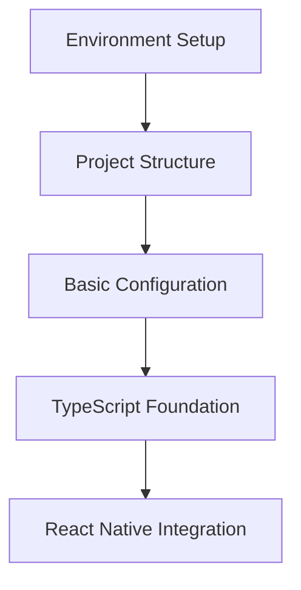

# Phase 1: Foundation Roadmap

## Overview
This roadmap provides a detailed A->B->C progression for Phase 1 implementation, ensuring a methodical approach to building the foundation.

## Dependencies

## Step-by-Step Progression

### A → B: Environment to Structure
1. **Verify Environment**
   - All tools installed
   - Versions correct
   - Editor ready

2. **Create Structure**
   - Initialize directories
   - Set up monorepo
   - Configure workspaces

### B → C: Structure to Configuration
1. **Verify Structure**
   - All directories present
   - Git initialized
   - Packages defined

2. **Configure System**
   - Next.js setup
   - Environment files
   - Build configuration

### C → D: Configuration to TypeScript
1. **Verify Configuration**
   - Development server running
   - Build process working
   - Scripts executing

2. **TypeScript Setup**
   - Base configuration
   - Type definitions
   - Platform support

### D → E: TypeScript to React Native
1. **Verify TypeScript**
   - Type checking passing
   - Definitions working
   - Platform types ready

2. **React Native Setup**
   - Web integration
   - Component system
   - Platform detection

## Verification Points

### A. Environment
- [ ] Node.js version check
- [ ] Yarn version check
- [ ] Git configuration
- [ ] Editor extensions

### B. Structure
- [ ] Directory tree check
- [ ] Package.json validation
- [ ] Workspace configuration
- [ ] Git initialization

### C. Configuration
- [ ] Next.js running
- [ ] Environment loaded
- [ ] Build successful
- [ ] Scripts working

### D. TypeScript
- [ ] Compilation clean
- [ ] Types resolved
- [ ] Paths working
- [ ] Platform types

### E. React Native
- [ ] Web compatibility
- [ ] Component rendering
- [ ] Style system
- [ ] Platform detection

## Critical Path
1. Environment must be 100% verified
2. Structure must be complete and stable
3. Configuration must be working end-to-end
4. TypeScript must be fully configured
5. React Native must be web-compatible

## Risk Mitigation
- Verify each step thoroughly
- Document all configurations
- Test cross-platform compatibility
- Maintain clean interfaces

## Success Criteria
- All verifications passing
- No TypeScript errors
- Clean build process
- Working development server
- Documented progression
