# Development Principles

See our [Principles Checklist](./checklists/principles-checklist.md) for a comprehensive implementation guide.

## Development Order and Dependencies

### 1. Bottom-Up Development
We follow a bottom-up development approach that ensures stability while maintaining flexibility:

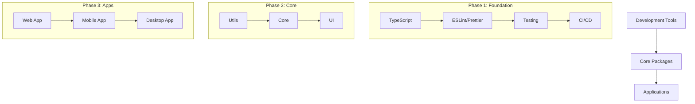

#### Foundation First
- Start with essential development tools and configurations
  - TypeScript setup for type safety
  - ESLint and Prettier for code quality
  - Jest for testing infrastructure
- Establish CI/CD pipelines early
- Set up monitoring and logging infrastructure

#### Core Package Development
- Build and stabilize core packages before dependent ones
- Focus on shared utilities and common functionality
- Establish clear APIs and documentation
- Implement comprehensive test coverage

#### Application Layer
- Build applications only after core packages are stable
- Implement features iteratively based on core functionality
- Focus on end-user value and experience

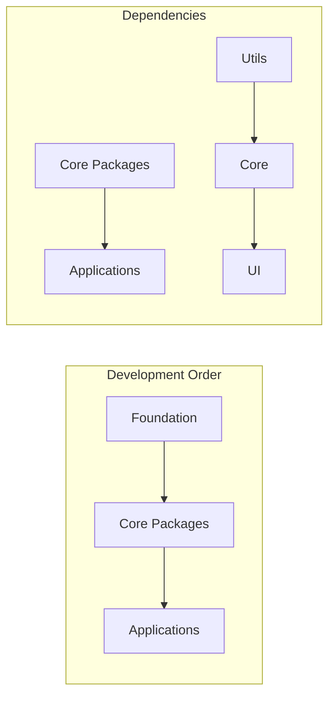

### 2. Dependency Chain Management
Our dependency chain follows a clear, logical progression while allowing parallel development where appropriate:

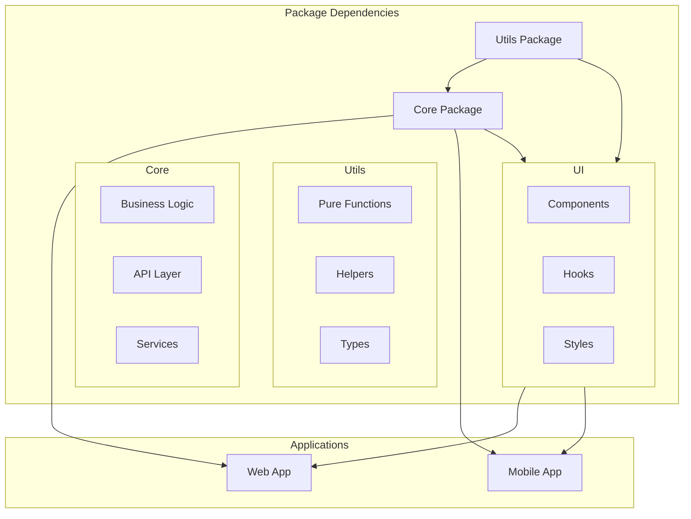

#### Package Hierarchy
- **Utils**: Base utilities and helpers
  - Pure functions and basic tools
  - No external dependencies
  - Highly reusable components
- **Core**: Essential business logic
  - Depends only on Utils
  - Implements core business rules
  - Provides primary APIs
- **UI**: User interface components
  - Built on Core and Utils
  - Platform-agnostic design
  - Consistent styling system

#### Application Structure
- Applications depend on packages, never vice versa
- Clear separation between app-specific and shared code
- Feature-based organization within apps

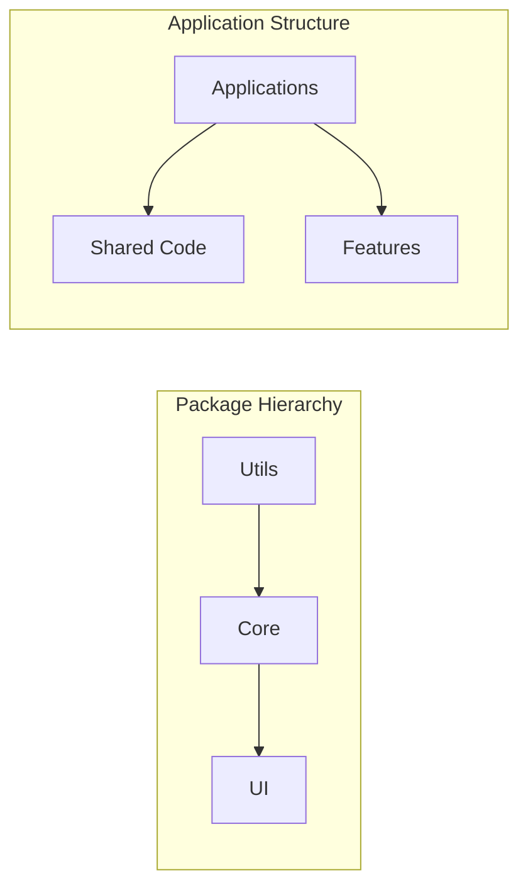

### 3. Tool Integration Strategy
We integrate tools progressively, ensuring each layer is stable before adding complexity:

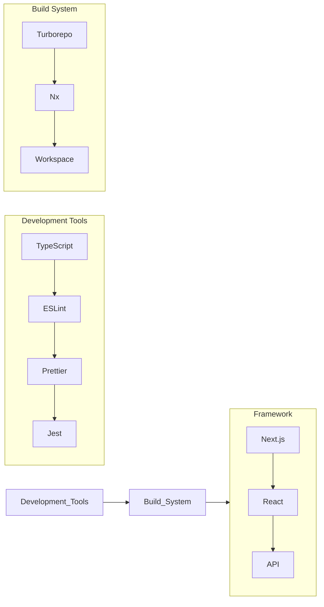

#### Development Tools (Phase 1)
- TypeScript for type safety
- ESLint for code quality
- Prettier for consistent formatting
- Jest for testing
- Git hooks for pre-commit checks

#### Build System (Phase 2)
- Turborepo for monorepo management
- Nx for advanced dependency handling
- Workspace management
- Build caching and optimization

#### Application Framework (Phase 3)
- Next.js for web applications
- React for UI components
- API integration
- Production optimizations

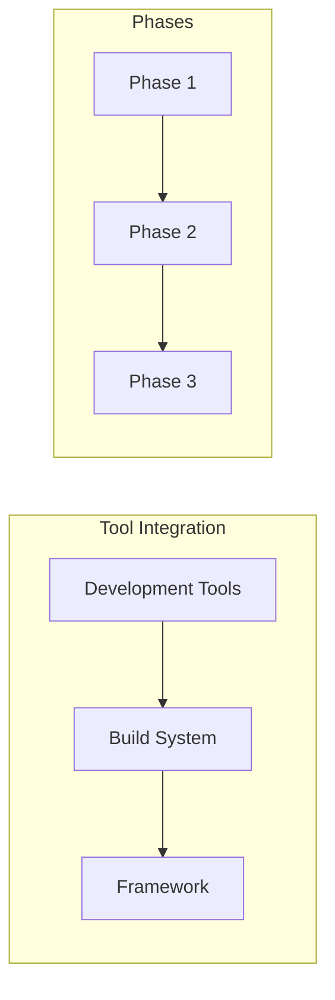

## Type Safety First

### Overview
We prioritize strong typing and compile-time safety over runtime checks.

### Implementation Strategy
- Define explicit interfaces for all data structures
- Use strict TypeScript configuration
- Prefer compile-time errors over runtime errors
- Leverage type inference when it improves readability

### Example
```typescript
// Good: Strong typing with inference
interface EnvironmentConfig {
  nodeEnv: string;
  port: number;
}

// Bad: Loose typing
const config: any = {
  nodeEnv: process.env.NODE_ENV,
  port: process.env.PORT
};
```

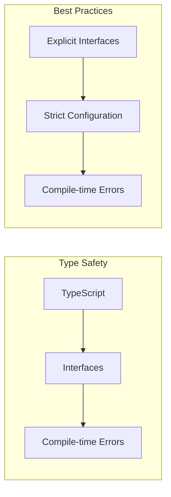

### Additional Examples
```typescript
// Good: Proper type narrowing
type ConfigValue = string | number;

function isNumberConfig(value: ConfigValue): value is number {
  return typeof value === 'number';
}

// Good: Generic constraints
interface ConfigGetter<T> {
  get<K extends keyof T>(key: K): T[K];
}

// Good: Union types with validation
type NodeEnv = 'development' | 'production' | 'test';
function validateNodeEnv(env: string): env is NodeEnv {
  return ['development', 'production', 'test'].includes(env);
}
```

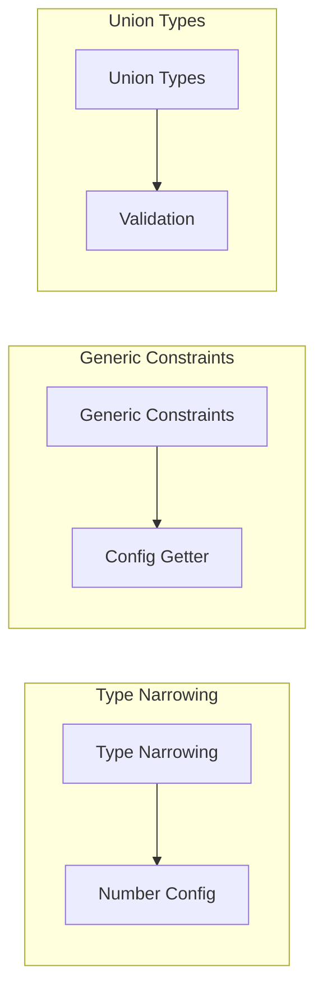

## Single Responsibility Principle

### Overview
Each module, class, or function should have one clear purpose.

### Implementation Strategy
- Keep files focused and concise
- Clear naming that reflects purpose
- Separate concerns appropriately
- Colocate related code

### Example
```typescript
// Good: Clear, single responsibility
class Environment {
  getConfig(): EnvironmentConfig { ... }
}

// Bad: Mixed responsibilities
class Environment {
  getConfig(): EnvironmentConfig { ... }
  validateTypeScript(): void { ... }
  setupDevTools(): void { ... }
}
```

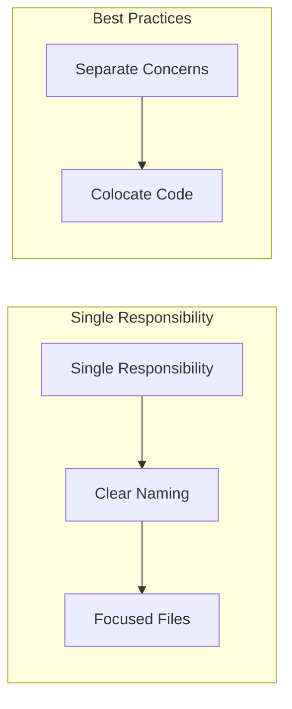

### Additional Examples
```typescript
// Good: Feature-based organization
/src
  /config
    environment.ts       // Environment configuration only
    types.ts            // Related types
    __tests__/          // Colocated tests
  /auth
    authenticator.ts    // Authentication only
    permissions.ts      // Permissions only
  /api
    endpoints.ts        // API endpoints
    validation.ts       // Request validation
```

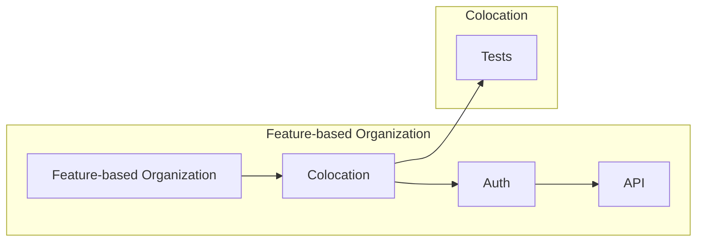

## Test-Driven Development

### Overview
We write tests first to drive design and ensure reliability.

### Implementation Strategy
- Write tests before implementation
- Maintain high test coverage
- Test edge cases thoroughly
- Use meaningful test descriptions

### Example
```typescript
describe('Environment', () => {
  it('should use default values when env vars not set', () => {
    const env = Environment.getInstance();
    expect(env.get('port')).toBe(3000);
  });
});
```

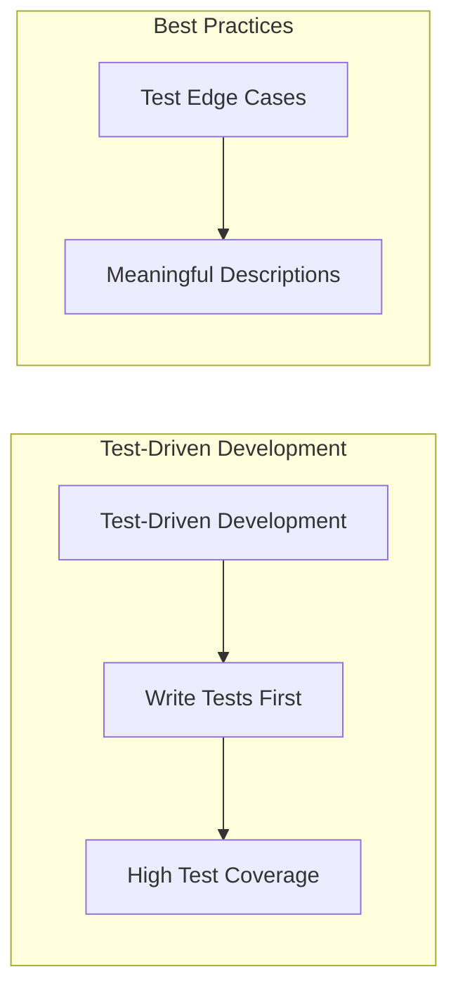

### Additional Examples
```typescript
describe('Environment', () => {
  // Good: Testing edge cases
  it('should handle missing environment variables', () => {
    delete process.env.PORT;
    const env = Environment.getInstance();
    expect(env.get('port')).toBe(3000);
  });

  // Good: Testing error conditions
  it('should throw on invalid port number', () => {
    process.env.PORT = 'invalid';
    expect(() => Environment.getInstance())
      .toThrow('Invalid port configuration');
  });

  // Good: Testing immutability
  it('should prevent configuration modification', () => {
    const env = Environment.getInstance();
    const config = env.getConfig();
    expect(() => {
      (config as any).port = 8080;
    }).toThrow(TypeError);
  });
});
```

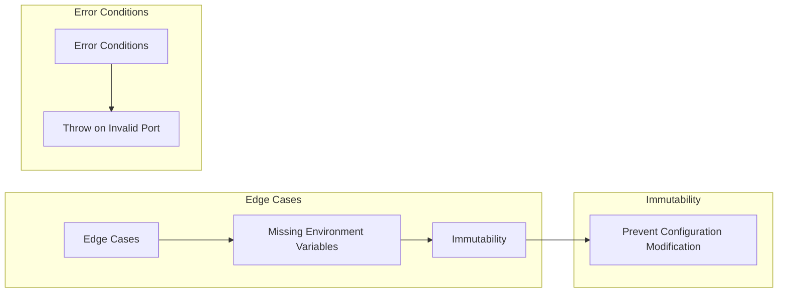

## API Design

### Overview
We design APIs that are intuitive, consistent, and type-safe.

### Implementation Strategy
- Use builder patterns for complex objects
- Provide fluent interfaces where appropriate
- Make illegal states unrepresentable
- Design for extensibility without premature abstraction

### Examples
```typescript
// Good: Builder pattern with type safety
interface ServerConfig {
  port: number;
  host: string;
  ssl?: {
    cert: string;
    key: string;
  };
}

class ServerConfigBuilder {
  private config: Partial<ServerConfig> = {};

  withPort(port: number): this {
    this.config.port = port;
    return this;
  }

  withHost(host: string): this {
    this.config.host = host;
    return this;
  }

  withSSL(cert: string, key: string): this {
    this.config.ssl = { cert, key };
    return this;
  }

  build(): ServerConfig {
    if (!this.config.port || !this.config.host) {
      throw new Error('Port and host are required');
    }
    return this.config as ServerConfig;
  }
}

// Good: Make invalid states unrepresentable
type Success<T> = { type: 'success'; data: T };
type Error = { type: 'error'; message: string };
type Result<T> = Success<T> | Error;

function getConfig(): Result<ServerConfig> {
  try {
    return {
      type: 'success',
      data: new ServerConfigBuilder()
        .withPort(3000)
        .withHost('localhost')
        .build()
    };
  } catch (e) {
    return {
      type: 'error',
      message: e instanceof Error ? e.message : 'Unknown error'
    };
  }
}

// Usage with type safety
const result = getConfig();
if (result.type === 'success') {
  // TypeScript knows result.data is ServerConfig
  startServer(result.data);
} else {
  // TypeScript knows result.message is string
  logError(result.message);
}
```

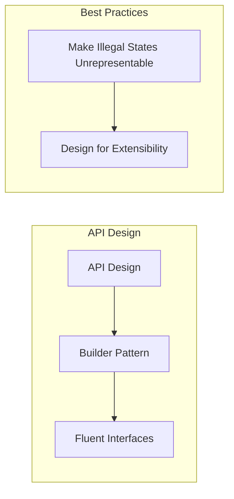

## Immutability

### Overview
We prefer immutable data structures and clear state management.

### Implementation Strategy
- Make objects immutable after creation
- Use readonly properties where appropriate
- Return new objects instead of modifying existing ones
- Freeze objects when needed

### Example
```typescript
// Good: Immutable configuration
class Environment {
  private readonly config: Readonly<EnvironmentConfig>;
}

// Bad: Mutable state
class Environment {
  private config: EnvironmentConfig;
  public updateConfig(key: string, value: any) { ... }
}
```

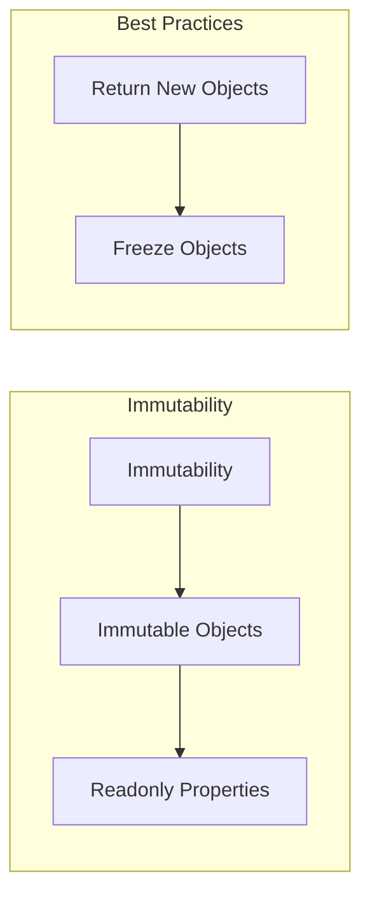

## Error Handling

### Overview
We handle errors explicitly and provide clear error messages.

### Implementation Strategy
- Use typed errors when possible
- Provide meaningful error messages
- Handle edge cases explicitly
- Document error scenarios

### Example
```typescript
// Good: Clear error handling
if (!(key in this.config)) {
  throw new Error(`Configuration key not found: ${key}`);
}

// Bad: Generic errors
if (!config) throw new Error('Invalid config');
```

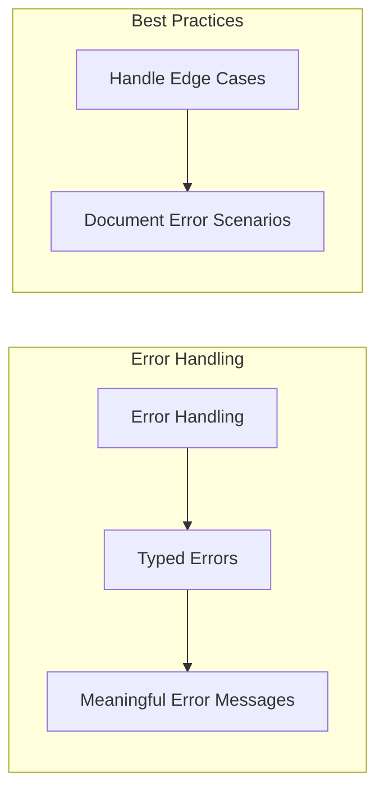

## Bottom-Up Problem Solving

### Overview
We solve problems from the bottom up, ensuring foundational components are solid before building higher-level features.

### Implementation Strategy
- Fix low-level issues before addressing higher-level symptoms
- Ensure core utilities and services are robust
- Test components in isolation before integration
- Address root causes, not just symptoms

### Examples
```typescript
// Bad: Addressing symptoms at a high level
class UserService {
  async getUser(id: string) {
    try {
      const user = await this.userRepo.findById(id);
      // Handling database connection issues here
      if (!user) this.handleDatabaseError();
      return user;
    } catch (e) {
      // Generic error handling
      this.logger.error('User fetch failed');
    }
  }
}

// Good: Fixing the root cause at the database level
class DatabaseConnection {
  private retryCount = 3;
  
  async query<T>(sql: string): Promise<T> {
    for (let i = 0; i < this.retryCount; i++) {
      try {
        return await this.executeQuery(sql);
      } catch (e) {
        if (this.isConnectionError(e) && i < this.retryCount - 1) {
          await this.reconnect();
          continue;
        }
        throw new DatabaseError('Query failed', { cause: e });
      }
    }
    throw new DatabaseError('Max retries exceeded');
  }
}
```

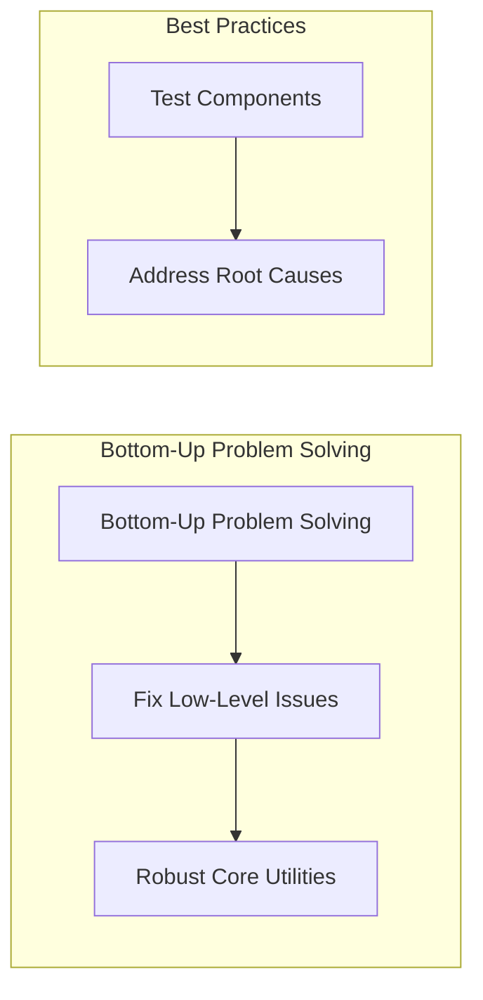

## Data Minimization

### Overview
We follow strict data minimization principles, storing only data that is essential for application functionality and health monitoring.

### Implementation Strategy
- Store only essential operational data
- Implement automatic data cleanup
- Use ephemeral storage where possible
- Clear data retention policies

### Examples
```typescript
// Good: Clear data lifecycle
interface OperationalMetric {
  timestamp: Date;
  metricType: 'health' | 'performance';
  value: number;
  retentionPeriod: number; // in days
}

class MetricsManager {
  async recordMetric(metric: OperationalMetric): Promise<void> {
    await this.store.save(metric);
    await this.scheduleCleanup(metric);
  }

  private async scheduleCleanup(metric: OperationalMetric): Promise<void> {
    const cleanupDate = new Date(
      metric.timestamp.getTime() + 
      metric.retentionPeriod * 24 * 60 * 60 * 1000
    );
    await this.cleanupScheduler.schedule(
      `cleanup-${metric.metricType}`,
      cleanupDate
    );
  }
}

// Good: Ephemeral session data
class SessionManager {
  private readonly sessions = new Map<string, Session>();
  
  createSession(userId: string): Session {
    const session = {
      id: crypto.randomUUID(),
      created: new Date(),
      expiresIn: 3600 // 1 hour
    };
    this.sessions.set(session.id, session);
    return session;
  }

  cleanup(): void {
    const now = new Date();
    for (const [id, session] of this.sessions) {
      if (this.isExpired(session, now)) {
        this.sessions.delete(id);
      }
    }
  }
}

// Bad: Unnecessary data collection
class UserAnalytics {
  // Don't track unnecessary user behavior
  trackUserJourney(userId: string): void {
    this.store.save({
      userId,
      clicks: [],
      pageViews: [],
      timeSpent: {},
    });
  }
}
```

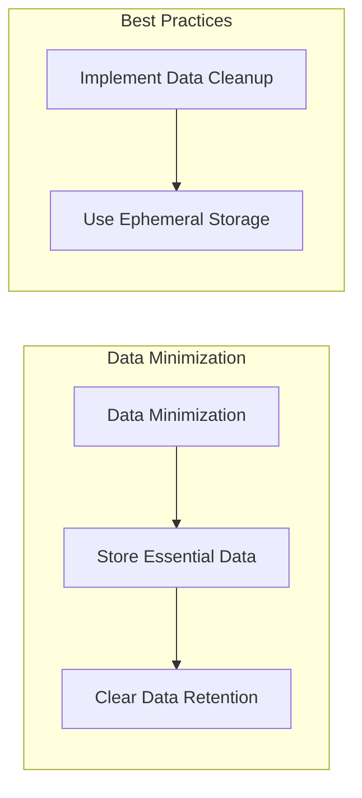

### Benefits
1. Privacy and Security
   - Reduced attack surface
   - Minimized sensitive data exposure
   - Simplified compliance (GDPR, CCPA)

2. Performance
   - Lower storage requirements
   - Faster data operations
   - Reduced backup complexity

3. Maintenance
   - Clearer data lifecycles
   - Simpler data models
   - Easier system updates

This principle complements our YAGNI approach by ensuring we only store what we absolutely need for functionality.

## Project Structure Principles

### Core Project Code
Core project code that is fundamental to Jadugar's operation lives in `src/core`. This includes:

1. Configuration System (`src/core/config`)
   - Essential to project operation
   - Not meant to be shared/published
   - Project-specific implementation

2. Directory Structure
```
jadugar/
├── src/
│   └── core/         # Core project functionality
│       └── config/   # Configuration system
├── apps/            # Application-specific code
│   ├── api/         # Backend API
│   ├── mobile/      # Mobile application
│   └── web/         # Web frontend
└── packages/        # Shared, publishable packages
    ├── core/        # Core shared utilities
    └── shared/      # Common components
```

3. Path Aliases
   - `@core/*` - Core project code
   - `@config/*` - Configuration system
   - `@jadugar/*` - Shared packages
   - `@types/*` - Type definitions

### Rationale
1. Co-location: Core code lives with its primary use
2. Clarity: Clear separation between project code and shared packages
3. Simplicity: Minimal package overhead for core functionality
4. Maintainability: Easier testing and development workflow

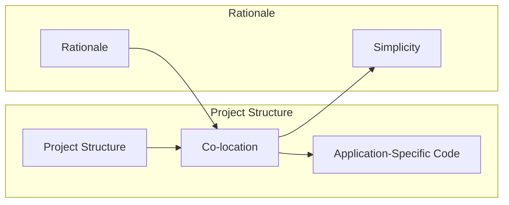

## Principled Deviations

While we strive to maintain our core principles of data minimization, type safety, and simplicity, there are cases where thoughtful deviation is warranted. These deviations must be:

1. **Clearly Justified**: The benefits must be concrete and measurable
2. **Well Contained**: Deviations should not spread beyond their specific use case
3. **Thoroughly Documented**: The rationale must be clear to future maintainers

### Example: Configuration Monitoring

Our configuration system includes monitoring capabilities that add some complexity and state. This is an intentional deviation from our simplicity principle, justified by:

1. **Production Benefits**:
   - Early error detection and diagnosis
   - Performance optimization opportunities
   - Usage pattern insights
   - Improved incident response

2. **Contained Implementation**:
   - Metrics are isolated in dedicated types
   - Core configuration remains immutable
   - Monitoring is separate from business logic
   - Added complexity is encapsulated

3. **Clear Value Proposition**:
   - System reliability is a higher-order concern
   - Benefits outweigh the cost of complexity
   - Monitoring directly improves system health
   - Lack of monitoring would increase operational risk

### Guidelines for Deviation

When considering a deviation from our principles:

1. **Evaluate Necessity**:
   - Is this solving a real, concrete problem?
   - Are there simpler alternatives?
   - What are the costs of not deviating?

2. **Contain Impact**:
   - Keep deviations isolated
   - Prevent complexity spread
   - Maintain clear boundaries

3. **Document Thoroughly**:
   - Explain the rationale
   - Detail the trade-offs
   - Provide concrete benefits
   - Set clear boundaries

4. **Review Regularly**:
   - Reassess the need periodically
   - Look for simplification opportunities
   - Measure actual benefits
   - Consider new alternatives

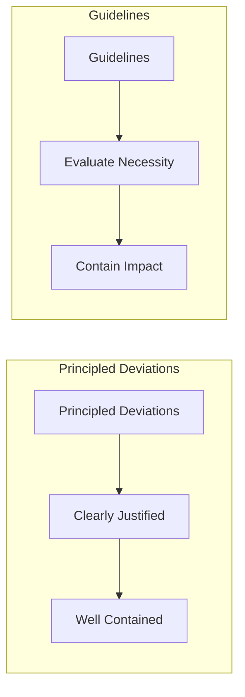

## Documentation

### Overview
We maintain clear, up-to-date documentation that helps developers understand and use our code.

### Implementation Strategy
- Document public APIs
- Keep README files current
- Include examples in documentation
- Document architectural decisions

### Example
```typescript
/**
 * Environment configuration singleton
 * Provides access to environment variables with proper typing and defaults
 */
export class Environment {
  /** Get the singleton instance */
  public static getInstance(): Environment { ... }
}
```

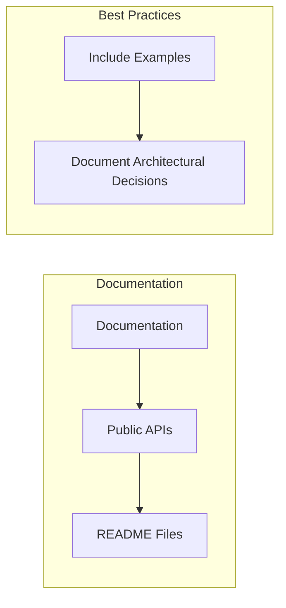

## Code Review Guidelines

### Overview
We maintain code quality through thorough review processes.

### Checklist
1. Type Safety
   - All types are properly defined
   - No unnecessary type assertions
   - Strict mode compliance

2. Testing
   - Tests cover edge cases
   - Clear test descriptions
   - Appropriate mocking

3. Documentation
   - Clear API documentation
   - Updated README if needed
   - Inline comments for complex logic

4. Error Handling
   - Proper error types
   - Meaningful error messages
   - Edge cases covered

5. Performance
   - No unnecessary computations
   - Appropriate data structures
   - Resource cleanup

```mermaid
graph LR
    subgraph "Code Review"
        C[Code Review] --> T[Type Safety]
        T --> E[Error Handling]
    end
    
    subgraph "Checklist"
        L[Checklist] --> P[Performance]
        P --> D[Documentation]
    end
```
