# Development Workflow

## Overview
This document outlines the development workflow for the Jadugar monorepo project, including package management, version control, and resource tracking.

## Development Cycle

### 1. Planning Phase
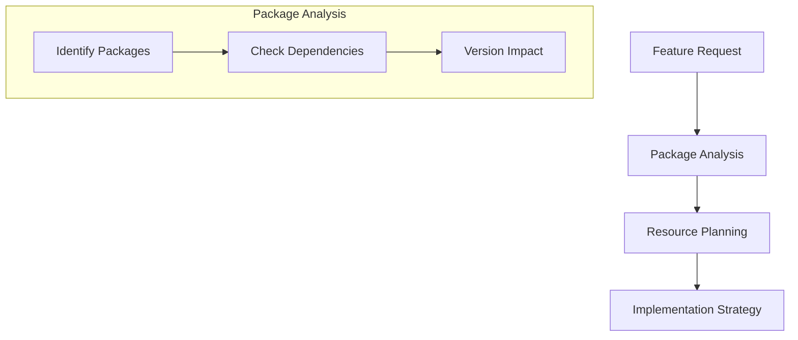

- Package identification
- Resource assessment
- Version planning
- Schedule coordination

### 2. Development Phase
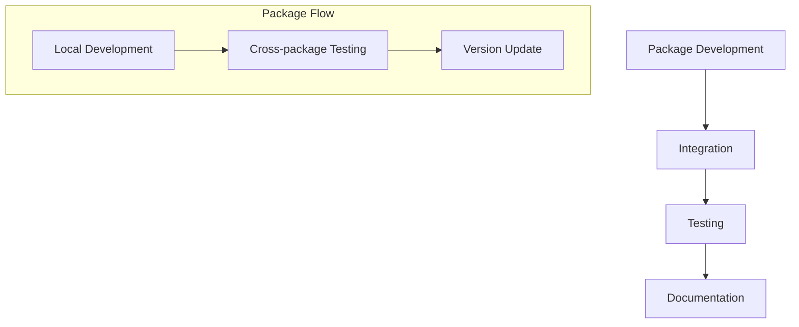

- Package implementation
- Cross-package integration
- Version management
- Documentation updates

### 3. Testing Phase
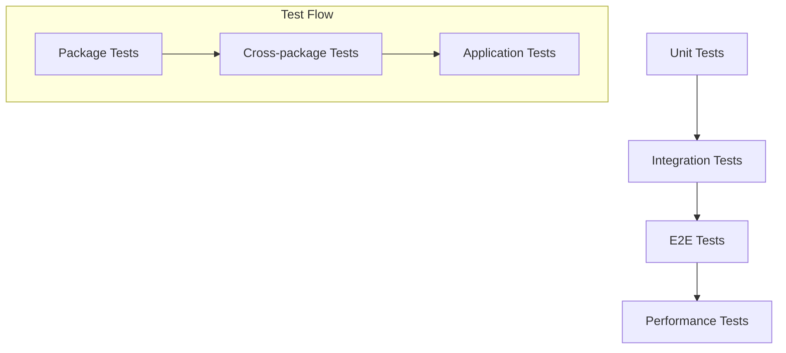

- Package-level testing
- Cross-package testing
- Application testing
- Performance validation

### 4. Review Phase
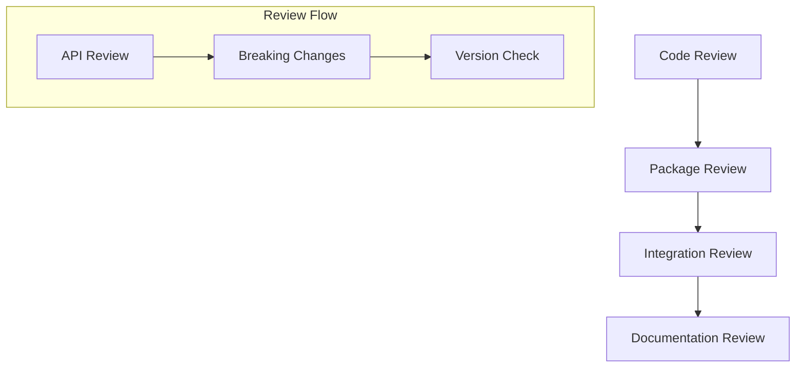

- Code quality
- Package APIs
- Integration points
- Documentation completeness

### 5. Release Phase
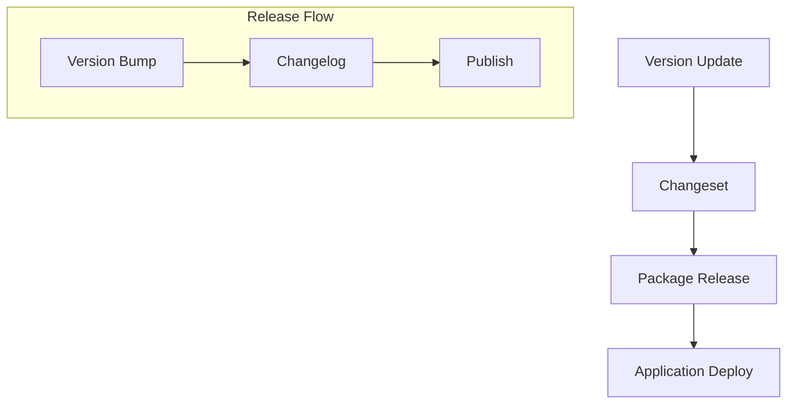

- Version updates
- Changesets
- Package publishing
- Application deployment

## Package Management

### 1. Version Control
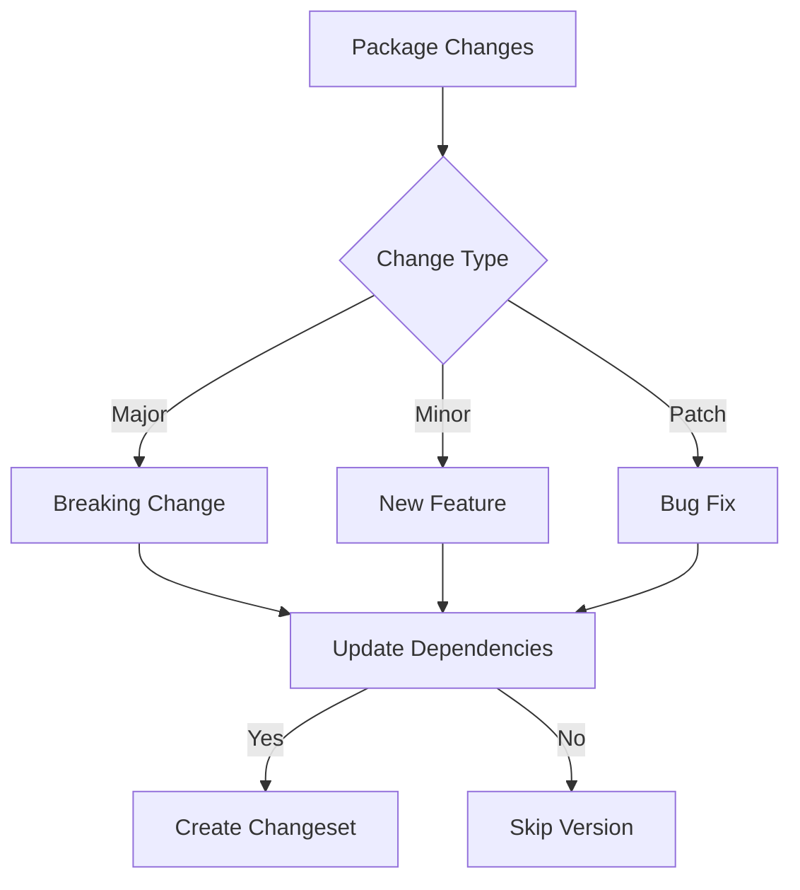

### 2. Dependency Management
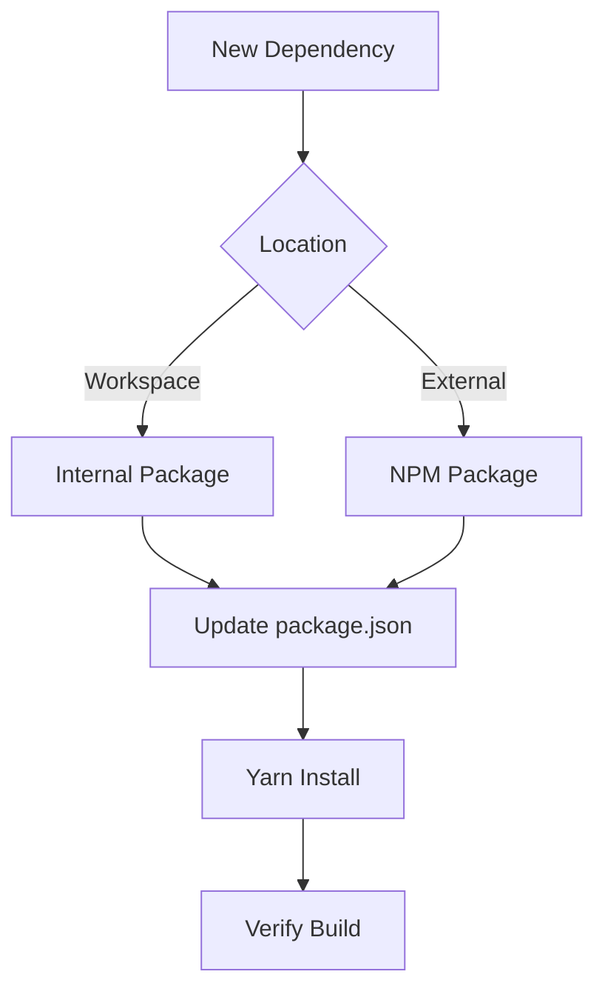

### 3. Resource Tracking
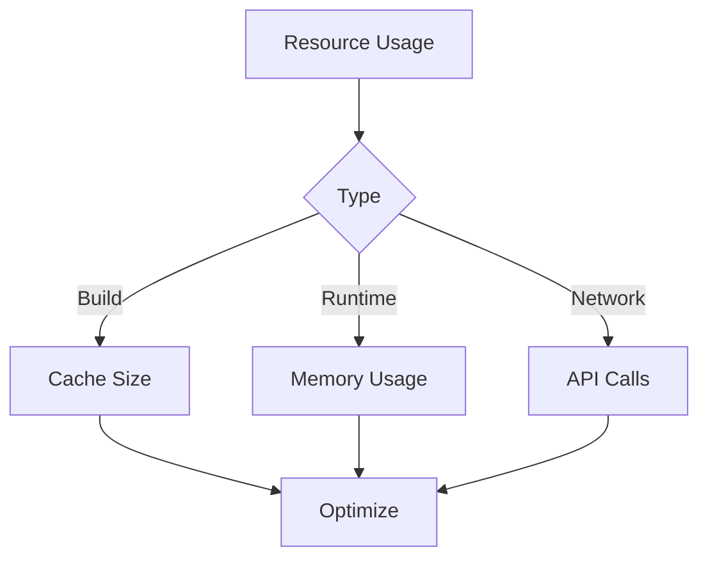

## Quality Gates

### 1. Package Quality
- TypeScript strict mode
- ESLint compliance
- Test coverage
- Documentation

### 2. Integration Quality
- Cross-package tests
- API compatibility
- Breaking changes
- Performance impact

### 3. Release Quality
- Version alignment
- Changeset accuracy
- Release notes
- Deployment verification

## Monitoring

### 1. Build Monitoring
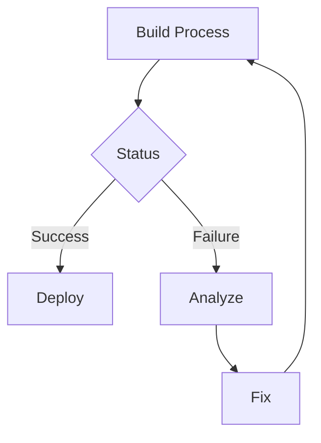

### 2. Runtime Monitoring
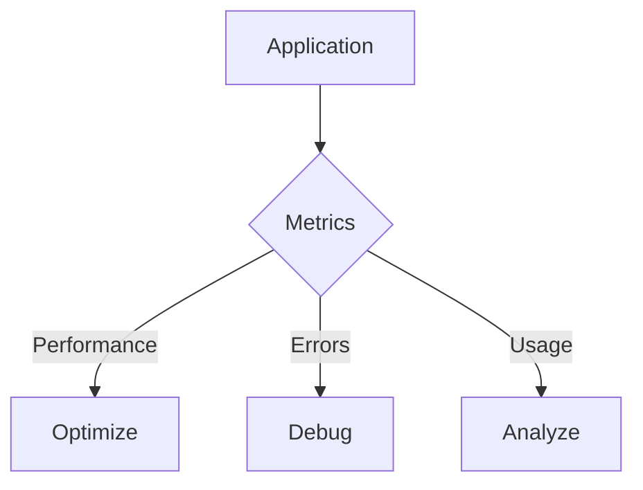

### 3. Package Health
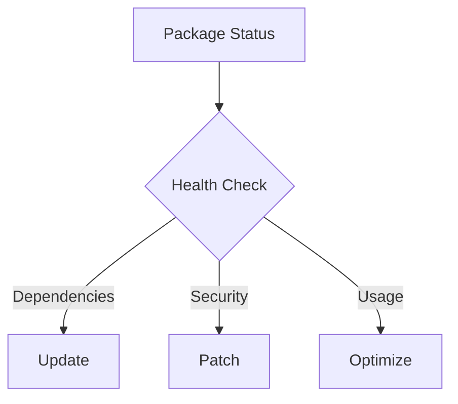

## Best Practices

### 1. Package Development
- Maintain clear APIs
- Version semantically
- Document changes
- Test thoroughly

### 2. Integration
- Check dependencies
- Verify compatibility
- Test cross-package
- Monitor performance

### 3. Deployment
- Use changesets
- Update changelogs
- Verify deployments
- Monitor health

## Resources
- [Turborepo Documentation](https://turborepo.org/docs)
- [Changesets Guide](https://github.com/changesets/changesets)
- [Yarn Workspaces](https://yarnpkg.com/features/workspaces)
