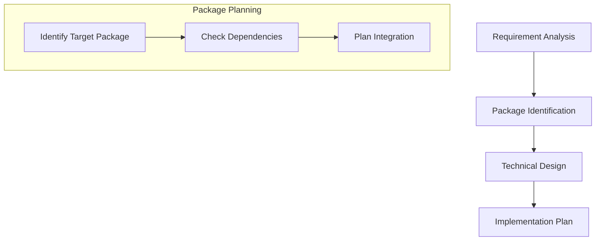

# Development Workflow

## Overview
This document outlines the development workflow for the Jadugar monorepo, ensuring consistent and efficient development practices across all packages and applications.

## Development Cycle

### 1. Feature Planning


1. **Requirement Analysis**
   - Review requirements
   - Identify affected packages
   - Define acceptance criteria

2. **Package Identification**
   - Determine target package(s)
   - Check package dependencies
   - Plan integration points

3. **Technical Design**
   - Design components
   - Plan data flow
   - Define interfaces
   - Document package APIs

### 2. Development Process

#### A. Environment Setup
```bash
# 1. Update main branch
git checkout main
git pull origin main

# 2. Create feature branch
git checkout -b feature/package-name/feature-name

# 3. Install dependencies
yarn install
```

#### B. Package Development
```bash
# 1. Start development
yarn workspace @jadugar/package-name dev

# 2. Run type checking
yarn workspace @jadugar/package-name typecheck

# 3. Run tests
yarn workspace @jadugar/package-name test
```

#### C. Cross-package Development
```bash
# 1. Link packages
yarn install

# 2. Run all affected packages
yarn turbo run dev --filter=@jadugar/package-name...

# 3. Test affected packages
yarn turbo run test --filter=@jadugar/package-name...
```

### 3. Code Organization

#### Package Structure
```typescript
// packages/my-package/
src/
  ├── components/     // React components
  ├── hooks/         // React hooks
  ├── utils/         // Utility functions
  ├── types/         // TypeScript types
  └── index.ts       // Public API
```

#### Application Structure
```typescript
// apps/web/
src/
  ├── pages/         // Next.js pages
  ├── components/    // App-specific components
  ├── features/      // Feature modules
  └── styles/        // App-specific styles
```

### 4. Testing Strategy

#### A. Package Testing
```typescript
// ✅ DO: Test package boundaries
describe('@jadugar/core', () => {
  it('should expose expected API', () => {
    expect(core.initialize).toBeDefined();
  });
});

// ✅ DO: Test integration points
describe('integration', () => {
  it('should work with @jadugar/utils', () => {
    const result = core.process(utils.format(data));
    expect(result).toBeDefined();
  });
});
```

#### B. Application Testing
```typescript
// ✅ DO: Test feature integration
describe('WebApp', () => {
  it('should integrate core package', () => {
    const { result } = renderHook(() => useCore());
    expect(result.current).toBeDefined();
  });
});
```

### 5. Code Review Process

#### Package Changes
- Review package API changes
- Check dependency updates
- Verify test coverage
- Review documentation

#### Application Changes
- Review feature implementation
- Check package integration
- Verify build output
- Test performance impact

### 6. Deployment Process

#### Package Publishing
```bash
# 1. Build packages
yarn turbo run build

# 2. Version packages
yarn changeset

# 3. Review changes
yarn changeset status

# 4. Publish
yarn changeset publish
```

#### Application Deployment
```bash
# 1. Build application
yarn workspace @jadugar/web build

# 2. Run integration tests
yarn workspace @jadugar/web test:integration

# 3. Deploy
yarn workspace @jadugar/web deploy
```

## Best Practices

### 1. Package Development
- Keep packages focused
- Maintain clear APIs
- Document all exports
- Version semantically

### 2. Dependency Management
- Minimize external dependencies
- Use workspace protocol
- Keep dependencies up to date
- Document breaking changes

### 3. Testing
- Write tests first
- Test package boundaries
- Verify integrations
- Maintain coverage

### 4. Performance
- Monitor bundle sizes
- Check build times
- Profile runtime performance
- Optimize critical paths

## Troubleshooting

### Common Issues

#### 1. Build Issues
```bash
# Clear turbo cache
yarn turbo clean

# Clean all builds
yarn clean

# Rebuild everything
yarn build
```

#### 2. Dependency Issues
```bash
# Clear yarn cache
yarn cache clean

# Reset modules
rm -rf node_modules
yarn install
```

#### 3. Type Issues
```bash
# Rebuild types
yarn typecheck

# Clean type cache
find . -name "*.tsbuildinfo" -exec rm {} +
```

## Additional Resources
- [Monorepo Best Practices](../docs/monorepo-guide.md)
- [Package Development Guide](../docs/package-guide.md)
- [Testing Strategy](../docs/testing-guide.md)
