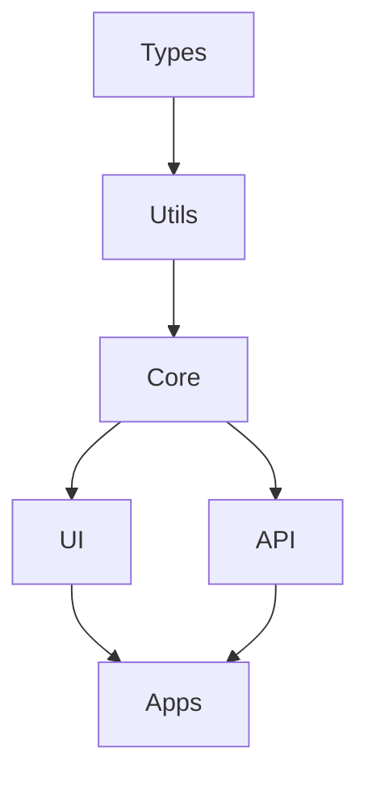
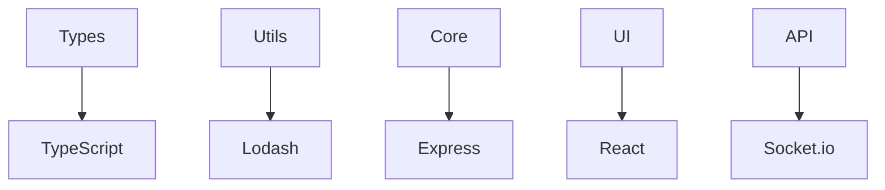

# Jadugar Package Structure

## Overview
Jadugar follows a strict package-first development approach with a clear hierarchy of dependencies.



## Package Hierarchy

### 1. @jadugar/types
```
types/
├── src/
│   ├── index.ts
│   ├── build/              # Build tracking types
│   │   ├── config.ts
│   │   ├── status.ts
│   │   └── events.ts
│   ├── monitoring/         # Monitoring types
│   │   ├── metrics.ts
│   │   ├── alerts.ts
│   │   └── events.ts
│   └── common/            # Shared types
│       ├── errors.ts
│       ├── config.ts
│       └── utils.ts
├── tests/
│   └── unit/
├── docs/
│   └── API.md
└── package.json
```

### 2. @jadugar/utils
```
utils/
├── src/
│   ├── index.ts
│   ├── logging/           # Logging utilities
│   │   ├── logger.ts
│   │   └── formatters.ts
│   ├── validation/        # Data validation
│   │   ├── schemas.ts
│   │   └── validators.ts
│   └── testing/          # Test utilities
│       ├── mocks.ts
│       └── helpers.ts
├── tests/
│   └── unit/
├── docs/
│   └── API.md
└── package.json
```

### 3. @jadugar/core
```
core/
├── src/
│   ├── index.ts
│   ├── build/            # Build tracking
│   │   ├── tracker.ts
│   │   └── analyzer.ts
│   ├── monitoring/       # System monitoring
│   │   ├── collector.ts
│   │   └── reporter.ts
│   └── services/        # Core services
│       ├── auth.ts
│       └── data.ts
├── tests/
│   ├── unit/
│   └── integration/
├── docs/
│   └── API.md
└── package.json
```

### 4. @jadugar/ui
```
ui/
├── src/
│   ├── index.ts
│   ├── components/       # React components
│   │   ├── build/
│   │   ├── monitoring/
│   │   └── common/
│   ├── hooks/           # React hooks
│   │   ├── useBuild.ts
│   │   └── useMonitor.ts
│   └── styles/          # TailwindCSS styles
│       ├── base.css
│       └── components.css
├── tests/
│   ├── unit/
│   └── integration/
├── stories/            # Storybook stories
├── docs/
│   └── API.md
└── package.json
```

### 5. @jadugar/api
```
api/
├── src/
│   ├── index.ts
│   ├── routes/          # API routes
│   │   ├── build.ts
│   │   └── monitor.ts
│   ├── middleware/      # Express middleware
│   │   ├── auth.ts
│   │   └── validation.ts
│   └── services/       # API services
│       ├── build.ts
│       └── monitor.ts
├── tests/
│   ├── unit/
│   └── integration/
├── docs/
│   └── API.md
└── package.json
```

## Dependencies

### Internal Dependencies


### External Dependencies


## Development Order

### 1. Foundation
1. @jadugar/types
   - Define interfaces
   - Create type utilities
   - Document type system

2. @jadugar/utils
   - Implement shared utilities
   - Create helper functions
   - Add validation tools

### 2. Core Systems
3. @jadugar/core
   - Build core logic
   - Implement services
   - Create business rules

### 3. User Interface
4. @jadugar/ui
   - Design components
   - Create hooks
   - Style system

### 4. API Layer
5. @jadugar/api
   - Define routes
   - Implement services
   - Add middleware

## Quality Gates

### 1. Type Safety
- No 'any' types
- Complete interfaces
- Proper generics
- Type documentation

### 2. Testing
- Unit tests: 90%+
- Integration tests
- E2E for critical paths
- Performance tests

### 3. Documentation
- API documentation
- Usage examples
- Type definitions
- Integration guides

### 4. Performance
- Bundle size limits
- Load time targets
- Memory constraints
- Network efficiency

## Package Templates

### Basic Package
```
package/
├── src/
│   ├── index.ts
│   ├── types.ts
│   └── utils/
├── tests/
│   └── index.test.ts
├── docs/
│   └── API.md
└── package.json
```

### UI Package
```
package/
├── src/
│   ├── index.tsx
│   ├── components/
│   ├── hooks/
│   └── styles/
├── tests/
│   └── index.test.tsx
├── stories/
├── docs/
│   └── API.md
└── package.json
```

### API Package
```
package/
├── src/
│   ├── index.ts
│   ├── routes/
│   ├── middleware/
│   └── services/
├── tests/
│   ├── unit/
│   └── integration/
├── docs/
│   └── API.md
└── package.json
```
