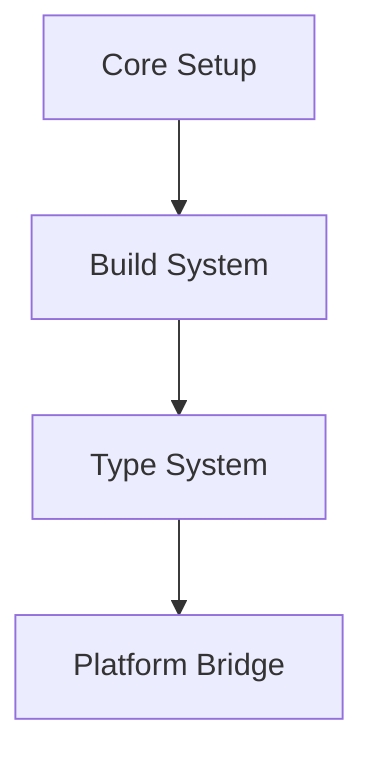
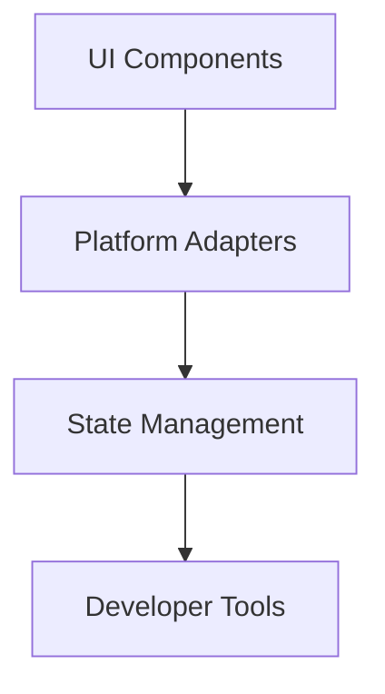
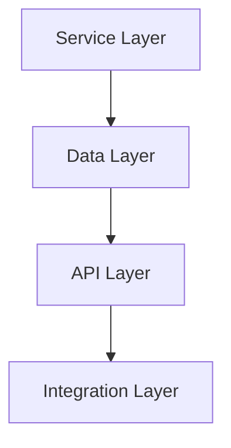
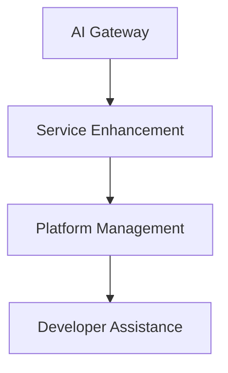

# Architecture Overview

## Introduction
Jadugar is designed as a modular, scalable platform following a phased development approach. This document outlines the core architecture and development phases.

## System Architecture

### Phase 1: Core Platform

#### Components
1. **Core Setup**
   - Environment configuration
   - Project structure
   - Development tools

2. **Build System**
   - Turborepo pipeline
   - Next.js configuration
   - Production optimization

3. **Type System**
   - TypeScript foundation
   - Shared types
   - Platform definitions

4. **Platform Bridge**
   - React Native Web
   - Style system
   - Component adaptation

### Phase 2: Cross-Platform Framework

#### Components
1. **UI Components**
   - Base components
   - Platform-specific components
   - Shared styles

2. **Platform Adapters**
   - Web adapter
   - Mobile adapter
   - Desktop adapter

3. **State Management**
   - Global state
   - Local state
   - Persistence

### Phase 3: Platform Services

#### Components
1. **Service Layer**
   - Core services
   - Business logic
   - Service registry

2. **Data Layer**
   - Data persistence
   - Caching
   - State management

### Phase 4: Future AI Integration

## Implementation Strategy

### Current Focus
1. Core platform functionality
2. Type safety and validation
3. Cross-platform compatibility
4. Developer experience

### Future Extensions
1. AI/LLM integration
2. Advanced analytics
3. Intelligent automation
4. Platform optimization

## Development Principles

### 1. Bottom-Up Development
- Start with stable foundations
- Validate each layer
- Clear dependencies

### 2. Type Safety
- Strict TypeScript
- Complete type coverage
- Runtime validation

### 3. Testing Strategy
- Unit tests
- Integration tests
- E2E tests
- Performance tests

## Quality Gates

### Technical Requirements
- 100% type safety
- Test coverage > 90%
- Response time < 200ms
- Build time < 5 minutes

### Quality Metrics
- All tests passing
- No type errors
- Performance benchmarks met
- Security requirements satisfied

## Next Steps
1. Complete Phase 1 implementation
2. Validate core functionality
3. Begin Phase 2 development
4. Document learnings and adjustments
