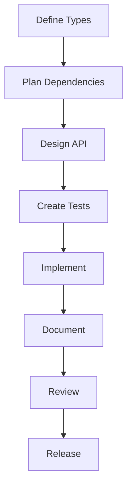
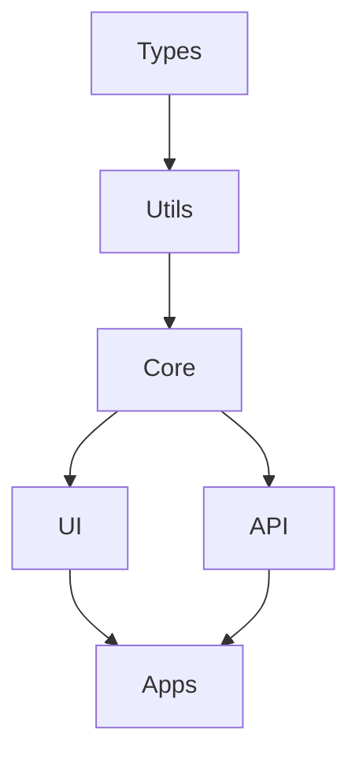

# Table of Contents

## 1. Project Overview
# Jadugar Documentation

## Quick Links
- [Quick Start Guide](./QUICKSTART.md)
- [Package Development](./development/PACKAGE_GUIDE.md)
- [Development Standards](./development/STANDARDS.md)
- [API Documentation](./api/API_DOCUMENTATION.md)
- [Troubleshooting](./troubleshooting/TROUBLESHOOTING_GUIDE.md)

## Package Documentation

### Core Packages
1. [@jadugar/types](./packages/types/README.md)
   - Type definitions
   - Interface contracts
   - Type utilities

2. [@jadugar/utils](./packages/utils/README.md)
   - Shared utilities
   - Helper functions
   - Common operations

3. [@jadugar/core](./packages/core/README.md)
   - Business logic
   - Core functionality
   - Service implementations

4. [@jadugar/ui](./packages/ui/README.md)
   - React components
   - UI utilities
   - Design system

5. [@jadugar/api](./packages/api/README.md)
   - API endpoints
   - Service integrations
   - Data models

## Project Documentation

### 1. Project Overview
- [Project Specification](./project/PROJECT_SPEC.md)
- [Technology Stack](./project/TECH_STACK.md)
- [Package Structure](./project/PACKAGE_STRUCTURE.md)

### 2. Development
- [Package Development Guide](./development/PACKAGE_GUIDE.md)
- [Development Standards](./development/STANDARDS.md)
- [Testing Strategy](./development/TESTING_STRATEGY.md)

### 3. Deployment
- [Deployment Guide](./deployment/DEPLOYMENT_GUIDE.md)
- [Environment Guides](./deployment/environments/)
  - [Development](./deployment/environments/DEVELOPMENT.md)
  - [Staging](./deployment/environments/STAGING.md)
  - [Production](./deployment/environments/PRODUCTION.md)

### 4. API & Integration
- [API Documentation](./api/API_DOCUMENTATION.md)
- [Integration Guide](./integration/STAGE_INTEGRATION.md)
- [Security Guidelines](./security/SECURITY_GUIDE.md)

## Quick References
- [Development QuickRef](./quickref/DEVELOPMENT_QUICKREF.md)
- [Staging QuickRef](./quickref/STAGING_QUICKREF.md)
- [Production QuickRef](./quickref/PRODUCTION_QUICKREF.md)

## Getting Started

### 1. New Developers
1. Read the [Quick Start Guide](./QUICKSTART.md)
2. Review [Package Development Guide](./development/PACKAGE_GUIDE.md)
3. Set up your [Development Environment](./deployment/environments/DEVELOPMENT.md)

### 2. Package Development
1. Start with [@jadugar/types](./packages/types/README.md)
2. Move to [@jadugar/utils](./packages/utils/README.md)
3. Implement [@jadugar/core](./packages/core/README.md)
4. Create [@jadugar/ui](./packages/ui/README.md) components
5. Build [@jadugar/api](./packages/api/README.md) endpoints

### 3. Validation Gates
- Type safety checks
- Test coverage requirements
- Documentation standards
- Performance benchmarks

## Support & Troubleshooting
- [Troubleshooting Guide](./troubleshooting/TROUBLESHOOTING_GUIDE.md)
- [Security Issues](./security/SECURITY_GUIDE.md#security-issues)
- [Performance Issues](./troubleshooting/TROUBLESHOOTING_GUIDE.md#performance-issues)
# Jadugar

## What is Jadugar?
Jadugar is a locally-hosted platform that serves two main purposes:

1. **Development Progress Tracking**
   - Track project milestones and tasks
   - Monitor development status
   - Provide progress visualization
   - Handle notifications and updates

2. **Platform Services**
   - Provide core services for other applications
   - Handle authentication and authorization
   - Manage service discovery
   - Handle basic configuration management

## Core Features

### Progress Tracking
- Milestone Management
- Task Tracking
- Status Dashboards
- Team Collaboration
- Progress Visualization
- Notification System

### Platform Services
- Authentication/Authorization
- Service Registry
- Configuration Management
- API Gateway
- Health Monitoring

## Design Philosophy
- Start with essential features
- Build a solid foundation
- Focus on stability and reliability
- Enable gradual expansion
- Keep it simple and maintainable

## Future Enhancements
- AI-powered assistance (internal use only)
- Advanced analytics
- Extended integration capabilities
- Additional platform services

## Target Users
- Development Teams
- Project Managers
- Application Developers
- System Administrators
# Quick Start Guide

## Overview
This guide will help you get started with Jadugar quickly. Follow these steps to set up your development environment and run your first application.

## Prerequisites
- Node.js 20.x
- npm 9.x
- Git
- VS Code (recommended)

## Initial Setup

1. Clone the Repository:
```bash
git clone https://github.com/your-org/jadugar.git
cd jadugar
```

2. Install Dependencies:
```bash
npm install
```

3. Build Packages (in order):
```bash
# Build types first
npm run build -w @jadugar/types

# Build utils
npm run build -w @jadugar/utils

# Build core
npm run build -w @jadugar/core

# Build UI
npm run build -w @jadugar/ui

# Build API
npm run build -w @jadugar/api
```

## Development Workflow

### 1. Package Development
Always follow the package hierarchy:
1. Start with `@jadugar/types`
2. Move to `@jadugar/utils`
3. Implement `@jadugar/core`
4. Create `@jadugar/ui` components
5. Build `@jadugar/api` endpoints

### 2. Running Tests
```bash
# Run all tests
npm test

# Test specific package
npm test -w @jadugar/[package-name]

# Watch mode
npm run test:watch -w @jadugar/[package-name]
```

### 3. Development Server
```bash
# Start all services
npm run dev

# Start specific package
npm run dev -w @jadugar/[package-name]
```

## Validation Gates

### 1. Type Safety
```bash
# Check types
npm run type-check

# Generate type documentation
npm run types:docs
```

### 2. Testing
```bash
# Run tests with coverage
npm run test:coverage

# Update snapshots
npm run test:update
```

### 3. Linting
```bash
# Lint all packages
npm run lint

# Fix linting issues
npm run lint:fix
```

## Common Commands

### Package Development
```bash
# Create new package
npm create @jadugar/[package-name]

# Add dependency
npm add @jadugar/[package-name] -w @jadugar/[target-package]

# Build package
npm run build -w @jadugar/[package-name]
```

### Testing
```bash
# Run specific tests
npm test -- -t "test name"

# Debug tests
npm run test:debug
```

### Documentation
```bash
# Generate docs
npm run docs:generate

# Validate docs
npm run docs:validate
```

## Getting Help

### 1. Documentation
- [Package Development Guide](./development/PACKAGE_GUIDE.md)
- [API Documentation](./api/API_DOCUMENTATION.md)
- [Troubleshooting Guide](./troubleshooting/TROUBLESHOOTING_GUIDE.md)

### 2. Development Support
- Create GitHub issue
- Check existing issues
- Join Discord channel

### 3. Common Issues
- Clear build cache: `npm run clean`
- Reset dependencies: `npm ci`
- Update packages: `npm update`

## Next Steps
1. Review [Package Development Guide](./development/PACKAGE_GUIDE.md)
2. Set up your [Development Environment](./deployment/environments/DEVELOPMENT.md)
3. Start with [@jadugar/types](./packages/types/README.md)
## 2. Architecture
# Technical Architecture

## System Overview

### Core Components

#### 1. Authentication Service (@jadugar/auth)
- User management
- Role-based access control
- API key management
- Session handling

#### 2. Service Registry (@jadugar/registry)
- Service registration
- Health checking
- Service discovery
- Configuration management

#### 3. Progress Tracking (@jadugar/tracking)
- Milestone management
- Task tracking
- Status management
- Assignment handling

#### 4. API Gateway (@jadugar/gateway)
- Request routing
- API documentation
- Rate limiting
- Request/response transformation

### Package Structure
```
jadugar/
├── apps/
│   ├── web/              # Web interface
│   └── api/              # API server
├── packages/
│   ├── auth/             # Authentication package
│   ├── registry/         # Service registry package
│   ├── tracking/         # Progress tracking package
│   ├── gateway/          # API gateway package
│   ├── ui/               # Shared UI components
│   ├── core/             # Core utilities
│   └── types/            # Shared TypeScript types
└── tools/                # Development tools
```

## Technology Stack

### Frontend
- Next.js for web application
- React for UI components
- TailwindCSS for styling
- TypeScript for type safety

### Backend
- Node.js runtime
- Express.js for API
- PostgreSQL for data storage
- Redis for caching

### Infrastructure
- Docker for containerization
- Docker Compose for local development
- GitHub Actions for CI/CD
- Jest for testing

## Data Flow

### Authentication Flow
1. User submits credentials
2. Auth service validates
3. JWT token issued
4. Token used for subsequent requests

### Service Registration Flow
1. Service starts up
2. Registers with registry
3. Begins health check cycle
4. Updates status as needed

### Progress Tracking Flow
1. User creates/updates item
2. Validation performed
3. Data stored
4. Notifications sent
5. Webhooks triggered

## Security Considerations

### Authentication
- JWT for stateless auth
- Secure cookie handling
- CSRF protection
- Rate limiting

### API Security
- API key validation
- Request signing
- Input validation
- Output sanitization

### Data Security
- Encrypted storage
- Secure connections
- Regular backups
- Access logging

## Scalability Considerations

### Current Scale
- Single instance deployment
- Local hosting
- Basic caching
- Simple backup strategy

### Future Scale
- Multiple instance support
- Load balancing
- Advanced caching
- Automated backups
# Project Structure

## Overview
This document outlines Jadugar's project structure, designed to support our phased development approach while maintaining clarity, scalability, and maintainability.

## Root Structure

```
jadugar/
├── apps/                      # Application implementations
├── packages/                  # Shared packages
├── docs/                      # Documentation
├── config/                    # Configuration files
├── scripts/                   # Build and utility scripts
├── tests/                     # Test suites
└── tools/                     # Development tools
```

## Detailed Structure

### 1. Applications (`apps/`)
Contains deployable applications:
```
apps/
├── web/                      # Web application
│   ├── src/                 # Application source
│   ├── public/             # Static assets
│   └── config/             # App-specific config
└── mobile/                  # Mobile application (future)
    ├── src/                # Mobile source
    └── assets/             # Mobile assets
```

### 2. Packages (`packages/`)
Shared code and functionality:
```
packages/
├── core/                    # Core functionality
│   ├── config/             # Configuration system
│   ├── error/              # Error handling
│   └── utils/              # Core utilities
├── ui/                      # UI components
│   ├── components/         # Base components
│   ├── hooks/              # React hooks
│   └── styles/             # Shared styles
└── utils/                  # Shared utilities
    ├── validation/         # Validation utils
    ├── formatting/         # Formatting utils
    └── testing/           # Test utilities
```

### 3. Configuration (`config/`)
Project configuration files:
```
config/
├── development/            # Development configs
│   ├── eslint/            # ESLint configuration
│   ├── prettier/          # Prettier configuration
│   ├── editor/            # Editor configuration
│   ├── env/              # Environment variables
│   └── tsconfig/         # TypeScript configuration
├── testing/               # Testing configs
│   ├── jest/             # Jest configuration
│   └── env/              # Test environment
├── docker/               # Docker configs
│   ├── Dockerfile       # Main Dockerfile
│   └── compose/         # Docker compose files
└── monitoring/          # Monitoring configs
    └── otel/            # OpenTelemetry configs
```

### 4. Scripts (`scripts/`)
Build and utility scripts:
```
scripts/
├── build/                # Build scripts
├── dev/                  # Development scripts
├── test/                # Test scripts
├── tools/               # Utility scripts
└── validation/          # Verification scripts
```

### 5. Tools (`tools/`)
Development tools:
```
tools/
├── dev/                  # Development tools
│   ├── husky/           # Git hooks
│   └── vscode/          # VSCode configuration
├── build/               # Build tools
└── analysis/            # Analysis tools
```

### 6. Tests (`tests/`)
Test suites:
```
tests/
├── unit/                # Unit tests
├── integration/         # Integration tests
└── e2e/                # End-to-end tests
```

## Configuration Files

### TypeScript Configuration
- Base configuration: `config/development/tsconfig.base.json`
- Workspace configuration: `config/development/tsconfig.workspace.json`
- Project configuration: `config/development/tsconfig.json`

### Code Style
- ESLint: `config/development/eslint/.eslintrc.js`
- Prettier: `config/development/prettier/.prettierrc`
- EditorConfig: `config/development/editor/.editorconfig`

### Testing
- Jest configuration: `config/testing/jest.config.js`
- Test setup: `config/testing/jest.setup.js`

## Scripts

### Build Scripts
- `scripts/build/build.sh`: Main build script
- `scripts/build/build-prod.sh`: Production build

### Development Scripts
- `scripts/dev/start-dev.sh`: Start development server
- `scripts/dev/watch.sh`: Watch mode for development

### Validation Scripts
- `scripts/validation/verify-env.sh`: Environment validation
- `scripts/validation/verify-docs.sh`: Documentation validation
- `scripts/validation/verify-typescript.sh`: TypeScript validation

### Utility Scripts
- `scripts/tools/clean.sh`: Clean build artifacts
- `scripts/tools/update-imports.sh`: Update import statements

## Purpose and Benefits

### 1. Clear Separation of Concerns
- Applications are isolated from shared code
- Each package has a specific responsibility
- Configuration is environment-specific
- Tests are organized by type and scope

### 2. Scalability
- New applications can be added to `apps/`
- Shared code can be added as new packages
- Documentation structure supports growth
- Test organization scales with codebase

### 3. Development Workflow
- Clear path for new features
- Consistent testing structure
- Environment-specific configurations
- Automated tooling support

### 4. Maintainability
- Logical grouping of related code
- Clear documentation structure
- Centralized configuration
- Automated testing organization

## Implementation Guidelines

### 1. File Naming
- Use kebab-case for directories
- Use camelCase for JavaScript/TypeScript files
- Use PascalCase for React components
- Use `.config.js` suffix for config files

### 2. Code Organization
- Group related functionality
- Keep files focused and small
- Use index files for exports
- Maintain clear dependencies

### 3. Documentation
- Keep docs close to code
- Use consistent formatting
- Include examples
- Keep READMEs updated

### 4. Testing
- Co-locate unit tests with code
- Group integration tests by feature
- Organize E2E tests by flow
- Maintain test utilities separately
## 3. Development
# Jadugar Development Standards

## Overview
This document outlines the development standards for the Jadugar project, ensuring consistency and quality across all packages.

## Core Principles

### 1. Package-First Development
- Follow package hierarchy strictly
- Maintain clear dependencies
- Ensure type safety
- Document interfaces

### 2. Type Safety
- Use TypeScript strict mode
- No `any` types
- No type assertions
- Complete interface definitions

### 3. Code Quality
- ESLint configuration
- Prettier formatting
- No circular dependencies
- Clean architecture patterns

### 4. Testing Standards
- Unit tests: 90%+ coverage
- Integration tests required
- E2E tests for critical paths
- Performance benchmarks

### 5. Documentation
- API documentation required
- Usage examples
- Type definitions
- Changelog maintenance

## Development Process

### 1. Package Development


### 2. Code Review Process
- Type safety check
- Test coverage verification
- Documentation review
- Performance validation

### 3. Release Process
- Version bump
- Changelog update
- Package publication
- Integration verification

## Coding Standards

### 1. TypeScript
```typescript
// ✅ Good
interface BuildConfig {
  projectId: string;
  timeout: number;
}

// ❌ Bad
interface BuildConfig {
  projectId: any;
  timeout: any;
}
```

### 2. React Components
```typescript
// ✅ Good
interface ButtonProps {
  label: string;
  onClick: () => void;
}

const Button: React.FC<ButtonProps> = ({ label, onClick }) => {
  return <button onClick={onClick}>{label}</button>;
};

// ❌ Bad
const Button = (props: any) => {
  return <button onClick={props.onClick}>{props.label}</button>;
};
```

### 3. API Endpoints
```typescript
// ✅ Good
interface BuildRequest {
  projectId: string;
}

interface BuildResponse {
  buildId: string;
  status: 'pending' | 'running' | 'complete';
}

// ❌ Bad
type BuildRequest = Record<string, any>;
type BuildResponse = any;
```

## Package Standards

### 1. Package Structure
```
package/
├── src/
│   ├── index.ts        # Main exports
│   ├── types.ts        # Type definitions
│   └── utils/          # Utilities
├── tests/
│   └── index.test.ts   # Tests
├── docs/
│   └── API.md          # Documentation
└── package.json        # Package config
```

### 2. Dependencies
- Explicit versions
- Peer dependencies declared
- Optional dependencies marked
- Dev dependencies separated

### 3. Documentation
```markdown
# Package Name

## Overview
Brief description

## Installation
Installation steps

## Usage
Code examples

## API Reference
API documentation

## Types
Type definitions
```

## Quality Gates

### 1. Code Quality
- ESLint: No errors
- Prettier: Formatted
- SonarQube: A rating
- Circular deps: None

### 2. Testing Quality
- Coverage: 90%+
- Unit tests: Required
- Integration: Required
- E2E: Critical paths

### 3. Documentation Quality
- API docs: Complete
- Examples: Working
- Types: Documented
- Changelog: Updated

### 4. Performance Quality
- Bundle size: Within limits
- Load time: < 100ms
- Memory: Optimized
- Network: Efficient

## Tools and Configuration

### 1. ESLint Configuration
```json
{
  "extends": [
    "eslint:recommended",
    "plugin:@typescript-eslint/recommended"
  ],
  "rules": {
    "@typescript-eslint/no-explicit-any": "error",
    "@typescript-eslint/explicit-function-return-type": "error"
  }
}
```

### 2. TypeScript Configuration
```json
{
  "compilerOptions": {
    "strict": true,
    "noImplicitAny": true,
    "strictNullChecks": true,
    "noUncheckedIndexedAccess": true
  }
}
```

### 3. Jest Configuration
```json
{
  "coverageThreshold": {
    "global": {
      "branches": 90,
      "functions": 90,
      "lines": 90,
      "statements": 90
    }
  }
}
```

## Validation Process

### 1. Pre-Commit
- Linting check
- Type check
- Unit tests
- Formatting

### 2. Pre-Push
- Full test suite
- Integration tests
- Build check
- Docs check

### 3. CI/CD
- Security scan
- Performance test
- E2E tests
- Deploy check
# Jadugar Package Development Guide

## Overview
This guide details how to develop packages for Jadugar, following our package-first development approach.

## Package Hierarchy



## Package Development Order

### 1. @jadugar/types
- Foundation for type safety
- Interface definitions
- Type utilities
- No runtime dependencies

### 2. @jadugar/utils
- Shared utilities
- Helper functions
- Common operations
- Depends on: types

### 3. @jadugar/core
- Business logic
- Core functionality
- Service implementations
- Depends on: types, utils

### 4. @jadugar/ui
- React components
- UI utilities
- Design system
- Depends on: types, utils, core

### 5. @jadugar/api
- API endpoints
- Service integrations
- Data models
- Depends on: types, utils, core

## Validation Gates

### 1. Type Safety
- No 'any' types
- No type assertions
- Complete interface definitions
- Generic constraints

### 2. Testing
- Unit tests: 90%+ coverage
- Integration tests
- E2E tests for critical paths
- Performance tests

### 3. Documentation
- API documentation
- Usage examples
- Type definitions
- Changelog

### 4. Performance
- Bundle size limits
- Runtime benchmarks
- Memory usage
- Network efficiency

## Development Process

### 1. Pre-Development
- Define types first
- Plan dependencies
- Design API
- Create tests

### 2. Development
- Implement types
- Write core logic
- Add tests
- Document changes

### 3. Review
- Type safety check
- Test coverage
- Documentation review
- Performance validation

### 4. Release
- Version bump
- Changelog update
- Package publication
- Integration verification

## Quality Requirements

### 1. Code Quality
- ESLint rules
- Prettier formatting
- No circular dependencies
- Clean architecture

### 2. Testing Quality
- Test coverage
- Test scenarios
- Edge cases
- Error handling

### 3. Documentation Quality
- API completeness
- Example accuracy
- Type documentation
- Update frequency

### 4. Performance Quality
- Load time
- Runtime performance
- Memory usage
- Network efficiency

## Integration Rules

### 1. Dependencies
- Explicit versions
- Peer dependencies
- Optional dependencies
- Dev dependencies

### 2. Type Integration
- Shared definitions
- Type augmentation
- Generic constraints
- No type assertions

### 3. API Integration
- RESTful principles
- GraphQL schemas
- WebSocket events
- Error standards

### 4. Build Integration
- Build order
- Cache invalidation
- Asset optimization
- Source maps

## Templates

### 1. Package Template
```
package/
├── src/
│   ├── index.ts
│   ├── types.ts
│   └── utils/
├── tests/
│   └── index.test.ts
├── docs/
│   └── API.md
└── package.json
```

### 2. Component Template
```
component/
├── index.tsx
├── styles.css
├── types.ts
└── tests/
    ├── index.test.tsx
    └── __snapshots__/
```

## Best Practices

### 1. Type Safety
- Use strict TypeScript
- Avoid type assertions
- Define clear interfaces
- Use generics wisely

### 2. Testing
- Test-driven development
- Complete test coverage
- Integration testing
- Performance testing

### 3. Documentation
- Clear API docs
- Usage examples
- Type definitions
- Change tracking

### 4. Performance
- Bundle optimization
- Code splitting
- Lazy loading
- Caching strategy

## Package Structure

### 1. Types Package (@jadugar/types)
```typescript
@jadugar/types/
├── src/
│   ├── build/           // Build-related types
│   │   ├── config.ts
│   │   ├── status.ts
│   │   └── events.ts
│   ├── monitoring/      // Monitoring types
│   │   ├── metrics.ts
│   │   ├── alerts.ts
│   │   └── health.ts
│   └── common/          // Shared types
│       ├── error.ts
│       └── config.ts
├── tests/
│   └── type-tests.ts    // Type testing
├── package.json
└── tsconfig.json
```

### 2. Utils Package (@jadugar/utils)
```typescript
@jadugar/utils/
├── src/
│   ├── logging/         // Logging utilities
│   │   ├── logger.ts
│   │   └── formatters.ts
│   ├── validation/      // Validation helpers
│   │   ├── schema.ts
│   │   └── validators.ts
│   └── common/          // Common utilities
│       ├── time.ts
│       └── string.ts
├── tests/
│   └── unit/           // Unit tests
├── package.json
└── tsconfig.json
```

### 3. Core Package (@jadugar/core)
```typescript
@jadugar/core/
├── src/
│   ├── build/          // Build tracking
│   │   ├── tracker.ts
│   │   └── manager.ts
│   ├── monitoring/     // Monitoring
│   │   ├── metrics.ts
│   │   └── health.ts
│   └── common/         // Shared functionality
│       ├── config.ts
│       └── errors.ts
├── tests/
│   ├── unit/          // Unit tests
│   └── integration/   // Integration tests
├── package.json
└── tsconfig.json
```

### 4. SDK Package (@jadugar/sdk)
```typescript
@jadugar/sdk/
├── src/
│   ├── client/         // SDK client
│   │   ├── index.ts
│   │   └── client.ts
│   ├── plugins/        // Build tool plugins
│   │   ├── webpack.ts
│   │   └── vite.ts
│   └── utils/          // SDK utilities
│       ├── auth.ts
│       └── config.ts
├── tests/
│   ├── unit/          // Unit tests
│   └── integration/   // Integration tests
├── package.json
└── tsconfig.json
```

## Development Workflow

### 1. Package Creation
```bash
# Create new package
npm create @jadugar/package-name

# Install dependencies
cd packages/package-name
npm install
```

### 2. Development Process
1. Define types in @jadugar/types
2. Implement utilities if needed
3. Develop core functionality
4. Create/update UI components
5. Integrate with API layer

### 3. Testing Strategy
```bash
# Unit tests
npm run test

# Integration tests
npm run test:integration

# E2E tests
npm run test:e2e
```

### 4. Documentation
1. Update API documentation
2. Add usage examples
3. Update dependency graph
4. Update changelog

### 5. Release Process
```bash
# Version bump
npm version [patch|minor|major]

# Create changeset
npm run changeset

# Build package
npm run build

# Publish
npm publish
```

## Package Dependencies

```mermaid
graph TD
    types[/@jadugar/types/]
    utils[/@jadugar/utils/]
    core[/@jadugar/core/]
    ui[/@jadugar/ui/]
    api[/@jadugar/api/]
    bo[/Build Observatory/]
    al[/Application Lighthouse/]

    %% Core dependencies
    types --> utils
    types --> core
    types --> ui
    types --> api
    
    %% Utils dependencies
    utils --> core
    utils --> ui
    utils --> api
    
    %% Core dependencies
    core --> ui
    core --> api
    
    %% Application dependencies
    api --> bo
    api --> al
    ui --> bo
    ui --> al
    
    %% Styling
    classDef package fill:#f9f,stroke:#333,stroke-width:2px
    classDef app fill:#bbf,stroke:#333,stroke-width:2px
    
    class types,utils,core,ui,api package
    class bo,al app
```

## Version Control

### Branch Strategy
```
main
├── develop
│   ├── feature/types/*
│   ├── feature/utils/*
│   ├── feature/core/*
│   ├── feature/ui/*
│   └── feature/api/*
└── release/*
```

### Commit Convention
```
<type>(<package>): <description>

feat(types): add build tracking types
fix(utils): correct date formatting
docs(core): update API documentation
```

## Quality Gates

### 1. Type Safety
- No `any` types
- Proper generics usage
- Type exports documented

### 2. Testing
- Unit tests: 90% coverage
- Integration tests
- E2E tests for critical paths

### 3. Performance
- Bundle size limits
- Runtime benchmarks
- Memory usage monitoring

### 4. Documentation
- API documentation
- Usage examples
- Changelog
- Dependency graph

## Troubleshooting

### Common Issues
1. Type conflicts
2. Circular dependencies
3. Version mismatches
4. Build failures

### Resolution Steps
1. Check package dependencies
2. Validate type definitions
3. Review circular imports
4. Clean and rebuild

## Resources
- [TypeScript Guidelines](../development/STANDARDS.md#typescript)
- [Testing Strategy](../development/TESTING_STRATEGY.md)
- [API Documentation](../api/API_DOCUMENTATION.md)
- [Security Guidelines](../security/SECURITY_GUIDE.md)
# Testing Strategy

## Package Testing Hierarchy

### 1. @jadugar/types
```typescript
// Unit Tests
describe('BuildConfig', () => {
  it('should validate build configuration', () => {
    const config: BuildConfig = {
      projectId: 'test',
      timeout: 3600
    };
    expect(validateBuildConfig(config)).toBe(true);
  });
});
```

### 2. @jadugar/utils
```typescript
// Unit Tests
describe('logger', () => {
  it('should format log messages', () => {
    const message = formatLog('test', 'info');
    expect(message).toMatch(/\[INFO\]/);
  });
});

// Integration Tests
describe('validation', () => {
  it('should validate against types', () => {
    const data = { id: 1 };
    expect(validateAgainstType(data, 'Entity')).toBe(true);
  });
});
```

### 3. @jadugar/core
```typescript
// Unit Tests
describe('BuildTracker', () => {
  it('should track build progress', async () => {
    const tracker = new BuildTracker();
    await tracker.start();
    expect(tracker.status).toBe('running');
  });
});

// Integration Tests
describe('BuildSystem', () => {
  it('should integrate with utils', async () => {
    const system = new BuildSystem();
    await system.initialize();
    expect(system.logger).toBeDefined();
  });
});

// E2E Tests
describe('BuildWorkflow', () => {
  it('should complete build process', async () => {
    const result = await completeBuildWorkflow();
    expect(result.status).toBe('success');
  });
});
```

### 4. @jadugar/ui
```typescript
// Unit Tests
describe('BuildStatus', () => {
  it('should render status correctly', () => {
    render(<BuildStatus status="running" />);
    expect(screen.getByText('Running')).toBeInTheDocument();
  });
});

// Integration Tests
describe('BuildDashboard', () => {
  it('should integrate with core', async () => {
    const { result } = renderHook(() => useBuildStatus());
    expect(result.current.status).toBeDefined();
  });
});

// Visual Tests
describe('BuildProgress', () => {
  it('should match snapshot', () => {
    const tree = renderer.create(<BuildProgress value={50} />);
    expect(tree).toMatchSnapshot();
  });
});
```

### 5. @jadugar/api
```typescript
// Unit Tests
describe('BuildController', () => {
  it('should handle build requests', async () => {
    const response = await buildController.start({ projectId: '1' });
    expect(response.status).toBe(200);
  });
});

// Integration Tests
describe('BuildAPI', () => {
  it('should integrate with core', async () => {
    const api = new BuildAPI();
    const result = await api.createBuild();
    expect(result.buildId).toBeDefined();
  });
});

// Load Tests
describe('BuildEndpoints', () => {
  it('should handle concurrent requests', async () => {
    const results = await loadTest('/api/builds', 100);
    expect(results.success).toBeGreaterThan(95);
  });
});
```

## Test Types

### 1. Unit Tests
- Test individual functions
- Mock dependencies
- Fast execution
- High coverage

### 2. Integration Tests
- Test package interactions
- Limited mocking
- Cross-package validation
- Real dependencies

### 3. E2E Tests
- Test complete workflows
- No mocking
- Real environment
- Critical paths

### 4. Performance Tests
- Load testing
- Stress testing
- Memory profiling
- Response times

## Test Coverage Requirements

### 1. Types Package
- Unit Tests: 100%
- No integration tests required
- Type validation tests
- Documentation tests

### 2. Utils Package
- Unit Tests: 95%+
- Integration Tests: 80%+
- Performance benchmarks
- Error handling tests

### 3. Core Package
- Unit Tests: 90%+
- Integration Tests: 85%+
- E2E Tests: Critical paths
- Performance Tests: Required

### 4. UI Package
- Unit Tests: 90%+
- Integration Tests: 80%+
- Visual Tests: Required
- Accessibility Tests: Required

### 5. API Package
- Unit Tests: 90%+
- Integration Tests: 85%+
- Load Tests: Required
- Security Tests: Required

## Testing Tools

### 1. Test Runners
```json
{
  "devDependencies": {
    "jest": "^29.0.0",
    "vitest": "^1.0.0",
    "cypress": "^13.0.0"
  }
}
```

### 2. Testing Libraries
```json
{
  "devDependencies": {
    "@testing-library/react": "^14.0.0",
    "@testing-library/jest-dom": "^6.0.0",
    "supertest": "^6.0.0",
    "mock-socket": "^9.0.0"
  }
}
```

### 3. Coverage Tools
```json
{
  "jest": {
    "coverageThreshold": {
      "global": {
        "branches": 90,
        "functions": 90,
        "lines": 90,
        "statements": 90
      }
    }
  }
}
```

## Test Environment

### 1. Development
```bash
# Run tests in watch mode
npm run test:watch

# Update snapshots
npm run test:update

# Check coverage
npm run test:coverage
```

### 2. CI/CD
```bash
# Full test suite
npm run test:ci

# E2E tests
npm run test:e2e

# Performance tests
npm run test:perf
```

### 3. Pre-release
```bash
# Integration suite
npm run test:integration

# Load tests
npm run test:load

# Security tests
npm run test:security
```

## Best Practices

### 1. Test Organization
```typescript
// Group by feature
describe('BuildFeature', () => {
  describe('when starting build', () => {
    it('should initialize correctly', () => {});
    it('should handle errors', () => {});
  });
});
```

### 2. Test Naming
```typescript
// Clear and descriptive names
it('should update build status when progress changes', () => {});
it('should throw error when configuration is invalid', () => {});
```

### 3. Test Setup
```typescript
// Use beforeEach for common setup
beforeEach(() => {
  buildSystem = new BuildSystem();
  mockLogger = jest.fn();
});
```

### 4. Assertions
```typescript
// Clear assertions
expect(result.status).toBe('success');
expect(error).toBeInstanceOf(BuildError);
expect(handler).toHaveBeenCalledWith(expect.any(Error));
# Jadugar Development Workflow

## Overview
This document outlines the development workflow for Jadugar, focusing on best practices for our tech stack and phased approach.

## Development Principles

### 1. Start Simple
```
- Focus on essentials
- Build incrementally
- Avoid complexity
- Enable easy changes
```

### 2. Follow Tech Best Practices
```
Frontend (React):
- Component-first
- Type safety
- Clean code
- Good testing

Backend (Express):
- Clear routes
- Service layer
- Error handling
- Good logging

Database (PostgreSQL):
- Clean schemas
- Good indexes
- Efficient queries
- Regular backups
```

## Development Cycle

### 1. Feature Development
```
1. Planning
   - Feature specification
   - Technical design
   - Task breakdown
   - Timeline estimate

2. Implementation
   - Database changes
   - Backend API
   - Frontend UI
   - Integration

3. Validation
   - Unit tests
   - Integration tests
   - Documentation
   - Code review
```

### 2. Daily Workflow
```
1. Morning
   - Pull latest changes
   - Review tasks
   - Check builds
   - Start development

2. Development
   - Write tests
   - Implement features
   - Document changes
   - Local testing

3. Integration
   - Push changes
   - Run tests
   - Update docs
   - Review results
```

## Code Standards

### 1. TypeScript Standards
```
- Strict mode
- Clear interfaces
- Good types
- No any

Example:
interface BuildStatus {
  id: string;
  phase: BuildPhase;
  progress: number;
  updatedAt: Date;
}
```

### 2. React Standards
```
- Functional components
- Custom hooks
- Props typing
- Error boundaries

Example:
const BuildProgress: React.FC<BuildProgressProps> = ({
  buildId,
  onUpdate
}) => {
  // Implementation
};
```

### 3. Express Standards
```
- Route organization
- Middleware usage
- Error handling
- Request validation

Example:
router.get('/build/:id',
  validateBuildId,
  async (req, res, next) => {
    // Implementation
  }
);
```

### 4. Database Standards
```
- Clear schemas
- Proper relations
- Good indexes
- Query optimization

Example:
CREATE TABLE builds (
  id SERIAL PRIMARY KEY,
  status VARCHAR(50) NOT NULL,
  progress INTEGER DEFAULT 0,
  created_at TIMESTAMP DEFAULT NOW()
);
```

## Testing Strategy

### 1. Unit Testing
```
Frontend:
- Component tests
- Hook tests
- Utility tests
- State tests

Backend:
- Route tests
- Service tests
- Utility tests
- Model tests
```

### 2. Integration Testing
```
- API endpoints
- Data flow
- Real-time events
- Error cases
```

### 3. End-to-End Testing
```
- User flows
- Full features
- Edge cases
- Performance
```

## Documentation Requirements

### 1. Code Documentation
```
- Clear comments
- JSDoc for functions
- Interface documentation
- Example usage
```

### 2. Feature Documentation
```
- User guides
- API documentation
- Database schemas
- Integration guides
```

### 3. Technical Documentation
```
- Architecture docs
- Setup guides
- Best practices
- Troubleshooting
```

## Git Workflow

### 1. Branch Strategy
```
main
  └── develop
      ├── feature/build-tracking
      ├── feature/monitoring
      └── bugfix/issue-123
```

### 2. Commit Standards
```
type(scope): description

Types:
- feat: New feature
- fix: Bug fix
- docs: Documentation
- style: Formatting
- refactor: Code change
- test: Test addition
- chore: Maintenance
```

### 3. Pull Request Process
```
1. Create PR
   - Clear description
   - Link issues
   - List changes
   - Add tests

2. Review Process
   - Code review
   - Test review
   - Documentation
   - Performance

3. Merge Requirements
   - Tests pass
   - Reviews approved
   - Docs updated
   - No conflicts
```

## Deployment Process

### 1. Development
```
- Local testing
- Feature validation
- Integration checks
- Performance tests
```

### 2. Staging
```
- Full deployment
- Integration tests
- Load testing
- User acceptance
```

### 3. Production
```
- Careful deployment
- Monitoring
- Backup verify
- Performance check
```

## Next Steps

### 1. Setup Phase
```
- Initialize project
- Set up tooling
- Create structure
- Basic features
```

### 2. Development Phase
```
- Core features
- Testing setup
- Documentation
- Integration
```

### 3. Review Process
```
- Code quality
- Performance
- Security
- Usability
```
# Security Guidelines

## Overview

Security is a core concern for Jadugar, especially as it provides authentication and service management capabilities.

## Authentication Security

### 1. Password Management
```typescript
// Password Requirements
- Minimum 12 characters
- Mix of uppercase and lowercase
- Numbers and special characters
- No common patterns
- Check against breach databases

// Storage
- Use Argon2 for hashing
- Individual salts per password
- Pepper using environment key
```

### 2. Session Management
```typescript
// JWT Configuration
- Short-lived access tokens (15min)
- Secure refresh tokens
- Rotation on security events
- Blacklist compromised tokens

// Cookie Security
- HttpOnly flag
- Secure flag
- SameSite=Strict
- Domain-specific
```

### 3. API Key Security
```typescript
// Key Generation
- Use cryptographically secure RNG
- Prefix for identification
- Include checksum
- Rotate regularly

// Storage
- Store only hashed values
- Separate storage from user data
- Audit key usage
```

## Service Security

### 1. Service Registry
```typescript
// Registration Security
- Validate service origins
- Require authentication
- Rate limit registrations
- Verify health check endpoints

// Communication
- Require HTTPS
- Validate certificates
- Implement mutual TLS
- Monitor for anomalies
```

### 2. Configuration Management
```typescript
// Secure Storage
- Encrypt sensitive values
- Separate encryption keys
- Regular key rotation
- Access audit logging

// Access Control
- Role-based access
- Environment separation
- Change validation
- Version history
```

## API Security

### 1. Request Security
```typescript
// Input Validation
- Validate all inputs
- Sanitize data
- Type checking
- Size limits

// Rate Limiting
- Per-user limits
- Per-IP limits
- Graduated response
- Abuse prevention
```

### 2. Response Security
```typescript
// Headers
Content-Security-Policy: default-src 'self'
X-Content-Type-Options: nosniff
X-Frame-Options: DENY
X-XSS-Protection: 1; mode=block
Strict-Transport-Security: max-age=31536000

// Data Protection
- Minimal exposure
- Sanitize outputs
- Remove sensitive data
- Consistent error handling
```

## Development Security

### 1. Dependency Management
```bash
# Regular Updates
yarn audit
yarn upgrade-interactive
yarn dedupe

# Version Pinning
- Lock file maintenance
- Security updates
- Dependency review
- Vulnerability scanning
```

### 2. Code Security
```typescript
// Security Practices
- No secrets in code
- Input validation
- Output encoding
- Proper error handling

// Code Review
- Security checklist
- Automated scanning
- Manual review
- Regular audits
```

## Operational Security

### 1. Environment Security
```bash
# Environment Variables
NODE_ENV=production
JWT_SECRET=<secure-random-value>
ENCRYPTION_KEY=<secure-random-value>
DATABASE_URL=<connection-string>

# File Permissions
- Minimal privileges
- Secure defaults
- Regular audits
- Access logging
```

### 2. Monitoring
```typescript
// Security Monitoring
- Failed login attempts
- Unusual patterns
- Resource usage
- Error rates

// Alerting
- Security events
- Performance issues
- Error thresholds
- System health
```

## Incident Response

### 1. Security Events
```typescript
// Event Types
- Authentication failures
- API abuse
- Service disruption
- Data access

// Response
- Immediate assessment
- Containment
- Investigation
- Resolution
```

### 2. Recovery
```typescript
// Steps
1. Identify compromise
2. Contain breach
3. Eradicate threat
4. Restore service
5. Learn and improve

// Communication
- Internal notification
- User notification
- Status updates
- Post-mortem
```

## Security Checklist

### Pre-Deployment
- [ ] Security headers configured
- [ ] Authentication working
- [ ] Input validation complete
- [ ] Output sanitization verified
- [ ] Rate limiting tested
- [ ] Error handling checked
- [ ] Logging configured
- [ ] Monitoring setup
- [ ] Backups verified
- [ ] Dependencies updated

### Regular Checks
- [ ] Security patches applied
- [ ] Dependencies updated
- [ ] Logs reviewed
- [ ] Access audit
- [ ] Configuration review
- [ ] Backup testing
- [ ] Security scanning
- [ ] Performance monitoring
- [ ] Error analysis
- [ ] User feedback review
# UI/UX Guidelines

## Design Principles

### 1. Clarity
- Clear hierarchy
- Consistent layouts
- Obvious actions
- Meaningful feedback

### 2. Efficiency
- Minimal clicks
- Keyboard shortcuts
- Quick access to common tasks
- Efficient data entry

### 3. Consistency
- Consistent patterns
- Standard components
- Predictable behavior
- Unified terminology

### 4. Feedback
- Clear status indicators
- Meaningful error messages
- Progress indicators
- Success confirmations

## Color Palette

### Primary Colors
```css
--primary-50:  #f0f9ff;
--primary-100: #e0f2fe;
--primary-200: #bae6fd;
--primary-300: #7dd3fc;
--primary-400: #38bdf8;
--primary-500: #0ea5e9;
--primary-600: #0284c7;
--primary-700: #0369a1;
--primary-800: #075985;
--primary-900: #0c4a6e;
```

### Neutral Colors
```css
--neutral-50:  #f8fafc;
--neutral-100: #f1f5f9;
--neutral-200: #e2e8f0;
--neutral-300: #cbd5e1;
--neutral-400: #94a3b8;
--neutral-500: #64748b;
--neutral-600: #475569;
--neutral-700: #334155;
--neutral-800: #1e293b;
--neutral-900: #0f172a;
```

### Semantic Colors
```css
--success-500: #22c55e;
--warning-500: #f59e0b;
--error-500:   #ef4444;
--info-500:    #3b82f6;
```

## Typography

### Font Family
```css
--font-sans: 'Inter', system-ui, sans-serif;
--font-mono: 'JetBrains Mono', monospace;
```

### Font Sizes
```css
--text-xs:  0.75rem;
--text-sm:  0.875rem;
--text-base: 1rem;
--text-lg:  1.125rem;
--text-xl:  1.25rem;
--text-2xl: 1.5rem;
--text-3xl: 1.875rem;
--text-4xl: 2.25rem;
```

### Font Weights
```css
--font-normal: 400;
--font-medium: 500;
--font-semibold: 600;
--font-bold: 700;
```

## Spacing

### Base Units
```css
--spacing-px: 1px;
--spacing-0:  0;
--spacing-1:  0.25rem;
--spacing-2:  0.5rem;
--spacing-3:  0.75rem;
--spacing-4:  1rem;
--spacing-5:  1.25rem;
--spacing-6:  1.5rem;
--spacing-8:  2rem;
--spacing-10: 2.5rem;
--spacing-12: 3rem;
--spacing-16: 4rem;
```

## Components

### Buttons

#### Primary Button
```tsx
<Button variant="primary" size="md">
  Primary Action
</Button>
```

#### Secondary Button
```tsx
<Button variant="secondary" size="md">
  Secondary Action
</Button>
```

#### Button Sizes
- xs: 24px height
- sm: 32px height
- md: 40px height
- lg: 48px height

### Forms

#### Text Input
```tsx
<Input
  label="Label"
  placeholder="Enter value"
  helperText="Helper text"
/>
```

#### Select
```tsx
<Select
  label="Label"
  options={options}
  placeholder="Select option"
/>
```

### Cards

#### Basic Card
```tsx
<Card>
  <CardHeader>Title</CardHeader>
  <CardBody>Content</CardBody>
  <CardFooter>Actions</CardFooter>
</Card>
```

## Layout

### Grid System
- 12-column grid
- Responsive breakpoints
- Consistent gutters

### Breakpoints
```css
--screen-sm: 640px;
--screen-md: 768px;
--screen-lg: 1024px;
--screen-xl: 1280px;
--screen-2xl: 1536px;
```

### Container Widths
```css
--container-sm: 640px;
--container-md: 768px;
--container-lg: 1024px;
--container-xl: 1280px;
```

## Icons

### Icon System
- Use Phosphor Icons
- Consistent sizes
- Semantic usage
- Color inheritance

### Icon Sizes
```css
--icon-sm: 16px;
--icon-md: 20px;
--icon-lg: 24px;
--icon-xl: 32px;
```

## Animations

### Durations
```css
--duration-75: 75ms;
--duration-100: 100ms;
--duration-150: 150ms;
--duration-200: 200ms;
--duration-300: 300ms;
```

### Timing Functions
```css
--ease-in-out: cubic-bezier(0.4, 0, 0.2, 1);
--ease-in: cubic-bezier(0.4, 0, 1, 1);
--ease-out: cubic-bezier(0, 0, 0.2, 1);
```

## Best Practices

### Accessibility
- WCAG 2.1 AA compliance
- Keyboard navigation
- Screen reader support
- Sufficient color contrast

### Responsive Design
- Mobile-first approach
- Fluid typography
- Flexible layouts
- Touch-friendly targets

### Performance
- Lazy loading
- Code splitting
- Image optimization
- Minimal dependencies

### Error Handling
- Clear error messages
- Recovery options
- Guided resolution
- Persistent state

## Implementation

### CSS Architecture
- CSS Modules
- Utility-first with Tailwind
- Custom properties
- Consistent naming

### Component Structure
```tsx
// Component.tsx
export interface Props {
  // Props interface
}

export const Component: React.FC<Props> = ({
  // Implementation
})

// Component.module.css
.root {
  // Styles
}
```

### Documentation
- Storybook stories
- Props documentation
- Usage examples
- Accessibility notes
## 4. API Documentation
# Jadugar API Documentation

## API Overview

### Base URLs
```yaml
development: http://localhost:3000/api/v1
staging: https://api.staging.jadugar.com/v1
production: https://api.jadugar.com/v1
```

### Authentication
```bash
# Bearer Token
Authorization: Bearer <jwt_token>

# API Key (for service-to-service)
X-API-Key: <api_key>
```

## Build Observatory API

### Build Tracking
```typescript
// Create Build
POST /builds
{
  "projectId": string,
  "branch": string,
  "commit": string,
  "buildConfig": {
    "platform": string,
    "toolchain": string,
    "options": object
  }
}

// Get Build Status
GET /builds/{buildId}
Response: {
  "id": string,
  "status": "pending" | "running" | "success" | "failed",
  "startTime": string,
  "endTime": string,
  "metrics": {
    "duration": number,
    "cpuUsage": number,
    "memoryUsage": number
  }
}

// Update Build
PATCH /builds/{buildId}
{
  "status": string,
  "metrics": object
}

// List Builds
GET /builds?projectId={projectId}&status={status}
Response: {
  "builds": [
    {
      "id": string,
      "status": string,
      "startTime": string
    }
  ],
  "pagination": {
    "next": string,
    "prev": string
  }
}
```

### Build Analytics
```typescript
// Get Build Metrics
GET /builds/{buildId}/metrics
Response: {
  "buildTime": number,
  "resourceUsage": {
    "cpu": number,
    "memory": number,
    "disk": number
  },
  "dependencies": {
    "count": number,
    "updates": number
  }
}

// Get Build Trends
GET /projects/{projectId}/trends
Response: {
  "dailyBuilds": number,
  "successRate": number,
  "averageDuration": number,
  "resourceTrends": {
    "cpu": [number],
    "memory": [number]
  }
}
```

## Application Lighthouse API

### Application Monitoring
```typescript
// Register Application
POST /applications
{
  "name": string,
  "environment": string,
  "endpoints": [
    {
      "path": string,
      "method": string,
      "healthCheck": boolean
    }
  ]
}

// Get Application Status
GET /applications/{appId}
Response: {
  "id": string,
  "status": "healthy" | "degraded" | "down",
  "lastCheck": string,
  "metrics": {
    "uptime": number,
    "responseTime": number,
    "errorRate": number
  }
}

// Update Application
PATCH /applications/{appId}
{
  "endpoints": [
    {
      "path": string,
      "method": string
    }
  ]
}
```

### Performance Monitoring
```typescript
// Get Performance Metrics
GET /applications/{appId}/performance
Response: {
  "responseTime": {
    "p50": number,
    "p90": number,
    "p99": number
  },
  "throughput": number,
  "errorRate": number,
  "saturation": {
    "cpu": number,
    "memory": number
  }
}

// Get Historical Performance
GET /applications/{appId}/history
{
  "timeRange": string,
  "metrics": [string]
}
Response: {
  "timestamps": [string],
  "metrics": {
    "responseTime": [number],
    "throughput": [number],
    "errors": [number]
  }
}
```

### Alert Management
```typescript
// Create Alert Rule
POST /alerts
{
  "name": string,
  "condition": {
    "metric": string,
    "operator": string,
    "threshold": number,
    "duration": string
  },
  "actions": [
    {
      "type": string,
      "target": string
    }
  ]
}

// Get Alert Status
GET /alerts/{alertId}
Response: {
  "id": string,
  "status": "active" | "resolved",
  "lastTriggered": string,
  "incidents": [
    {
      "time": string,
      "value": number,
      "threshold": number
    }
  ]
}

// Update Alert Rule
PATCH /alerts/{alertId}
{
  "condition": {
    "threshold": number
  },
  "actions": [
    {
      "type": string,
      "target": string
    }
  ]
}
```

## Integration APIs

### Cross-Service Communication
```typescript
// Link Build to Application
POST /integrations/build-app
{
  "buildId": string,
  "applicationId": string,
  "deploymentInfo": {
    "version": string,
    "environment": string,
    "timestamp": string
  }
}

// Get Integrated Metrics
GET /integrations/metrics
{
  "buildId": string,
  "applicationId": string
}
Response: {
  "build": {
    "duration": number,
    "success": boolean
  },
  "application": {
    "performance": object,
    "health": string
  }
}
```

### Webhook Integration
```typescript
// Register Webhook
POST /webhooks
{
  "url": string,
  "events": [string],
  "secret": string
}

// Webhook Payload Example
{
  "event": string,
  "timestamp": string,
  "data": {
    "id": string,
    "type": string,
    "attributes": object
  }
}
```

## Error Responses

### Common Error Codes
```json
{
  "400": {
    "message": "Bad Request",
    "details": "Invalid input parameters"
  },
  "401": {
    "message": "Unauthorized",
    "details": "Invalid or missing authentication"
  },
  "403": {
    "message": "Forbidden",
    "details": "Insufficient permissions"
  },
  "404": {
    "message": "Not Found",
    "details": "Resource not found"
  },
  "429": {
    "message": "Too Many Requests",
    "details": "Rate limit exceeded"
  },
  "500": {
    "message": "Internal Server Error",
    "details": "Unexpected server error"
  }
}
```

## Rate Limiting

### Limits
```yaml
authenticated:
  - 1000 requests per minute per IP
  - 10000 requests per hour per token

unauthenticated:
  - 60 requests per minute per IP
  - 1000 requests per hour per IP

headers:
  - X-RateLimit-Limit
  - X-RateLimit-Remaining
  - X-RateLimit-Reset
```

## API Versioning
```yaml
versioning:
  strategy: URL path
  current: v1
  supported: [v1]
  deprecated: []
  sunset: []

headers:
  - X-API-Version
  - X-API-Deprecated
  - X-API-Sunset-Date
```
# API Specifications

## Overview

Jadugar's API follows REST principles and uses JSON for request/response bodies. All endpoints are versioned and require authentication unless specified otherwise.

## Base URL
```
http://localhost:4000/api/v1
```

## Authentication

### Headers
```
Authorization: Bearer <token>
```

### Endpoints

#### POST /auth/login
Login with credentials
```typescript
Request:
{
  email: string
  password: string
}

Response:
{
  token: string
  user: {
    id: string
    email: string
    name: string
    role: string
  }
}
```

#### POST /auth/register
Register new user
```typescript
Request:
{
  email: string
  password: string
  name: string
}

Response:
{
  token: string
  user: {
    id: string
    email: string
    name: string
    role: string
  }
}
```

## Progress Tracking

### Milestones

#### GET /milestones
Get all milestones
```typescript
Response:
{
  milestones: Array<{
    id: string
    title: string
    description: string
    startDate: string
    endDate: string
    status: 'NOT_STARTED' | 'IN_PROGRESS' | 'COMPLETED'
    progress: number
  }>
}
```

#### POST /milestones
Create new milestone
```typescript
Request:
{
  title: string
  description: string
  startDate: string
  endDate: string
}

Response:
{
  id: string
  title: string
  description: string
  startDate: string
  endDate: string
  status: 'NOT_STARTED'
  progress: 0
}
```

### Tasks

#### GET /tasks
Get all tasks
```typescript
Response:
{
  tasks: Array<{
    id: string
    title: string
    description: string
    status: 'NOT_STARTED' | 'IN_PROGRESS' | 'BLOCKED' | 'COMPLETED'
    priority: 'LOW' | 'MEDIUM' | 'HIGH'
    assignee: string
    dueDate: string
    milestoneId: string
  }>
}
```

#### POST /tasks
Create new task
```typescript
Request:
{
  title: string
  description: string
  priority: 'LOW' | 'MEDIUM' | 'HIGH'
  assignee: string
  dueDate: string
  milestoneId: string
}

Response:
{
  id: string
  title: string
  description: string
  status: 'NOT_STARTED'
  priority: 'LOW' | 'MEDIUM' | 'HIGH'
  assignee: string
  dueDate: string
  milestoneId: string
}
```

## Service Registry

### Services

#### GET /services
Get all registered services
```typescript
Response:
{
  services: Array<{
    id: string
    name: string
    url: string
    status: 'HEALTHY' | 'UNHEALTHY'
    lastCheck: string
  }>
}
```

#### POST /services/register
Register new service
```typescript
Request:
{
  name: string
  url: string
  healthCheck: string
}

Response:
{
  id: string
  name: string
  url: string
  status: 'HEALTHY'
  lastCheck: string
}
```

## Configuration

### GET /config
Get configuration
```typescript
Response:
{
  config: {
    [key: string]: any
  }
}
```

### POST /config
Update configuration
```typescript
Request:
{
  key: string
  value: any
}

Response:
{
  key: string
  value: any
}
```

## Webhooks

### POST /webhooks
Register webhook
```typescript
Request:
{
  url: string
  events: string[]
}

Response:
{
  id: string
  url: string
  events: string[]
}
```

## Error Responses

### 400 Bad Request
```typescript
{
  error: {
    code: 'BAD_REQUEST'
    message: string
  }
}
```

### 401 Unauthorized
```typescript
{
  error: {
    code: 'UNAUTHORIZED'
    message: string
  }
}
```

### 403 Forbidden
```typescript
{
  error: {
    code: 'FORBIDDEN'
    message: string
  }
}
```

### 404 Not Found
```typescript
{
  error: {
    code: 'NOT_FOUND'
    message: string
  }
}
```

### 500 Internal Server Error
```typescript
{
  error: {
    code: 'INTERNAL_ERROR'
    message: string
  }
}
```

## Rate Limiting

- 100 requests per minute per IP
- 1000 requests per hour per API key
- Headers:
  - X-RateLimit-Limit
  - X-RateLimit-Remaining
  - X-RateLimit-Reset

## Pagination

### Request
```
GET /endpoint?page=1&limit=10
```

### Response Headers
```
X-Total-Count: 100
X-Total-Pages: 10
```

### Response Body
```typescript
{
  data: T[]
  pagination: {
    page: number
    limit: number
    total: number
    pages: number
  }
}
```

## Versioning

- API versions in URL: /api/v1
- Breaking changes increment major version
- New endpoints can be added in current version
- Old versions supported for 6 months
## 5. Deployment
# Jadugar Deployment Guide

## Overview
This guide details the deployment process for Jadugar's integrated system, including both Build Observatory and Application Lighthouse components.

## Infrastructure Requirements

### 1. Core Infrastructure
```yaml
# Kubernetes Requirements
compute:
  minimum:
    cpu: 4 cores
    memory: 16GB
    storage: 100GB
  recommended:
    cpu: 8 cores
    memory: 32GB
    storage: 250GB

# Database Requirements
database:
  postgresql:
    version: "15.x"
    storage: 100GB
    replicas: 2
    
  redis:
    version: "7.x"
    memory: 8GB
    replicas: 3

# Network Requirements
network:
  ingress:
    ssl: required
    domains:
      - jadugar.example.com
      - api.jadugar.example.com
  ports:
    http: 80
    https: 443
    websocket: 8080
    metrics: 9090
```

### 2. Cloud Provider Requirements
```yaml
# AWS Configuration
aws:
  services:
    - EKS
    - RDS (PostgreSQL)
    - ElastiCache (Redis)
    - S3
    - CloudFront
    - Route53
    
# Required IAM Permissions
iam:
  policies:
    - AWSEKSClusterPolicy
    - AWSRDSFullAccess
    - AWSElastiCacheFullAccess
    - AWSS3FullAccess
    - AWSCloudFrontFullAccess
    - AWSRoute53FullAccess
```

## Deployment Architecture

### 1. Component Layout
```yaml
# Frontend Components
frontend:
  - name: dashboard-ui
    replicas: 2
    resources:
      cpu: 1
      memory: 2GB
  - name: analytics-ui
    replicas: 2
    resources:
      cpu: 1
      memory: 2GB

# Backend Services
backend:
  - name: build-service
    replicas: 3
    resources:
      cpu: 2
      memory: 4GB
  - name: monitor-service
    replicas: 3
    resources:
      cpu: 2
      memory: 4GB
  - name: analytics-service
    replicas: 2
    resources:
      cpu: 2
      memory: 4GB

# Databases
databases:
  - name: postgresql-main
    type: RDS
    size: db.r6g.xlarge
  - name: redis-cache
    type: ElastiCache
    size: cache.r6g.large
```

### 2. Network Layout
```yaml
# Network Topology
network:
  zones:
    public:
      - frontend-lb
      - api-gateway
    private:
      - backend-services
      - databases
      
  subnets:
    public:
      - cidr: 10.0.1.0/24
        az: us-east-1a
      - cidr: 10.0.2.0/24
        az: us-east-1b
    private:
      - cidr: 10.0.10.0/24
        az: us-east-1a
      - cidr: 10.0.11.0/24
        az: us-east-1b
```

## Deployment Process

### 1. Infrastructure Setup
```bash
# 1. Create Kubernetes Cluster
eksctl create cluster -f cluster-config.yaml

# 2. Setup Databases
kubectl apply -f databases/

# 3. Setup Networking
kubectl apply -f networking/

# 4. Setup Monitoring
kubectl apply -f monitoring/
```

### 2. Application Deployment
```bash
# 1. Deploy Secrets
kubectl apply -f secrets/

# 2. Deploy Configs
kubectl apply -f configs/

# 3. Deploy Services
kubectl apply -f services/

# 4. Deploy Frontend
kubectl apply -f frontend/
```

## Configuration Management

### 1. Environment Configuration
```yaml
# config/environment.yaml
environment:
  name: production
  region: us-east-1
  domain: jadugar.example.com
  
services:
  build:
    url: https://build.jadugar.example.com
    api_version: v1
    
  monitor:
    url: https://monitor.jadugar.example.com
    api_version: v1
    
database:
  host: postgresql.internal
  port: 5432
  
cache:
  host: redis.internal
  port: 6379
```

### 2. Service Configuration
```yaml
# config/services.yaml
build_service:
  workers: 5
  queue_size: 1000
  timeout: 3600
  
monitor_service:
  poll_interval: 60
  retention_days: 30
  alert_threshold: 0.9
```

## Security Configuration

### 1. TLS Configuration
```yaml
# config/tls.yaml
tls:
  provider: cert-manager
  issuer: letsencrypt
  domains:
    - jadugar.example.com
    - "*.jadugar.example.com"
```

### 2. Authentication Configuration
```yaml
# config/auth.yaml
auth:
  provider: oauth2
  domain: auth.jadugar.example.com
  allowed_origins:
    - https://jadugar.example.com
```

## Monitoring Setup

### 1. Metrics Configuration
```yaml
# config/monitoring.yaml
prometheus:
  retention: 15d
  scrape_interval: 15s
  
grafana:
  retention: 90d
  dashboards:
    - build-metrics
    - application-metrics
    - system-metrics
```

### 2. Logging Configuration
```yaml
# config/logging.yaml
elasticsearch:
  retention: 30d
  shards: 5
  replicas: 2
  
fluentd:
  buffer_size: 256MB
  flush_interval: 60s
```

## Deployment Checklist

### 1. Pre-deployment Checks
```bash
#!/bin/bash

# 1. Check Infrastructure
check_infrastructure() {
  # Verify Kubernetes cluster
  kubectl cluster-info
  
  # Verify databases
  check_database_connection
  
  # Verify network
  check_network_connectivity
}

# 2. Check Configurations
check_configurations() {
  # Verify secrets
  check_secrets_present
  
  # Verify configs
  validate_configurations
  
  # Verify permissions
  check_permissions
}
```

### 2. Deployment Steps
```bash
#!/bin/bash

# 1. Database Migration
run_migrations() {
  # Apply database migrations
  kubectl apply -f migrations/
  
  # Verify migration status
  check_migration_status
}

# 2. Service Deployment
deploy_services() {
  # Deploy core services
  kubectl apply -f services/core/
  
  # Deploy auxiliary services
  kubectl apply -f services/aux/
  
  # Verify service health
  check_service_health
}
```

## Scaling Configuration

### 1. Horizontal Scaling
```yaml
# config/scaling.yaml
autoscaling:
  build_service:
    min_replicas: 3
    max_replicas: 10
    cpu_threshold: 70
    memory_threshold: 80
    
  monitor_service:
    min_replicas: 3
    max_replicas: 10
    cpu_threshold: 70
    memory_threshold: 80
```

### 2. Resource Scaling
```yaml
# config/resources.yaml
resources:
  build_service:
    requests:
      cpu: 1
      memory: 2Gi
    limits:
      cpu: 2
      memory: 4Gi
      
  monitor_service:
    requests:
      cpu: 1
      memory: 2Gi
    limits:
      cpu: 2
      memory: 4Gi
```

## Backup Configuration

### 1. Database Backup
```yaml
# config/backup.yaml
backup:
  postgresql:
    schedule: "0 2 * * *"
    retention: 30d
    storage:
      type: s3
      bucket: jadugar-backups
      
  redis:
    schedule: "0 3 * * *"
    retention: 7d
    storage:
      type: s3
      bucket: jadugar-backups
```

### 2. Application Backup
```yaml
# config/app-backup.yaml
backup:
  configurations:
    schedule: "0 1 * * *"
    retention: 90d
    
  user_data:
    schedule: "0 2 * * *"
    retention: 90d
```

## Disaster Recovery

### 1. Recovery Procedures
```yaml
# config/recovery.yaml
recovery:
  database:
    rpo: 24h
    rto: 4h
    procedure:
      - restore_backup
      - verify_data
      - sync_replicas
      
  application:
    rpo: 24h
    rto: 2h
    procedure:
      - restore_config
      - deploy_services
      - verify_health
```

### 2. Failover Configuration
```yaml
# config/failover.yaml
failover:
  database:
    automatic: true
    check_interval: 30s
    
  application:
    automatic: true
    check_interval: 30s
    health_endpoint: /health
```

## Maintenance Procedures

### 1. Update Procedures
```bash
#!/bin/bash

# 1. Update Services
update_services() {
  # Update configurations
  kubectl apply -f configs/
  
  # Rolling update of services
  kubectl rollout restart deployment/build-service
  kubectl rollout restart deployment/monitor-service
  
  # Verify updates
  verify_service_health
}

# 2. Database Maintenance
maintain_database() {
  # Run vacuum
  run_database_vacuum
  
  # Update statistics
  update_database_stats
  
  # Verify performance
  check_database_performance
}
```

### 2. Monitoring Procedures
```bash
#!/bin/bash

# 1. System Monitoring
monitor_system() {
  # Check system metrics
  check_system_metrics
  
  # Check service health
  check_service_health
  
  # Check database health
  check_database_health
}

# 2. Performance Monitoring
monitor_performance() {
  # Check response times
  check_response_times
  
  # Check resource usage
  check_resource_usage
  
  # Check error rates
  check_error_rates
}
```
# CI/CD Guide

## 1. CI/CD Philosophy

### 1.1 Core Principles
1. Automated Pipeline
   - Continuous Integration
   - Continuous Delivery
   - Continuous Deployment
   - Automated Testing

2. Quality Gates
   - Code Quality
   - Test Coverage
   - Performance
   - Security

3. Package Order
   - Types First
   - Utils Second
   - Core Third
   - UI Last

### 1.2 Pipeline Stages
1. Validation
   - Code
   - Tests
   - Types
   - Lint

2. Build
   - Packages
   - Documentation
   - Examples
   - Assets

3. Test
   - Unit
   - Integration
   - Performance
   - Security

4. Deploy
   - Staging
   - Production
   - Documentation
   - Monitoring

## 2. CI Pipeline

### 2.1 Pull Request Pipeline
```yaml
name: PR Validation

on:
  pull_request:
    branches: [main]

jobs:
  validate:
    runs-on: ubuntu-latest
    steps:
      - uses: actions/checkout@v2
      
      - name: Setup Node
        uses: actions/setup-node@v2
        with:
          node-version: '18'
          
      - name: Install
        run: yarn install
        
      - name: Type Check
        run: yarn type-check
        
      - name: Lint
        run: yarn lint
        
      - name: Test
        run: yarn test
        
      - name: Build
        run: yarn build
```

### 2.2 Main Pipeline
```yaml
name: Main Validation

on:
  push:
    branches: [main]

jobs:
  validate:
    runs-on: ubuntu-latest
    steps:
      - uses: actions/checkout@v2
      
      - name: Setup
        uses: actions/setup-node@v2
        
      - name: Install
        run: yarn install
        
      - name: Validate
        run: |
          yarn type-check
          yarn lint
          yarn test
          yarn build
          
      - name: Integration
        run: yarn test:integration
```

## 3. CD Pipeline

### 3.1 Release Pipeline
```yaml
name: Release

on:
  push:
    tags:
      - 'v*'

jobs:
  release:
    runs-on: ubuntu-latest
    steps:
      - uses: actions/checkout@v2
      
      - name: Setup
        uses: actions/setup-node@v2
        with:
          registry-url: 'https://registry.npmjs.org'
          
      - name: Install
        run: yarn install
        
      - name: Build
        run: yarn build
        
      - name: Test
        run: |
          yarn test
          yarn test:integration
          
      - name: Publish
        run: yarn publish
        env:
          NODE_AUTH_TOKEN: ${{ secrets.NPM_TOKEN }}
```

### 3.2 Documentation Pipeline
```yaml
name: Documentation

on:
  push:
    branches: [main]
    paths:
      - 'docs/**'
      - '**.md'

jobs:
  docs:
    runs-on: ubuntu-latest
    steps:
      - uses: actions/checkout@v2
      
      - name: Setup
        uses: actions/setup-node@v2
        
      - name: Build Docs
        run: yarn docs:build
        
      - name: Deploy Docs
        uses: peaceiris/actions-gh-pages@v3
        with:
          github_token: ${{ secrets.GITHUB_TOKEN }}
          publish_dir: ./docs/dist
```

## 4. Quality Gates

### 4.1 Code Quality
```yaml
quality:
  runs-on: ubuntu-latest
  steps:
    - name: Lint
      run: yarn lint
      
    - name: Type Check
      run: yarn type-check
      
    - name: Test Coverage
      run: yarn test --coverage
      
    - name: SonarQube
      uses: sonarsource/sonarqube-scan-action@master
```

### 4.2 Security Gates
```yaml
security:
  runs-on: ubuntu-latest
  steps:
    - name: Security Scan
      uses: snyk/actions/node@master
      
    - name: Dependency Audit
      run: yarn audit
      
    - name: License Check
      run: yarn license-check
```

## 5. Deployment Stages

### 5.1 Staging Deployment
```yaml
staging:
  runs-on: ubuntu-latest
  steps:
    - name: Deploy Types
      run: yarn workspace @jadugar/types deploy:staging
      
    - name: Deploy Utils
      run: yarn workspace @jadugar/utils deploy:staging
      
    - name: Deploy Core
      run: yarn workspace @jadugar/core deploy:staging
      
    - name: Deploy UI
      run: yarn workspace @jadugar/ui deploy:staging
```

### 5.2 Production Deployment
```yaml
production:
  runs-on: ubuntu-latest
  needs: [staging]
  steps:
    - name: Deploy Types
      run: yarn workspace @jadugar/types deploy:prod
      
    - name: Deploy Utils
      run: yarn workspace @jadugar/utils deploy:prod
      
    - name: Deploy Core
      run: yarn workspace @jadugar/core deploy:prod
      
    - name: Deploy UI
      run: yarn workspace @jadugar/ui deploy:prod
```

## 6. Monitoring

### 6.1 Build Monitoring
```yaml
monitor:
  runs-on: ubuntu-latest
  steps:
    - name: Build Metrics
      run: yarn build --report
      
    - name: Upload Report
      uses: actions/upload-artifact@v2
      with:
        name: build-report
        path: build/report.html
```

### 6.2 Performance Monitoring
```yaml
performance:
  runs-on: ubuntu-latest
  steps:
    - name: Performance Test
      run: yarn test:performance
      
    - name: Upload Results
      uses: actions/upload-artifact@v2
      with:
        name: performance-report
        path: performance/report.json
```

## 7. Environment Management

### 7.1 Environment Variables
```yaml
env:
  NODE_ENV: production
  NPM_TOKEN: ${{ secrets.NPM_TOKEN }}
  GITHUB_TOKEN: ${{ secrets.GITHUB_TOKEN }}
  SONAR_TOKEN: ${{ secrets.SONAR_TOKEN }}
```

### 7.2 Secrets Management
```yaml
jobs:
  deploy:
    environment: production
    steps:
      - name: Configure NPM
        run: npm config set //registry.npmjs.org/:_authToken $NPM_TOKEN
        env:
          NPM_TOKEN: ${{ secrets.NPM_TOKEN }}
```

## 8. Cache Management

### 8.1 Dependencies Cache
```yaml
- name: Cache Dependencies
  uses: actions/cache@v2
  with:
    path: '**/node_modules'
    key: ${{ runner.os }}-modules-${{ hashFiles('**/yarn.lock') }}
```

### 8.2 Build Cache
```yaml
- name: Cache Build
  uses: actions/cache@v2
  with:
    path: '**/dist'
    key: ${{ runner.os }}-build-${{ github.sha }}
```

## 9. Error Handling

### 9.1 Pipeline Errors
```yaml
on_error:
  runs-on: ubuntu-latest
  steps:
    - name: Notify Error
      uses: actions/slack-notify@v2
      with:
        status: FAILED
        channel: '#deployments'
```

### 9.2 Rollback
```yaml
rollback:
  runs-on: ubuntu-latest
  steps:
    - name: Revert Deploy
      run: yarn deploy:revert
      
    - name: Notify Rollback
      uses: actions/slack-notify@v2
      with:
        status: ROLLBACK
```

## 10. Documentation

### 10.1 Pipeline Documentation
1. Setup Guide
   - Prerequisites
   - Configuration
   - Environment
   - Secrets

2. Workflow Guide
   - PR Process
   - Release Process
   - Deployment Process
   - Rollback Process

### 10.2 Maintenance
1. Regular Tasks
   - Update dependencies
   - Review workflows
   - Check security
   - Monitor performance

2. Troubleshooting
   - Common issues
   - Debug steps
   - Support contacts
   - Recovery procedures
# Monitoring Guide

## 1. Monitoring Philosophy

### 1.1 Core Principles
1. Package-First Monitoring
   - Types health
   - Utils performance
   - Core stability
   - UI responsiveness

2. Key Metrics
   - Build performance
   - Runtime performance
   - Type safety
   - Error rates

3. Monitoring Levels
   - Development
   - Staging
   - Production
   - Post-release

### 1.2 Monitoring Strategy
1. Continuous Monitoring
   - Real-time metrics
   - Trend analysis
   - Alert thresholds
   - Health checks

2. Performance Monitoring
   - Build time
   - Runtime
   - Memory usage
   - CPU usage

## 2. Build Monitoring

### 2.1 Build Metrics
```typescript
interface BuildMetrics {
    startTime: number;
    endTime: number;
    duration: number;
    success: boolean;
    warnings: string[];
    errors: string[];
}

function trackBuild(): BuildMetrics {
    const start = performance.now();
    
    try {
        // Build process
        return {
            startTime: start,
            endTime: performance.now(),
            duration: performance.now() - start,
            success: true,
            warnings: [],
            errors: []
        };
    } catch (error) {
        return {
            startTime: start,
            endTime: performance.now(),
            duration: performance.now() - start,
            success: false,
            warnings: [],
            errors: [error.message]
        };
    }
}
```

### 2.2 Build Reports
```typescript
interface BuildReport {
    metrics: BuildMetrics;
    artifacts: string[];
    coverage: number;
    size: number;
}

async function generateBuildReport(): Promise<BuildReport> {
    const metrics = await trackBuild();
    const artifacts = await getArtifacts();
    const coverage = await getCoverage();
    const size = await getSize();
    
    return {
        metrics,
        artifacts,
        coverage,
        size
    };
}
```

## 3. Runtime Monitoring

### 3.1 Performance Metrics
```typescript
interface PerformanceMetrics {
    loadTime: number;
    typeCheckTime: number;
    validationTime: number;
    memoryUsage: number;
}

function trackPerformance(): PerformanceMetrics {
    const start = performance.now();
    
    // Track operations
    const typeCheck = measureTypeCheck();
    const validation = measureValidation();
    const memory = process.memoryUsage();
    
    return {
        loadTime: performance.now() - start,
        typeCheckTime: typeCheck,
        validationTime: validation,
        memoryUsage: memory.heapUsed
    };
}
```

### 3.2 Error Tracking
```typescript
interface ErrorMetrics {
    count: number;
    types: Record<string, number>;
    stack: string[];
    timestamp: number;
}

function trackErrors(): ErrorMetrics {
    return {
        count: getErrorCount(),
        types: getErrorTypes(),
        stack: getErrorStack(),
        timestamp: Date.now()
    };
}
```

## 4. Type Safety Monitoring

### 4.1 Type Coverage
```typescript
interface TypeCoverage {
    total: number;
    covered: number;
    percentage: number;
    uncovered: string[];
}

function checkTypeCoverage(): TypeCoverage {
    const analysis = analyzeTypes();
    
    return {
        total: analysis.total,
        covered: analysis.covered,
        percentage: (analysis.covered / analysis.total) * 100,
        uncovered: analysis.uncovered
    };
}
```

### 4.2 Type Validation
```typescript
interface TypeValidation {
    valid: boolean;
    errors: string[];
    warnings: string[];
    time: number;
}

function validateTypes(): TypeValidation {
    const start = performance.now();
    
    try {
        // Validate types
        return {
            valid: true,
            errors: [],
            warnings: [],
            time: performance.now() - start
        };
    } catch (error) {
        return {
            valid: false,
            errors: [error.message],
            warnings: [],
            time: performance.now() - start
        };
    }
}
```

## 5. Integration Monitoring

### 5.1 Cross-Package Metrics
```typescript
interface PackageMetrics {
    name: string;
    version: string;
    dependencies: string[];
    size: number;
    coverage: number;
}

function monitorPackages(): PackageMetrics[] {
    return [
        monitorTypes(),
        monitorUtils(),
        monitorCore(),
        monitorUI()
    ];
}
```

### 5.2 Integration Tests
```typescript
interface IntegrationMetrics {
    success: boolean;
    duration: number;
    failures: string[];
    coverage: number;
}

async function monitorIntegration(): Promise<IntegrationMetrics> {
    const start = performance.now();
    
    try {
        // Run integration tests
        return {
            success: true,
            duration: performance.now() - start,
            failures: [],
            coverage: 100
        };
    } catch (error) {
        return {
            success: false,
            duration: performance.now() - start,
            failures: [error.message],
            coverage: 0
        };
    }
}
```

## 6. Alert System

### 6.1 Alert Configuration
```typescript
interface AlertConfig {
    metric: string;
    threshold: number;
    condition: 'above' | 'below';
    severity: 'low' | 'medium' | 'high';
}

const alerts: AlertConfig[] = [
    {
        metric: 'buildTime',
        threshold: 300,
        condition: 'above',
        severity: 'high'
    },
    {
        metric: 'errorRate',
        threshold: 0.01,
        condition: 'above',
        severity: 'high'
    }
];
```

### 6.2 Alert Handling
```typescript
interface Alert {
    id: string;
    config: AlertConfig;
    value: number;
    timestamp: number;
}

async function handleAlert(alert: Alert): Promise<void> {
    // 1. Log alert
    console.error(`Alert: ${alert.config.metric}`);
    
    // 2. Notify team
    await notify(alert);
    
    // 3. Take action
    await autoRemediate(alert);
}
```

## 7. Reporting

### 7.1 Metrics Dashboard
```typescript
interface Dashboard {
    build: BuildMetrics;
    runtime: PerformanceMetrics;
    types: TypeCoverage;
    integration: IntegrationMetrics;
}

function generateDashboard(): Dashboard {
    return {
        build: trackBuild(),
        runtime: trackPerformance(),
        types: checkTypeCoverage(),
        integration: monitorIntegration()
    };
}
```

### 7.2 Health Reports
```typescript
interface HealthReport {
    status: 'healthy' | 'degraded' | 'failing';
    metrics: Dashboard;
    alerts: Alert[];
    recommendations: string[];
}

function generateHealthReport(): HealthReport {
    const dashboard = generateDashboard();
    const alerts = checkAlerts(dashboard);
    
    return {
        status: determineStatus(alerts),
        metrics: dashboard,
        alerts,
        recommendations: generateRecommendations(dashboard)
    };
}
```

## 8. Visualization

### 8.1 Metrics Visualization
```typescript
interface MetricsChart {
    type: 'line' | 'bar' | 'gauge';
    data: number[];
    labels: string[];
    thresholds: number[];
}

function visualizeMetrics(): MetricsChart[] {
    return [
        buildChart(),
        performanceChart(),
        coverageChart(),
        errorChart()
    ];
}
```

### 8.2 Trend Analysis
```typescript
interface TrendAnalysis {
    metric: string;
    current: number;
    previous: number;
    change: number;
    trend: 'up' | 'down' | 'stable';
}

function analyzeTrends(): TrendAnalysis[] {
    return [
        analyzeBuildTrend(),
        analyzePerformanceTrend(),
        analyzeErrorTrend(),
        analyzeCoverageTrend()
    ];
}
```

## 9. Automation

### 9.1 Auto-Remediation
```typescript
interface Remediation {
    issue: string;
    action: string;
    success: boolean;
    timestamp: number;
}

async function autoRemediate(alert: Alert): Promise<Remediation> {
    try {
        // Take corrective action
        return {
            issue: alert.config.metric,
            action: 'fixed',
            success: true,
            timestamp: Date.now()
        };
    } catch (error) {
        return {
            issue: alert.config.metric,
            action: 'failed',
            success: false,
            timestamp: Date.now()
        };
    }
}
```

### 9.2 Auto-Scaling
```typescript
interface ScalingMetrics {
    load: number;
    capacity: number;
    scaling: 'up' | 'down' | 'stable';
}

async function autoScale(): Promise<ScalingMetrics> {
    const metrics = await getMetrics();
    
    return {
        load: metrics.load,
        capacity: metrics.capacity,
        scaling: determineScaling(metrics)
    };
}
```

## 10. Documentation

### 10.1 Metrics Documentation
1. Build Metrics
   - Build time
   - Success rate
   - Coverage
   - Size

2. Runtime Metrics
   - Load time
   - Memory usage
   - CPU usage
   - Error rate

### 10.2 Alert Documentation
1. Alert Types
   - Performance
   - Errors
   - Coverage
   - Health

2. Response Procedures
   - Notification
   - Investigation
   - Resolution
   - Prevention
# Release Management Guide

## 1. Release Philosophy

### 1.1 Core Principles
1. Package-First Releases
   - Types drives versions
   - Utils follows types
   - Core follows utils
   - UI follows core

2. Version Strategy
   - Semantic versioning
   - Breaking changes clear
   - Migration paths
   - Backward compatibility

3. Release Types
   - Major: Breaking changes
   - Minor: New features
   - Patch: Bug fixes
   - Pre-release: Alpha/Beta

### 1.2 Release Schedule
1. Regular Releases
   - Major: Quarterly
   - Minor: Monthly
   - Patch: Weekly
   - Emergency: As needed

## 2. Version Management

### 2.1 Semantic Versioning
```typescript
interface Version {
    major: number; // Breaking changes
    minor: number; // New features
    patch: number; // Bug fixes
    pre?: string;  // Alpha/beta/rc
}

// Example versions
const versions = {
    stable: '1.0.0',
    feature: '1.1.0',
    bugfix: '1.0.1',
    beta: '2.0.0-beta.1'
};
```

### 2.2 Version Bumping
```json
{
    "scripts": {
        "version:major": "yarn workspaces run version major",
        "version:minor": "yarn workspaces run version minor",
        "version:patch": "yarn workspaces run version patch",
        "version:beta": "yarn workspaces run version prerelease --preid beta"
    }
}
```

## 3. Changelog Management

### 3.1 Changelog Structure
```markdown
# Changelog

## [2.0.0] - 2025-02-07

### Breaking Changes
- Complete rewrite of type system
- New validation API
- Updated event system

### Added
- New type utilities
- Enhanced validation
- Better error handling

### Fixed
- Type inference issues
- Performance bottlenecks
- Memory leaks

### Security
- Updated dependencies
- Fixed vulnerabilities
- Enhanced type safety
```

### 3.2 Changelog Generation
```yaml
name: Generate Changelog

on:
  push:
    tags:
      - 'v*'

jobs:
  changelog:
    runs-on: ubuntu-latest
    steps:
      - name: Generate
        uses: conventional-changelog/action@v1
        
      - name: Commit
        run: |
          git add CHANGELOG.md
          git commit -m "chore: update changelog"
```

## 4. Release Process

### 4.1 Pre-Release Checklist
1. Version Check
   ```bash
   # Check current versions
   yarn workspaces list --json
   
   # Check dependencies
   yarn why @jadugar/types
   ```

2. Quality Gates
   ```bash
   # Run all checks
   yarn pre-release
   
   # Includes
   yarn type-check
   yarn test
   yarn build
   yarn docs
   ```

### 4.2 Release Steps
1. @jadugar/types
   ```bash
   cd packages/types
   yarn version
   yarn test
   yarn build
   yarn publish
   ```

2. Dependent Packages
   ```bash
   # Update dependencies
   yarn up @jadugar/types
   
   # Verify
   yarn test
   
   # Release
   yarn publish
   ```

## 5. Migration Management

### 5.1 Migration Guide
```markdown
# Migration Guide

## Migrating to v2.0.0

### Breaking Changes
1. Type System
   - Before: `type Old = string`
   - After: `type New = String`

2. Validation API
   - Before: `validate(data)`
   - After: `validateWithOptions(data, options)`

### Migration Steps
1. Update Dependencies
2. Run Migration Script
3. Update Code
4. Verify Types
```

### 5.2 Migration Scripts
```typescript
// migration.ts
async function migrate() {
    // 1. Backup
    await backup();
    
    // 2. Update
    await updateTypes();
    
    // 3. Validate
    await validateMigration();
    
    // 4. Report
    await generateReport();
}
```

## 6. Release Validation

### 6.1 Package Validation
```typescript
// validate-release.ts
async function validateRelease() {
    // 1. Version Check
    await checkVersions();
    
    // 2. Dependency Check
    await checkDependencies();
    
    // 3. Type Check
    await checkTypes();
    
    // 4. Integration Check
    await checkIntegration();
}
```

### 6.2 Integration Tests
```typescript
describe('Release Integration', () => {
    test('cross-package compatibility', async () => {
        // Test types with utils
        const types = await import('@jadugar/types');
        const utils = await import('@jadugar/utils');
        
        // Verify compatibility
        expect(
            utils.process(types.create())
        ).toBeDefined();
    });
});
```

## 7. Release Artifacts

### 7.1 Package Artifacts
1. Distribution Files
   ```
   dist/
   ├── index.js
   ├── index.d.ts
   ├── index.js.map
   └── package.json
   ```

2. Documentation
   ```
   docs/
   ├── api/
   ├── guides/
   ├── examples/
   └── changelog.md
   ```

### 7.2 Release Tags
```bash
# Create tag
git tag -a v2.0.0 -m "Release v2.0.0"

# Push tag
git push origin v2.0.0

# Create release
gh release create v2.0.0 \
    --title "v2.0.0" \
    --notes "Release notes..."
```

## 8. Rollback Procedures

### 8.1 Package Rollback
```bash
# 1. Unpublish
npm unpublish @jadugar/types@2.0.0

# 2. Revert Tag
git tag -d v2.0.0
git push origin :v2.0.0

# 3. Restore Previous
npm publish @jadugar/types@1.0.0
```

### 8.2 System Rollback
```bash
# 1. Revert Commit
git revert HEAD

# 2. Update Dependencies
yarn up @jadugar/types@1.0.0

# 3. Rebuild
yarn build

# 4. Verify
yarn test
```

## 9. Release Communication

### 9.1 Release Notes
```markdown
# Release Notes v2.0.0

## Highlights
- New type system
- Enhanced performance
- Better developer experience

## Breaking Changes
- See migration guide

## Installation
\`\`\`bash
yarn add @jadugar/types@2.0.0
\`\`\`

## Documentation
- [API Reference](./api)
- [Migration Guide](./migration)
- [Examples](./examples)
```

### 9.2 Release Announcement
```markdown
# Jadugar v2.0.0 Released!

We're excited to announce Jadugar v2.0.0!

## What's New
- Complete type system rewrite
- 50% performance improvement
- Enhanced developer tools

## Get Started
\`\`\`bash
yarn add @jadugar/types@2.0.0
\`\`\`

## Resources
- [Documentation](./docs)
- [Migration](./migration)
- [Examples](./examples)
```

## 10. Release Maintenance

### 10.1 Post-Release Tasks
1. Monitor
   - Usage metrics
   - Error rates
   - Performance
   - Feedback

2. Support
   - Issue triage
   - Bug fixes
   - Documentation
   - Examples

### 10.2 Long-term Tasks
1. Clean up
   - Old versions
   - Legacy code
   - Documentation
   - Examples

2. Planning
   - Next release
   - Feature roadmap
   - Breaking changes
   - Migration path
## 6. Build Plan
# Jadugar Build Plan

This directory contains the comprehensive build plan for Jadugar, following our core development principles and risk mitigation strategy.

## Build Status

| Package | Status | Progress | Validation Gates | Integration | Documentation |
|---------|--------|-----------|-----------------|-------------|---------------|
| [@jadugar/types](packages/01-types.md) | [NOT STARTED] Not Started | 0% | [0/3](integration/validation-gates.md#jadugarutils) | [0/1](integration/stability-checks.md) | 0/2 |
| [@jadugar/utils](packages/02-utils.md) | [IN PROGRESS] In Progress | ~90% | [3/3](integration/validation-gates.md#jadugarutils) | [1/1](integration/stability-checks.md) | 2/2 |
| [@jadugar/core](packages/03-core.md) | [NOT STARTED] Not Started | 0% | [0/3](integration/validation-gates.md#jadugarcore) | [0/1](integration/stability-checks.md) | 0/2 |
| [@jadugar/ui](packages/04-ui.md) | [NOT STARTED] Not Started | 0% | [0/3](integration/validation-gates.md#jadugarui) | [0/1](integration/stability-checks.md) | 0/2 |

Status Key:
- [NOT STARTED] Not Started
- [IN PROGRESS] In Progress
- [DONE] Completed
- [BLOCKED] Blocked

## Critical Path Tracking
- Current Focus: [@jadugar/utils](packages/02-utils.md) completion
- Next Step: [@jadugar/types](packages/01-types.md) initialization
- Blockers: None
- Dependencies: All [validation gates](integration/validation-gates.md) must pass before moving between packages

## Directory Structure

```
build-plan/
├── packages/           # Package-specific build plans
│   ├── 01-types.md    # @jadugar/types
│   ├── 02-utils.md    # @jadugar/utils
│   ├── 03-core.md     # @jadugar/core
│   └── 04-ui.md       # @jadugar/ui
├── integration/        # Integration requirements
│   ├── validation-gates.md
│   └── stability-checks.md
└── release/           # Release process
    ├── checklist.md
    └── verification.md
```

## Core Principles

1. **Package-First Development**
   - Build packages in strict order
   - Each package must be stable before moving up
   - No skipping or parallel development

2. **Integration Requirements**
   - Cross-package tests must pass
   - Types must be consistent
   - Documentation must be complete

3. **Validation Gates**
   - Type checking must pass (100% coverage)
   - Tests must cover core functionality (>80%)
   - Integration tests must pass
   - No breaking changes without review

4. **Risk Mitigation**
   - Package validation gates
   - Automated type checking
   - Integration checkpoints
   - Manual review gates

## Important Documents
- [Validation Gates](integration/validation-gates.md)
- [Stability Checks](integration/stability-checks.md)
- [Release Checklist](release/checklist.md)
- [Release Verification](release/verification.md)

## Using This Documentation

1. Follow the package build order exactly
2. Complete all validation gates before proceeding
3. Document any deviations or issues
4. Update relevant checklists as you progress

## Important Notes

- Do not skip validation gates
- Report any cross-package issues immediately
- Keep documentation updated as you build
- Follow type-safety requirements strictly
# @jadugar/types Build Plan

## Current Status: [NOT STARTED] Not Started

## Related Documents
- [Validation Gates](../integration/validation-gates.md#jadugar/types)
- [Stability Requirements](../integration/stability-checks.md)
- [Release Checklist](../release/checklist.md#jadugar/types)
- [Release Verification](../release/verification.md)

## Dependencies
- None (Foundation Package)

## Required For
- [@jadugar/utils](02-utils.md)
- [@jadugar/core](03-core.md)
- [@jadugar/ui](04-ui.md)

## Phase 1: Core Types
### Base Types [NOT STARTED]
- [ ] Result type
  - [ ] Success type
  - [ ] Failure type
- [ ] Validation types
  - [ ] ValidationResult
  - [ ] ValidationError

### Type Guards [NOT STARTED]
- [ ] Result type guards
  - [ ] isSuccess
  - [ ] isFailure
- [ ] Validation guards
  - [ ] isValidationResult
  - [ ] isValidationError

## Phase 2: Testing
### Type Tests [NOT STARTED]
- [ ] Result type tests
  - [ ] Type inference tests
  - [ ] Type guard tests
- [ ] Validation type tests
  - [ ] Type inference tests
  - [ ] Type guard tests

### Test Coverage [NOT STARTED]
- [ ] 100% type coverage
- [ ] All edge cases covered
- [ ] No any types
- [ ] No type assertions

## Phase 3: Documentation
### API Documentation [NOT STARTED]
- [ ] Type definitions
- [ ] Type guard functions
- [ ] Usage examples
- [ ] Edge cases

### Integration Guide [NOT STARTED]
- [ ] Package integration steps
- [ ] Common patterns
- [ ] Best practices

## Validation Gates
Each item requires sign-off before proceeding:

### Gate 1: Type Safety [IN PROGRESS]
- [ ] No any types
- [ ] No type assertions
- [ ] Explicit generics
- [ ] Proper type inference

### Gate 2: Documentation [NOT STARTED]
- [ ] All types documented
- [ ] All functions documented
- [ ] Examples provided
- [ ] Integration guide complete

### Gate 3: Testing [NOT STARTED]
- [ ] All tests passing
- [ ] 100% type coverage
- [ ] Edge cases covered
- [ ] No type assertions in tests

## Notes
- All types must be immutable
- No runtime code in this package
- Focus on type inference
- Document breaking changes

## Integration Checklist
Before marking as complete:
- [ ] All validation gates passed
- [ ] Cross-package tests added
- [ ] Documentation reviewed
- [ ] Breaking changes documented
- [ ] Version bumped appropriately
# @jadugar/utils Build Plan

## Current Status: [IN PROGRESS] In Progress (~90%)

## Related Documents
- [Validation Gates](../integration/validation-gates.md#jadugar/utils)
- [Stability Requirements](../integration/stability-checks.md)
- [Release Checklist](../release/checklist.md#jadugar/utils)
- [Release Verification](../release/verification.md)

## Phase 1: Foundation Utilities
### Validation Utilities 
- [x] Required validator
- [x] Pattern validator
- [x] Range validator
- [x] Length validator
- [x] Compose validator
- [x] URL validator
- [x] Non-empty string validator
- [x] OneOf validator

### Result Utilities 
- [x] mapSuccess
- [x] chain
- [x] combine
- [x] tryResult
- [x] fromPromise

## Phase 2: Testing
### Unit Tests 
- [x] Validation tests (100% coverage)
- [x] Result utility tests (100% coverage)
- [x] Edge case coverage
- [x] Error handling tests

### Integration Tests 
- [x] Cross-function tests
- [x] Type inference tests
- [x] Error propagation tests

## Phase 3: Documentation
### API Documentation 
- [x] Function documentation
- [x] Type documentation
- [x] Usage examples
- [x] Error handling guide

### Integration Guide 
- [x] Package integration steps
- [x] Common patterns
- [x] Best practices

## Validation Gates
Each gate requires sign-off:

### Gate 1: Type Safety 
- [x] No any types
- [x] No type assertions
- [x] Explicit generics
- [x] Proper type inference

### Gate 2: Test Coverage 
- [x] >95% code coverage
- [x] All edge cases covered
- [x] Error paths tested
- [x] Integration tests passing

### Gate 3: Documentation 
- [x] All functions documented
- [x] Examples provided
- [x] Integration guide complete
- [x] Breaking changes documented

## Remaining Tasks
1. Version Management 
   - [ ] Update version to 0.1.0
   - [ ] Create CHANGELOG.md
   - [ ] Document breaking changes
   - [ ] Create release tag

2. Final Integration Check 
   - [ ] Cross-package tests with @jadugar/types
   - [ ] Verify build process
   - [ ] Check bundle size
   - [ ] Verify exports

## Dependencies
- Requires [@jadugar/types](01-types.md) 
  - Currently using local types
  - Need to update once @jadugar/types is complete

## Required For
- [@jadugar/core](03-core.md)
- [@jadugar/ui](04-ui.md)

## Metrics
- Test Coverage: 97.43%
- Type Coverage: 100%
- Build Status: Passing
- Integration Tests: Passing
- Documentation: Complete

## Notes
- Package is feature complete
- All core functionality tested
- Documentation is comprehensive
- Awaiting @jadugar/types completion for final integration
# @jadugar/core Build Plan

## Current Status: [NOT STARTED] Not Started

## Related Documents
- [Validation Gates](../integration/validation-gates.md#jadugar/core)
- [Stability Requirements](../integration/stability-checks.md)
- [Release Checklist](../release/checklist.md#jadugar/core)
- [Release Verification](../release/verification.md)

## Phase 1: Core Functionality
### Service Layer [NOT STARTED]
- [ ] Service registration
  - [ ] Service lifecycle management
  - [ ] Dependency injection
  - [ ] Service discovery
- [ ] Service interfaces
  - [ ] Base service types
  - [ ] Service configuration
  - [ ] Service state management

### Error System [NOT STARTED]
- [ ] Error hierarchy
  - [ ] Base error types
  - [ ] Domain-specific errors
  - [ ] Error factories
- [ ] Error handling
  - [ ] Error propagation
  - [ ] Recovery strategies
  - [ ] Logging integration

### Configuration [NOT STARTED]
- [ ] Environment handling
  - [ ] Environment types
  - [ ] Config validation
  - [ ] Secrets management
- [ ] Feature flags
  - [ ] Flag types
  - [ ] Flag management
  - [ ] Default configurations

## Phase 2: Testing
### Unit Tests [NOT STARTED]
- [ ] Service tests
  - [ ] Lifecycle tests
  - [ ] State management tests
  - [ ] Configuration tests
- [ ] Error system tests
  - [ ] Error creation tests
  - [ ] Error handling tests
  - [ ] Recovery tests

### Integration Tests [NOT STARTED]
- [ ] Cross-service tests
- [ ] Configuration integration
- [ ] Error handling integration
- [ ] Package integration tests

## Phase 3: Documentation
### API Documentation [NOT STARTED]
- [ ] Service API docs
- [ ] Error system docs
- [ ] Configuration docs
- [ ] Integration guides

### Architecture Documentation [NOT STARTED]
- [ ] System design
- [ ] Service patterns
- [ ] Error handling patterns
- [ ] Configuration patterns

## Validation Gates
Each gate requires sign-off:

### Gate 1: Type Safety [NOT STARTED]
- [ ] No any types
- [ ] No type assertions
- [ ] Explicit generics
- [ ] Proper type inference

### Gate 2: Test Coverage [NOT STARTED]
- [ ] >90% code coverage
- [ ] All edge cases covered
- [ ] Error paths tested
- [ ] Integration tests passing

### Gate 3: Documentation [NOT STARTED]
- [ ] All APIs documented
- [ ] Architecture documented
- [ ] Examples provided
- [ ] Breaking changes documented

## Dependencies
- [@jadugar/types](01-types.md) ⚠️ (Blocked)
- [@jadugar/utils](02-utils.md) ⚠️ (In Progress)

## Required For
- [@jadugar/ui](04-ui.md)

## Metrics
- Test Coverage: 0%
- Type Coverage: 0%
- Build Status: Not Started
- Integration Tests: Not Started
- Documentation: Not Started

## Notes
- Must wait for @jadugar/types completion
- Must wait for @jadugar/utils completion
- Focus on type safety from the start
- Document all architectural decisions
# @jadugar/ui Build Plan

## Current Status: [NOT STARTED] Not Started

## Related Documents
- [Validation Gates](../integration/validation-gates.md#jadugar/ui)
- [Stability Requirements](../integration/stability-checks.md)
- [Release Checklist](../release/checklist.md#jadugar/ui)
- [Release Verification](../release/verification.md)

## Phase 1: Foundation
### Component System [NOT STARTED]
- [ ] Base components
  - [ ] Layout components
  - [ ] Input components
  - [ ] Display components
  - [ ] Navigation components
- [ ] Component types
  - [ ] Prop types
  - [ ] Event types
  - [ ] Style types

### Theme System [NOT STARTED]
- [ ] Theme types
  - [ ] Color system
  - [ ] Typography
  - [ ] Spacing
  - [ ] Breakpoints
- [ ] Theme utilities
  - [ ] Theme generation
  - [ ] Theme validation
  - [ ] Theme switching

### Hook System [NOT STARTED]
- [ ] Core hooks
  - [ ] State hooks
  - [ ] Effect hooks
  - [ ] Context hooks
- [ ] Service hooks
  - [ ] Core service integration
  - [ ] Error handling
  - [ ] State management

## Phase 2: Testing
### Component Tests [NOT STARTED]
- [ ] Unit tests
  - [ ] Render tests
  - [ ] Event tests
  - [ ] State tests
- [ ] Integration tests
  - [ ] Theme integration
  - [ ] Service integration
  - [ ] Core package integration

### Visual Tests [NOT STARTED]
- [ ] Storybook setup
- [ ] Component stories
- [ ] Visual regression tests
- [ ] Accessibility tests

## Phase 3: Documentation
### Component Documentation [NOT STARTED]
- [ ] API documentation
- [ ] Usage examples
- [ ] Props documentation
- [ ] Event documentation

### Design System Documentation [NOT STARTED]
- [ ] Theme documentation
- [ ] Style guidelines
- [ ] Component patterns
- [ ] Best practices

## Validation Gates
Each gate requires sign-off:

### Gate 1: Type Safety [NOT STARTED]
- [ ] No any types
- [ ] No type assertions
- [ ] Component type inference
- [ ] Hook type safety

### Gate 2: Test Coverage [NOT STARTED]
- [ ] >90% code coverage
- [ ] Visual tests passing
- [ ] A11y tests passing
- [ ] Integration tests passing

### Gate 3: Documentation [NOT STARTED]
- [ ] Component docs complete
- [ ] Design system docs complete
- [ ] Examples provided
- [ ] Breaking changes documented

## Dependencies
- [@jadugar/types](01-types.md) ⚠️ (Blocked)
- [@jadugar/utils](02-utils.md) ⚠️ (In Progress)
- [@jadugar/core](03-core.md) ⚠️ (Blocked)

## Required For
- None (Top-level Package)

## Metrics
- Test Coverage: 0%
- Type Coverage: 0%
- Build Status: Not Started
- Integration Tests: Not Started
- Documentation: Not Started
- A11y Score: Not Started

## Notes
- Must wait for all previous packages
- Focus on accessibility from start
- Document all design decisions
- Keep bundle size optimized
- Ensure SSR compatibility
# Stability Checks

## Overview
These checks ensure the stability of the entire system during and after integration.

## Build System Checks
### Primary Checks 🔲
- [ ] All packages build independently
- [ ] Cross-package builds succeed
- [ ] No circular dependencies
- [ ] Build performance acceptable

### Secondary Checks 🔲
- [ ] Bundle sizes optimized
- [ ] Tree shaking verified
- [ ] Source maps valid
- [ ] Build caching effective

## Runtime Checks
### Performance 🔲
- [ ] Memory usage within limits
- [ ] CPU usage acceptable
- [ ] Bundle load time acceptable
- [ ] Time to interactive acceptable

### Error Handling 🔲
- [ ] Error boundaries working
- [ ] Error reporting complete
- [ ] Recovery mechanisms tested
- [ ] Error logs meaningful

## Integration Checks
### Cross-Package Functionality 🔲
- [ ] All packages work together
- [ ] No version conflicts
- [ ] APIs compatible
- [ ] Events propagate correctly

### State Management 🔲
- [ ] State updates consistent
- [ ] No memory leaks
- [ ] State persistence working
- [ ] State recovery tested

## Monitoring Points
### Build Monitoring
| Metric | Threshold | Current | Status |
|--------|-----------|---------|--------|
| Build Time | <5min | N/A | 🔲 |
| Bundle Size | <100KB | N/A | 🔲 |
| Type Errors | 0 | N/A | 🔲 |
| Test Coverage | >90% | N/A | 🔲 |

### Runtime Monitoring
| Metric | Threshold | Current | Status |
|--------|-----------|---------|--------|
| Memory | <50MB | N/A | 🔲 |
| CPU | <10% | N/A | 🔲 |
| Load Time | <2s | N/A | 🔲 |
| Error Rate | <0.1% | N/A | 🔲 |

## Recovery Procedures
### Build Failures
1. Check dependency graph
2. Verify package versions
3. Clear build cache
4. Rebuild affected packages

### Runtime Failures
1. Check error boundaries
2. Verify state consistency
3. Check service connections
4. Validate configurations

## Sign-off Requirements
Each stability milestone requires:
- [ ] All checks passing
- [ ] Metrics within thresholds
- [ ] Documentation updated
- [ ] Recovery procedures tested
# Validation Gates

This document outlines the validation gates that each package must pass before being considered ready for integration.

## Common Gates

All packages must pass these gates:
- [ ] All TypeScript types are properly defined and exported
- [ ] Unit tests cover core functionality (>80% coverage)
- [ ] Documentation is complete and up-to-date
- [ ] No breaking changes without proper versioning

## Package-Specific Gates

### @jadugar/types
- [ ] Type definitions are comprehensive
- [ ] Type tests pass
- [ ] Cross-package type compatibility verified
- [ ] Type documentation is complete

### @jadugar/utils
- [ ] Utility functions are properly typed
- [ ] Performance tests pass
- [ ] Cross-package utility compatibility verified
- [ ] Utility documentation is complete

### @jadugar/core
- [ ] Core functionality is properly typed
- [ ] Integration tests pass
- [ ] Cross-package core compatibility verified
- [ ] Core documentation is complete

### @jadugar/ui
- [ ] Component types are properly defined
- [ ] Visual regression tests pass
- [ ] Cross-package UI compatibility verified
- [ ] Component documentation is complete

## Gate Status Tracking
| Package | Common | types | utils | core | ui |
|---------|--------|-------|-------|------|----|
| types   | 🔲     | 🔲    | 🔲    | 🔲   | 🔲 |
| utils   | ✅     | ✅    | ✅    | ✅   | ✅ |
| core    | 🔲     | 🔲    | 🔲    | 🔲   | 🔲 |
| ui      | 🔲     | 🔲    | 🔲    | 🔲   | 🔲 |
# Release Process

## Pre-Release Phase
### Version Management 🔲
- [ ] Update package versions
- [ ] Update peer dependencies
- [ ] Update changelogs
- [ ] Tag releases

### Documentation 🔲
- [ ] API documentation current
- [ ] Breaking changes documented
- [ ] Upgrade guides ready
- [ ] Release notes prepared

### Testing 🔲
- [ ] All tests passing
- [ ] Integration tests passing
- [ ] Performance tests passing
- [ ] Manual testing complete

## Release Phase
### Build Process 🔲
- [ ] Clean build environment
- [ ] Build all packages
- [ ] Generate types
- [ ] Create bundles

### Validation 🔲
- [ ] Bundle validation
- [ ] Type validation
- [ ] Integration validation
- [ ] Documentation validation

### Publication 🔲
- [ ] Publish to npm
- [ ] Create git tags
- [ ] Update documentation
- [ ] Notify stakeholders

## Post-Release Phase
### Verification 🔲
- [ ] Install from npm
- [ ] Verify bundles
- [ ] Check documentation
- [ ] Test examples

### Monitoring 🔲
- [ ] Check error rates
- [ ] Monitor performance
- [ ] Track adoption
- [ ] Gather feedback

## Release Checklist by Package

### @jadugar/types
- [ ] Version updated
- [ ] Tests passing
- [ ] Documentation current
- [ ] Breaking changes noted

### @jadugar/utils
- [ ] Version updated
- [ ] Tests passing
- [ ] Documentation current
- [ ] Breaking changes noted

### @jadugar/core
- [ ] Version updated
- [ ] Tests passing
- [ ] Documentation current
- [ ] Breaking changes noted

### @jadugar/ui
- [ ] Version updated
- [ ] Tests passing
- [ ] Documentation current
- [ ] Breaking changes noted

## Version Matrix
| Package | Current | Next | Breaking Changes |
|---------|---------|------|-----------------|
| types   | 0.0.0   | 0.1.0| Yes            |
| utils   | 0.0.0   | 0.1.0| No             |
| core    | 0.0.0   | 0.1.0| Yes            |
| ui      | 0.0.0   | 0.1.0| Yes            |

## Release Notes Template
```markdown
# Release Notes - v[VERSION]

## Breaking Changes
- [List breaking changes]

## New Features
- [List new features]

## Bug Fixes
- [List bug fixes]

## Documentation
- [List documentation updates]

## Migration Guide
[If needed, include migration steps]
```
# Release Verification

## Overview
This document outlines the verification process for each release.

## Package Verification
### Installation Tests 🔲
- [ ] Fresh install
- [ ] Upgrade install
- [ ] Peer dependency check
- [ ] Bundle size verification

### Type Verification 🔲
- [ ] Type exports correct
- [ ] Type imports working
- [ ] Generic constraints valid
- [ ] No type errors

### Integration Verification 🔲
- [ ] Cross-package imports
- [ ] API compatibility
- [ ] Event handling
- [ ] Error propagation

## Environment Matrix
| Environment | Node | TypeScript | React | Status |
|-------------|------|------------|-------|--------|
| Minimum     | 16.x | 4.8.x     | 17.x  | 🔲 |
| Current     | 18.x | 5.0.x     | 18.x  | 🔲 |
| Latest      | 20.x | 5.3.x     | 18.x  | 🔲 |

## Verification Steps

### Step 1: Package Installation
```bash
# Fresh install
npm create vite@latest test-app -- --template react-ts
cd test-app
npm install @jadugar/types @jadugar/utils @jadugar/core @jadugar/ui
```

### Step 2: Type Checking
```bash
# Should show no errors
tsc --noEmit
```

### Step 3: Build Verification
```bash
# Should build successfully
npm run build
```

### Step 4: Runtime Tests
- [ ] Import all packages
- [ ] Use main features
- [ ] Test error handling
- [ ] Verify performance

## Common Issues
### Known Issues
- List known issues and workarounds

### Resolution Steps
1. Clear node_modules
2. Clear build cache
3. Update dependencies
4. Rebuild project

## Sign-off Requirements
Each release requires:
- [ ] All verification steps passed
- [ ] Environment matrix checked
- [ ] Documentation verified
- [ ] Examples working
