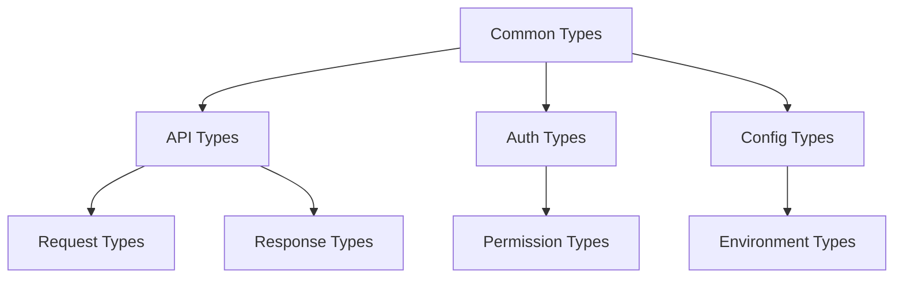

# Technical Specification: @jadugar/types Package

## Overview
The `@jadugar/types` package serves as the foundational type system for the entire Jadugar framework. It provides type definitions, interfaces, and type utilities that are used across all other packages.

## Status
- **Current Phase**: Implementation
- **Target Release**: v0.1.0
- **Target Date**: 2025-03-01

## Goals
1. Provide a comprehensive type system for the entire framework
2. Ensure type safety across all packages
3. Establish patterns for type-driven development
4. Enable excellent developer experience through proper typings

## Non-Goals
1. Runtime type checking (use zod or similar for that)
2. Complex type computations that impact build performance
3. Browser-specific types (handled by @jadugar/ui)
4. Database schema definitions (handled by @jadugar/database)

## Background and Strategic Fit
The types package is the foundation of our type-driven development approach. It ensures consistency and type safety across the entire framework while enabling excellent developer experience through proper typings.

## Core Principles
1. Zero Runtime Dependencies
2. Type-Only Exports
3. Comprehensive Type Safety
4. Clear Documentation
5. Extensive Test Coverage

## Detailed Design

### System Architecture


### Package Structure
```
@jadugar/types/
├── src/
│   ├── api/           # API-related types
│   ├── auth/          # Authentication types
│   ├── common/        # Shared utility types
│   ├── config/        # Configuration types
│   ├── events/        # Event system types
│   ├── progress/      # Progress tracking types
│   ├── requests/      # Request handling types
│   ├── responses/     # Response handling types
│   ├── services/      # Service layer types
│   └── index.ts       # Public API
```

### Core Components

#### Common Types
```typescript
// Result type for handling success/failure
interface Result<T, E = Error> {
  success: boolean;
  data?: T;
  error?: E;
}

// Validation result
interface ValidationResult<T> {
  valid: boolean;
  value?: T;
  errors?: ValidationError[];
}

// Generic async operation result
interface AsyncResult<T> extends Promise<Result<T>> {}
```

#### API Types
```typescript
// Base request type
interface ApiRequest {
  path: string;
  method: HttpMethod;
  headers?: Record<string, string>;
  params?: Record<string, unknown>;
}

// Base response type
interface ApiResponse<T> {
  status: number;
  data?: T;
  errors?: ApiError[];
  metadata?: ResponseMetadata;
}
```

#### Auth Types
```typescript
// User credentials
interface Credentials {
  username: string;
  password: string;
}

// Permission definition
interface Permission {
  resource: string;
  action: PermissionAction;
  conditions?: Record<string, unknown>;
}
```

## Type Patterns

### Result Types
All operations that can fail should return a Result type:
```typescript
const result: Result<User> = await getUser(id);
if (result.success) {
  // Handle success case
  const user = result.data;
} else {
  // Handle error case
  const error = result.error;
}
```

### Validation Types
Validation should use the ValidationResult type:
```typescript
const validation: ValidationResult<User> = validateUser(data);
if (validation.valid) {
  // Use validated data
  const user = validation.value;
} else {
  // Handle validation errors
  const errors = validation.errors;
}
```

## Testing Strategy
1. Type compilation tests
2. Usage examples in tests
3. Edge case coverage
4. Integration tests with dependent packages

## Documentation Requirements
1. TSDoc comments for all exports
2. Usage examples
3. Type constraints
4. Breaking change notes

## Migration Strategy
1. Start with common types
2. Move to API types
3. Add auth types
4. Implement config types
5. Add remaining specialized types

## Risks and Mitigations
1. **Risk**: Type complexity impacts build performance
   - **Mitigation**: Regular performance testing, avoid complex type computations

2. **Risk**: Breaking changes in type definitions
   - **Mitigation**: Comprehensive tests, proper versioning, migration guides

3. **Risk**: Inconsistent type usage across packages
   - **Mitigation**: Clear documentation, type pattern guides, automated checks

## Open Questions
1. How to handle framework-specific vs. general-purpose types?
2. What's the strategy for deprecating types?
3. How to manage type versioning with package versioning?

## Timeline
1. Phase 1: Foundation Setup (2 weeks)
2. Phase 2: Testing (1 week)
3. Phase 3: Quality Assurance (1 week)
4. Phase 4: Integration (1 week)
