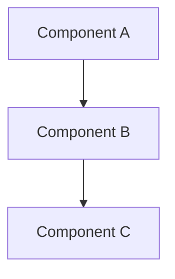

# Technical Specification: [Feature Name]

## Overview
[Brief description of the feature or system being specified]

## Status
- **Current Phase**: [Planning | Implementation | Review | Complete]
- **Target Release**: [Version x.y.z]
- **Target Date**: [YYYY-MM-DD]

## Goals
1. [Primary goal]
2. [Secondary goal]
3. [Additional goals]

## Non-Goals
1. [What this spec is not trying to address]
2. [Future considerations that are out of scope]

## Background and Strategic Fit
[Context and how this fits into the larger system/strategy]

## Detailed Design

### System Architecture


### Core Components

#### Component A
```typescript
interface ComponentA {
  property: string;
  method(): void;
}
```

#### Component B
```typescript
class ComponentB implements ComponentA {
  property: string;
  
  method(): void {
    // Implementation
  }
}
```

### Data Models

#### Model 1
```typescript
interface Model1 {
  id: string;
  name: string;
  created_at: Date;
}
```

### API Design

#### Endpoints

##### GET /api/resource
```typescript
interface RequestParams {
  id: string;
}

interface Response {
  data: Model1;
  status: string;
}
```

### Database Schema
```sql
CREATE TABLE resource (
  id VARCHAR(36) PRIMARY KEY,
  name VARCHAR(255) NOT NULL,
  created_at TIMESTAMP DEFAULT CURRENT_TIMESTAMP
);
```

## Performance Requirements
- Latency: [target latency]
- Throughput: [target throughput]
- Resource usage: [memory/CPU targets]

## Security Considerations
1. [Security requirement 1]
2. [Security requirement 2]
3. [Security requirement 3]

## Privacy Considerations
1. [Privacy requirement 1]
2. [Privacy requirement 2]
3. [Privacy requirement 3]

## Scalability
- [Horizontal scaling approach]
- [Vertical scaling limits]
- [Sharding strategy]

## Monitoring and Alerting
1. Metrics to track:
   - [Metric 1]
   - [Metric 2]
2. Alert conditions:
   - [Condition 1]
   - [Condition 2]

## Testing Strategy

### Unit Tests
```typescript
describe('ComponentA', () => {
  it('should behave correctly', () => {
    // Test implementation
  });
});
```

### Integration Tests
[Description of integration test approach]

### Performance Tests
[Description of performance test approach]

## Deployment Strategy
1. [Deployment step 1]
2. [Deployment step 2]
3. [Rollback procedure]

## Rollout Plan
1. Phase 1: [Alpha testing]
2. Phase 2: [Beta testing]
3. Phase 3: [General availability]

## Migration Strategy
1. [Data migration approach]
2. [Code migration approach]
3. [User migration approach]

## Risks and Mitigations

### Technical Risks
| Risk | Impact | Likelihood | Mitigation |
|------|---------|------------|------------|
| [Risk 1] | High | Low | [Mitigation 1] |
| [Risk 2] | Medium | Medium | [Mitigation 2] |

### Business Risks
| Risk | Impact | Likelihood | Mitigation |
|------|---------|------------|------------|
| [Risk 1] | High | Low | [Mitigation 1] |
| [Risk 2] | Medium | Medium | [Mitigation 2] |

## Dependencies
1. [External dependency 1]
2. [Internal dependency 2]
3. [Infrastructure dependency 3]

## Success Metrics
1. [Metric 1]
   - Target: [target value]
   - Measurement: [measurement approach]
2. [Metric 2]
   - Target: [target value]
   - Measurement: [measurement approach]

## Future Considerations
1. [Future enhancement 1]
2. [Future enhancement 2]
3. [Future enhancement 3]

## Timeline
- Design Review: [YYYY-MM-DD]
- Implementation Start: [YYYY-MM-DD]
- Testing Complete: [YYYY-MM-DD]
- Rollout Complete: [YYYY-MM-DD]

## References
1. [Reference 1]
2. [Reference 2]
3. [Reference 3]

## Appendix

### A1: Alternative Approaches Considered
[Description of alternatives and why they were not chosen]

### A2: Capacity Planning
[Detailed capacity planning calculations]

### A3: Cost Analysis
[Cost implications and ROI calculations]
